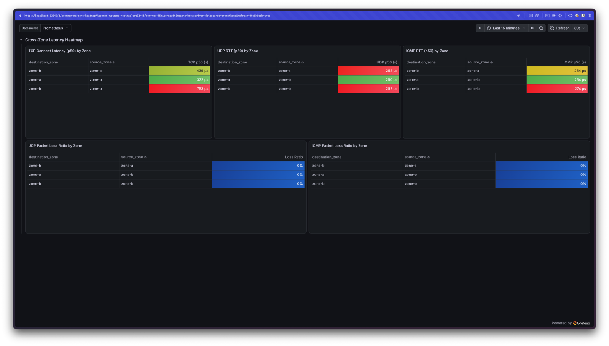
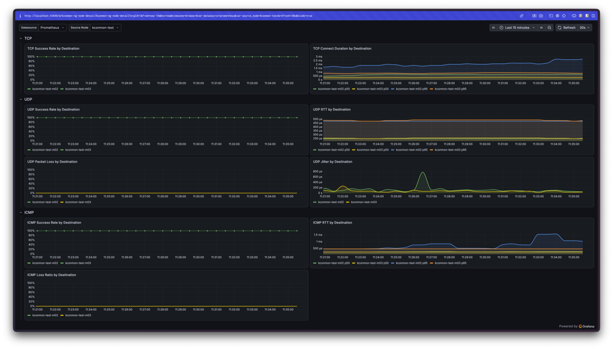

# kconmon-ng

[](https://github.com/EsDmitrii/kconmon-ng/actions/workflows/release.yaml)
[](https://artifacthub.io/packages/search?repo=kconmon-ng)
[](https://go.dev/)
[](LICENSE)

kconmon-ng is a connectivity monitor for Kubernetes nodes. An agent on every
node probes every other node over TCP, UDP, ICMP, DNS and HTTP, and exports
what it measures — latency, jitter, packet loss, per protocol and per node
pair — as Prometheus metrics. When a probe fails, the agent runs an MTR trace
to that peer and exports per-hop RTT and loss. By the time you open the
dashboard, the answer to "where exactly does it break?" is usually already
there.

<p align="center">
  
</p>

## Why

Most cluster network monitoring answers one question: can node A reach
node B? That is the easy part. The failures that actually cost debugging
time are partial ones. UDP loss between two nodes while TCP on the same pair
is fine — conntrack exhaustion or a firewall quietly dropping UDP. DNS timing
out from one node only. Jitter creeping up across a zone boundary. A binary
reachability check stays green through all of it.

kconmon-ng runs each protocol as a separate check for every node pair, so a
protocol-specific, pair-specific failure shows up as exactly that: one red
cell in the matrix, with the failing hop traced and exported next to it.

[Goldpinger](https://github.com/bloomberg/goldpinger) is the established tool
in this space, and if "did the CNI rollout partition the mesh?" is the
question, it answers it well — with a built-in web UI that kconmon-ng does
not have. The honest comparison:

| Capability | Goldpinger | kconmon-ng |
|---|---|---|
| Node-to-node reachability | ✅ (HTTP peer ping; optional external TCP/HTTP/DNS targets) | ✅ (TCP, UDP, ICMP) |
| Built-in web UI / connectivity graph | ✅ | ❌ (Grafana dashboards instead) |
| Protocol breadth (per-protocol checks) | ✅ (HTTP peer ping + UDP probe + optional TCP/HTTP/DNS target checks), but not per-peer ICMP | ✅ (TCP/UDP/ICMP/DNS/HTTP as separate per-peer checks) |
| Per-hop traceroute on failure | ❌ | ✅ (reactive MTR, per-hop RTT/loss metrics) |
| Packet loss / hop-count / RTT | ✅ (UDP probe: loss %, hop count, RTT, dup/out-of-order) | ✅ (UDP jitter + loss ratio, ICMP loss ratio) |
| Zone/topology-aware labels | Partial | ✅ (`source_zone`/`destination_zone`, auto-discovered from node labels since v1.2.0) |
| Controller HA / leader election | N/A (fully mesh, no controller) | ✅ (`controller.leaderElection`, active/standby) |
| Prometheus metrics | ✅ | ✅ |
| Pre-built Grafana dashboards | Community-provided | ✅ (3 dashboards ship in-repo) |
| Self-monitoring (alerts if the monitor itself degrades) | ❌ | ✅ (`KconmonAgentsMissing`, `KconmonControllerDown`) |
| Setup complexity | Low (single DaemonSet) | Low-medium (Helm chart, agent + controller) |

## Install

Requirements: Kubernetes 1.25+, Helm 3.14+, and Prometheus Operator if you
want the bundled ServiceMonitor and alert rules. The agent needs the
`NET_RAW` capability for ICMP and MTR; the chart sets it up, along with RBAC
for the controller's node watch.

```bash
helm upgrade --install kconmon-ng oci://ghcr.io/esdmitrii/charts/kconmon-ng \
  --version 1.3.2 \
  --set serviceMonitor.enabled=true \
  --set prometheusRule.enabled=true
```

Expect one controller pod plus one agent per node:

```bash
kubectl get pods -l app.kubernetes.io/name=kconmon-ng -o wide
```

Metrics start flowing within seconds. To look at them raw:

```bash
AGENT=$(kubectl get pods -l app.kubernetes.io/component=agent -o jsonpath='{.items[0].metadata.name}')
kubectl port-forward "$AGENT" 8080 &
curl -s http://localhost:8080/metrics | grep '^kconmon_ng' | head
```

Then import the three dashboards from [`dashboards/`](dashboards/) into
Grafana — via the UI, or:

```bash
for f in dashboards/*.json; do
  curl -s -X POST "http://localhost:3000/api/dashboards/db" \
    -H "Content-Type: application/json" -u admin:admin \
    -d "{\"dashboard\": $(cat "$f"), \"overwrite\": true}"
done
```

<p align="center">
  
  
</p>

To build from source or run a full local playground (Minikube + Prometheus +
Grafana + kconmon-ng in one command), see
[CONTRIBUTING.md](CONTRIBUTING.md) and [hack/README.md](hack/README.md).

## How it works

```
                          +-------------------------------------------+
                          |          Controller (Deployment)          |
                          |                                           |
                          |  - Agent registry (heartbeat eviction)    |
                          |  - NodeWatcher (k8s node zone labels)     |
                          |  - Topology API / gRPC streaming server   |
                          |  - Leader election (active/standby HA)    |
                          +---------------------+---------------------+
                                                |
                      gRPC stream (peer list sync + updates on change)
                                                |
                        +----------------------+----------------------+
                        |                      |                      |
              +---------+---------+  +---------+---------+  +---------+---------+
              | Agent (node-1)    |  | Agent (node-2)    |  | Agent (node-3)    |
              | DaemonSet         |  | DaemonSet         |  | DaemonSet         |
              |                   |  |                   |  |                   |
              | TCP / UDP / ICMP  |  | TCP / UDP / ICMP  |  | TCP / UDP / ICMP  |
              | DNS / HTTP        |  | DNS / HTTP        |  | DNS / HTTP        |
              | MTR on failure    |  | MTR on failure    |  | MTR on failure    |
              | /metrics :8080    |  | /metrics :8080    |  | /metrics :8080    |
              +-------------------+  +-------------------+  +-------------------+
                ^                                                             ^
                +------------------- probes between all pairs ---------------+
```

Agents register with the controller over gRPC and receive a live-updated peer
list — no polling, and no per-agent configuration: the controller resolves
each agent's zone from its node labels at registration. Each enabled checker
runs concurrently against every peer. A failed TCP, UDP or ICMP probe
triggers an MTR trace for that pair (rate-limited by a per-pair cooldown),
and its hop-by-hop metrics are exported alongside the probe results. When the
topology changes, stale per-pair gauges are reset so dead peers don't leave
ghost readings behind. On shutdown an agent deregisters itself, so restarting
kconmon-ng doesn't leave false loss records in its own metrics.

The checkers, briefly:

| Checker | What it measures |
|---|---|
| TCP | connect time and total RTT per peer |
| UDP | mean RTT, jitter, packet loss over a configurable packet burst |
| ICMP | echo RTT and loss (IPv4/IPv6, raw sockets) |
| DNS | resolution time per (hostname, resolver), system or explicit upstreams |
| HTTP | phased timing for configured URLs: DNS, connect, TLS, TTFB, total |
| MTR | reactive traceroute on failure, per-hop RTT and loss |

Five alert rules ship with the chart: high UDP loss, failing TCP checks,
failing DNS checks, and two self-monitoring rules that fire when agents go
missing or no controller holds leadership — so a broken monitor alerts
instead of going quiet. Config hot-reloads on change and is strictly
validated: a typo'd key fails fast instead of being silently ignored.

## On-demand diagnostics (kubectl plugin)

The continuous metrics answer "is this pair healthy right now?". When you want
to probe a specific pair on demand — mid-incident, or to confirm a fix — the
`kubectl-kconmon` plugin talks to the controller's HTTP API through a client-go
port-forward, so you get topology and one-shot checks straight from your
terminal without Grafana. Install it via krew from a release manifest (until it
lands in the official krew index):

```bash
kubectl krew install --manifest-url \
  https://github.com/EsDmitrii/kconmon-ng/releases/download/v1.3.2/kconmon.yaml
```

```
$ kubectl kconmon topology
NODE     ZONE         READY   AGENT                           AGENT IP
node-1   us-east-1a   yes     node-1-kconmon-ng-agent-aaaaa   10.0.0.1
node-2   us-east-1b   yes     node-2-kconmon-ng-agent-bbbbb   10.0.0.2
node-3   us-east-1c   no      -                               -

$ kubectl kconmon check node-1 node-2 --type icmp
OK icmp node-1 -> node-2 (us-east-1a -> us-east-1b)  duration=1.52ms
  sent=1 recv=1 loss=0% rtt=2.1ms

$ kubectl kconmon check node-1 node-2 --type udp
OK udp node-1 -> node-2 (us-east-1a -> us-east-1b)  duration=1.1ms
  sent=5 recv=5 loss=0% rtt=1.1ms jitter=240µs

$ kubectl kconmon mtr node-1 node-2
target: 10.244.0.12
HOP   IP            RTT     LOSS
1     10.244.0.1    480µs   0%
2     *             0s      100%
3     10.244.0.12   2.1ms   0%
```

`check` and `mtr` take `--type`/`--plane`/`--timeout`; `-o json` prints the raw
`CheckResult` for scripting. A failed check exits `2` (distinct from `1` for CLI
or API errors), so it composes in shell pipelines. This drives the new
`POST /api/v1/diagnostics` controller endpoint — see [docs/api.md](docs/api.md).

## Reference

- [Configuration](docs/configuration.md) — full config file, environment
  variables, Helm values, zone auto-discovery.
- [Metrics and alerting](docs/metrics.md) — every exported metric with types
  and labels, default alert rules, self-monitoring.
- [HTTP API](docs/api.md) — health endpoints and the topology API.
- [charts/kconmon-ng/values.yaml](charts/kconmon-ng/values.yaml) — every
  Helm value, documented inline.

## See it catch a failure

[docs/demo/breaking-cni.md](docs/demo/breaking-cni.md) is a reproducible
walkthrough on a disposable Minikube cluster: blackhole UDP between two
nodes, watch exactly one cell of the matrix go red while TCP and ICMP on the
same pair stay green, watch MTR fire and the bundled alert go pending — then
break TCP, ICMP and HTTP in three other places at once and see each failure
isolated to its own pair and protocol.

## Development

```bash
make build        # agent + controller binaries → bin/
make test         # unit tests        make test-race    # with race detector
make lint         # golangci-lint     make helm-lint    # chart against CI value sets
make local-up     # full local stand: Minikube + Prometheus + Grafana + kconmon-ng
```

CI runs lint, race tests, cross-compile and helm-lint on every PR; tags
matching `v*` publish Docker images and the Helm chart to GHCR and run e2e.
See [CONTRIBUTING.md](CONTRIBUTING.md).

## License

Apache License 2.0. See [LICENSE](LICENSE).
