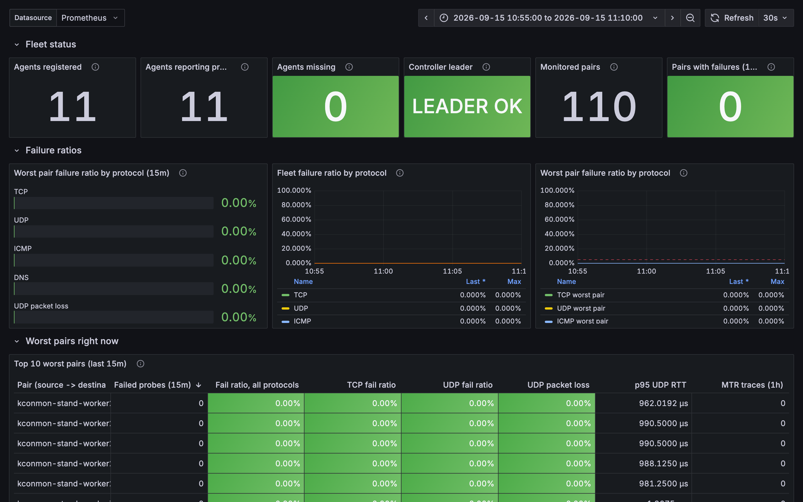
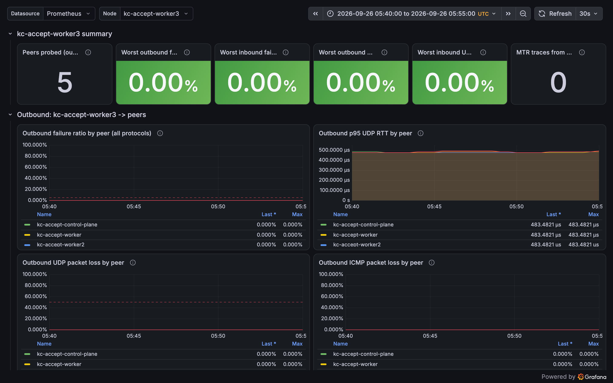

# kconmon-ng

[](https://github.com/EsDmitrii/kconmon-ng/actions/workflows/release.yaml)
[](https://artifacthub.io/packages/search?repo=kconmon-ng)
[](https://esdmitrii.github.io/kconmon-ng/)
[](https://go.dev/)
[](LICENSE)


**Someone says "the network is fine." Prove it.**

kconmon-ng makes inter-node connectivity a measured fact. An agent on every
node probes every other node over TCP, UDP and ICMP every five seconds,
resolves DNS and checks HTTP endpoints from each node, and exports latency,
jitter and packet loss for every ordered node pair, per protocol; a failed
probe fires an MTR trace, so the bad hop is on record before anyone looks.
Each protocol is measured separately for each pair, so the partial failures
that cost you the evening (UDP dropping on one pair while TCP stays clean)
read as exactly that instead of vanishing into a green aggregate. Everything
downstream is built on those measurements: an N×N matrix, a topology map, MTR
path history, incident timelines, alert rules that Prometheus evaluates, and
a `?at=` on the URL that rewinds every page to the minute it broke.

<p align="center">
  <br>
  <sub>Overview on a kind cluster with ten in-cluster agents and the external agent edge-host-01: all 110 pairs healthy, 11/11 nodes ready plus one external agent, an empty worst-pairs panel, no firing alert and one open incident, a zone-c blackhole drill.</sub>
</p>

<table>
  <tr>
    <td width="50%"><br><sub>Matrix, TCP, live, mid-break: worker2, worker5, worker6 and worker7 are red at 100% both as rows and as columns, 68 of 110 cells. The external agent edge-host-01 sits in the top row and the first column, green against every healthy node and red only where the break is.</sub></td>
    <td width="50%"><br><sub>Incidents, scoped to worker3 → worker6 over 1h: 331 timeline entries, the newest an audit row and the pair's TCP diagnostic timeouts, and the Signals panel showing the fail ratio going from 0.0% to 100.0%. Its packet-loss chart has two short 100% bursts around 08:47-08:55 and holds 100% from about 09:38.</sub></td>
  </tr>
  <tr>
    <td width="50%"><br><sub>Alerting: two console-managed rules, both synced against the cluster and enabled, the chart's own PrometheusRule (1 group, 10 rules) offered for import as a foreign rule, and one declared maintenance window at the bottom.</sub></td>
    <td width="50%"><br><sub>Time Machine: the same Matrix resolved at 9/15/2026 09:36:00, a minute before that break. The amber banner marks the viewed instant; all 110 pairs are green, the external agent's row and column included.</sub></td>
  </tr>
  <tr>
    <td width="50%"><br><sub>Bundled Grafana overview on a healthy stand: 11 agents registered and all 11 reporting, leader OK, 110 monitored pairs, none failing, the failure-ratio charts flat at 0 on a 0-100% axis, and every visible row of the top-10 worst pairs at 0.00%.</sub></td>
    <td width="50%"><br><sub>Bundled Zone Heatmap during a staged break: zone-to-zone UDP loss, p95 UDP and ICMP RTT, and TCP and UDP failure ratios over the last 15 minutes, plus MTR traces triggered over the last hour. Zone-c reads 100.0% as a source and as a destination on loss and both failure ratios and NaN on the RTT tables, zone-a and zone-b sit between 33.3% and 66.7% elsewhere, and the external agent's zone has a row and a column of its own.</sub></td>
  </tr>
  <tr>
    <td colspan="2" align="center"><br><sub>Bundled Node Detail dashboard for the external agent edge-host-01: 10 peers probed outbound, every worst-case failure and UDP loss tile at 0.00%, no MTR traces from this node, and per-peer outbound charts with p95 UDP RTT peaking around 2 ms.</sub></td>
  </tr>
</table>

## Documentation

Everything lives at **<https://esdmitrii.github.io/kconmon-ng/>**; start with:

- [Install in 15 minutes](https://esdmitrii.github.io/kconmon-ng/getting-started/install-15-min/)
- [Enable the console](https://esdmitrii.github.io/kconmon-ng/getting-started/enable-the-console/)
- [Console guide](https://esdmitrii.github.io/kconmon-ng/console/overview/)
- [Helm values](https://esdmitrii.github.io/kconmon-ng/reference/helm-values/)
- [Metrics and alerting](https://esdmitrii.github.io/kconmon-ng/metrics/)
- [External agents](https://esdmitrii.github.io/kconmon-ng/external-agents/)
- [FAQ](https://esdmitrii.github.io/kconmon-ng/faq/)
- [Release notes](https://esdmitrii.github.io/kconmon-ng/reference/release-notes/)

## What it does

- **Measures every pair on every protocol.** One controller Deployment, one
  agent per node; agents register over gRPC and get a live-pushed peer list,
  and every metric carries `source_zone`/`destination_zone` read from the node
  labels. TCP, UDP, ICMP and DNS run on a 5s interval; HTTP is opt-in.
  [Architecture](https://esdmitrii.github.io/kconmon-ng/concepts/architecture/)
- **Traces the failure while it is happening.** A failed TCP, UDP or ICMP probe
  triggers MTR for that pair under a per-pair cooldown; paths are content-hashed
  at ingest, so path history is a list of changes, not identical traces.
  [Routes (MTR)](https://esdmitrii.github.io/kconmon-ng/console/routes-mtr/)
- **Finds MTU black holes.** A once-a-minute path MTU probe sends full-size
  datagrams with DF set and bisects on loss, so a pair where handshakes and
  pings pass but large packets vanish goes red with the size that still
  crosses, instead of staying green on every other plane.
  [Catch an MTU black hole](https://esdmitrii.github.io/kconmon-ng/scenarios/mtu-black-hole/)
- **Speaks Prometheus.** Stable metric names, three Grafana dashboards in
  [`dashboards/`](dashboards/), thirteen alert rules with the chart (UDP loss,
  failing TCP, an MTU black hole, a node unreachable or isolated, DNS and
  external checks, a pair gone silent, two zone rules,
  `KconmonAgentsMissing` and `KconmonControllerDown`, so a monitor that goes
  quiet pages you, plus an opt-in `KconmonExternalAgentDown` for bare-host
  agents), each tunable via `prometheusRule.<alertName>.*`; the
  console's own families share the prefix, documented by their HELP strings.
  [Metrics and alerting](https://esdmitrii.github.io/kconmon-ng/metrics/)
- **Adds an optional Console, off by default.** N×N heatmap, topology map,
  curated charts; an Investigate page merging nine timeline sources, causes
  ranked by documented arithmetic; alert rules from typed templates or raw
  PromQL, reconciled into one `PrometheusRule`; diagnostics, external targets,
  schedules; four auth modes, 26 permissions across four built-in roles, an
  audit log, HMAC-signed webhooks. Read-only pages need only a Prometheus
  URL; the rest needs PostgreSQL.
  [Console guide](https://esdmitrii.github.io/kconmon-ng/console/overview/)
- **Rewinds.** `?at=` on any URL resolves every read surface through that
  instant, with mutations disabled while it is engaged.
  [Time Machine](https://esdmitrii.github.io/kconmon-ng/console/time-machine/)
- **Takes vantage points outside the cluster.** Since v2.3.0 the same agent
  installs on a bare host from deb or rpm and joins through a TLS gateway with
  a bearer token and optional client-certificate pinning.
  [External agents](https://esdmitrii.github.io/kconmon-ng/external-agents/)

## Quick start

Kubernetes 1.31+, Helm 4 (or Helm 3 from 3.14; the chart is an OCI artifact)
and a Prometheus to scrape. The Operator is optional; with it you get the
bundled `ServiceMonitor` and alert rules:

```bash
helm upgrade --install kconmon-ng oci://ghcr.io/esdmitrii/charts/kconmon-ng \
  --set serviceMonitor.enabled=true \
  --set prometheusRule.enabled=true
```

```bash
# one controller pod plus one agent per node
kubectl get pods -l app.kubernetes.io/name=kconmon-ng -o wide
```

Metrics flow within seconds; then follow
[Install in 15 minutes](https://esdmitrii.github.io/kconmon-ng/getting-started/install-15-min/)
for the first queries, the dashboards, the scrape job without the operator and
the `make local-up` Minikube demo. The agent needs no added capabilities and
passes restricted PSS unchanged ([why](https://esdmitrii.github.io/kconmon-ng/faq/#what-privileges-do-the-agents-need)).

## No Prometheus Operator?

Moved to the site: [one endpoints-role scrape job](https://esdmitrii.github.io/kconmon-ng/getting-started/install-15-min/#no-prometheus-operator) covers the fleet, and the [alert rules](https://esdmitrii.github.io/kconmon-ng/metrics/#default-alerting-rules) are plain PromQL.

## Turn on the Console

Moved to the site: [Enable the console](https://esdmitrii.github.io/kconmon-ng/getting-started/enable-the-console/), one flag on the same release, then one capability at a time.

## From your terminal

`kubectl-kconmon` reaches the controller's HTTP API over a client-go
port-forward. A failed check exits `2`, distinct from `1` for CLI or API
errors, so it composes in pipelines; `-o json` prints the raw result.

```
$ kubectl kconmon topology
NODE     ZONE         READY   AGENT                           AGENT IP
node-1   us-east-1a   yes     node-1-kconmon-ng-agent-aaaaa   10.0.0.1
node-2   us-east-1b   yes     node-2-kconmon-ng-agent-bbbbb   10.0.0.2
node-3   us-east-1c   no      -                               -

$ kubectl kconmon check node-1 node-2 --type udp
OK udp node-1 -> node-2 (us-east-1a -> us-east-1b)  duration=1.1ms
  sent=5 recv=5 loss=0% rtt=1.1ms jitter=240µs
```

Install it from the krew index with `kubectl krew install kconmon`, or pin a
release with `kubectl krew install --manifest-url https://github.com/EsDmitrii/kconmon-ng/releases/latest/download/kconmon.yaml`.

## Scope and limits

- **External agents are supported since v2.3.0**: TLS gateway on the
  controller, bearer token, optional client-certificate pinning, deb and rpm
  packages. 2.4.0 adds per-agent ports (an external host no longer mirrors the
  fleet's port pair), a Prometheus HTTP SD endpoint so external hosts are
  scraped without hand-written targets, `agent.hostNetwork` for probing from
  the node's own address, and console awareness of external members.
- **What stays out**: Windows hosts
  ([why](https://esdmitrii.github.io/kconmon-ng/faq/#does-the-agent-run-on-windows)),
  two agents on one IP, a CSR flow for agent certificates; the full list is
  [What v1 does not do](https://esdmitrii.github.io/kconmon-ng/external-agents/#what-v1-does-not-do).
- **Scale envelope**: 50–100 nodes on a full mesh is production-proven; each
  directed pair keeps ~75 active series and pairs grow as N×(N−1), about 740k
  series at 100 nodes. `topology.mode: sparse` (since v2.3.0) trims probed
  pairs to a ring plus cross-zone chords. Arithmetic and levers:
  [Scaling and cardinality](https://esdmitrii.github.io/kconmon-ng/metrics/#scaling-and-cardinality).

## How it compares

kconmon-ng inherits its name and shape from
[kconmon](https://github.com/Stono/kconmon) by Karl Stoney (Node.js, archived
in June 2026) and is a ground-up Go implementation of the same idea, not a
fork, extended with ICMP, reactive MTR tracing and the Console. Reach for
goldpinger when an HTTP-level pod graph is enough, for kubenurse when the
question is the path through ingress and API server, and for kconmon-ng when
you need per-protocol pair evidence with the bad hop already traced; the
feature table is in the
[FAQ](https://esdmitrii.github.io/kconmon-ng/faq/#how-does-this-relate-to-the-original-kconmon).

## Links

- Documentation: <https://esdmitrii.github.io/kconmon-ng/>
- Chart: [Artifact Hub](https://artifacthub.io/packages/helm/kconmon-ng/kconmon-ng),
  `oci://ghcr.io/esdmitrii/charts/kconmon-ng`; images
  `ghcr.io/esdmitrii/kconmon-ng-{agent,controller,console}` on
  [GHCR](https://github.com/EsDmitrii?tab=packages&repo_name=kconmon-ng)
- [Releases](https://github.com/EsDmitrii/kconmon-ng/releases) (deb/rpm host
  packages, krew manifest), [`dashboards/`](dashboards/),
  [CONTRIBUTING.md](CONTRIBUTING.md), [SECURITY.md](SECURITY.md)

## Development

```bash
make build      # agent + controller binaries → bin/
make test       # unit tests; make test-race adds the race detector
make lint       # golangci-lint; make helm-lint runs the chart against CI value sets
make local-up   # Minikube + Prometheus + Grafana + kconmon-ng, one command
```

CI runs lint, race tests, cross-compile and helm-lint on every PR; a `v*` tag
publishes images and the chart to GHCR and runs e2e. Start with
[CONTRIBUTING.md](CONTRIBUTING.md) and [hack/README.md](hack/README.md).

## Community

[Governance](GOVERNANCE.md), [maintainers](MAINTAINERS.md), [roadmap](ROADMAP.md),
[code of conduct](CODE_OF_CONDUCT.md) and [adopters](ADOPTERS.md). Running
kconmon-ng somewhere? A pull request adding a line to ADOPTERS.md helps more
than a star.

## License

Apache License 2.0. See [LICENSE](LICENSE).
