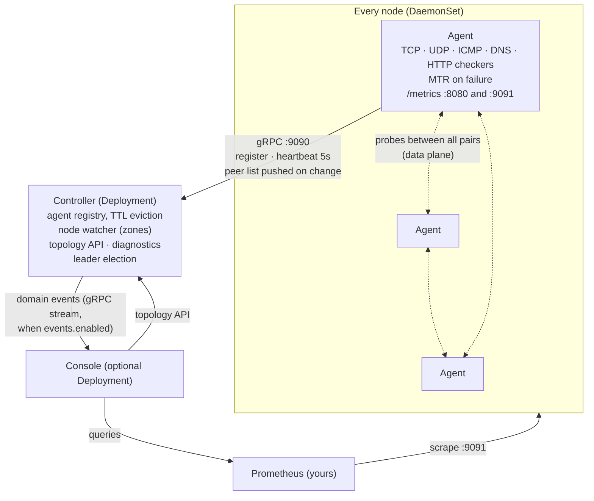

# Architecture

kconmon-ng is three components with one direction of trust: agents measure,
and everything else reads. Results never transit the controller: they go
straight from each agent's `/metrics` into your Prometheus.

## Components: agent, controller, console

**The agent** is a DaemonSet: one pod per node, running the enabled checkers
(TCP, UDP, ICMP, DNS, HTTP, external) against every peer and firing a reactive
MTR trace when a TCP, UDP or ICMP probe fails. It exports everything as
Prometheus metrics and needs no Kubernetes API access at all; it never links
client-go.

**The controller** is a Deployment: it keeps the agent registry (heartbeats,
TTL eviction), watches nodes to resolve each agent's zone label, serves the
topology API and an on-demand [diagnostics endpoint](../api.md), and streams
domain events to the console when `controller.events.enabled` is on. It is
coordination only. No probe result ever flows through it.

**The console** is an optional web UI Deployment, off by default. It reads
your Prometheus and the controller's APIs; with a PostgreSQL DSN it adds
history, incidents, auth and managed alert rules. See
[Enable the console](../getting-started/enable-the-console.md).

## How a probe becomes a metric

1. A checker fires on its interval (5s for TCP/UDP/ICMP/DNS by default)
   against every peer on the current list.
2. The result lands in the agent's local Prometheus registry: latency
   histograms, loss/jitter gauges, result counters — labelled with
   `source_node`, `destination_node`, `source_zone`, `destination_zone`.
3. Prometheus scrapes each agent (and the controller). The chart offers a
   `ServiceMonitor`, or you write [one scrape
   job](../getting-started/install-15-min.md#no-prometheus-operator); either
   way there is a dedicated `metrics` port (9091) separate from the API port.
4. Everything downstream is a Prometheus query over those series:
   dashboards, the Console's Matrix and Metrics pages, the alert rules.

Four design decisions matter at 3am, each on its own line:

- A failed TCP/UDP/ICMP probe triggers MTR for that pair under a per-pair
  cooldown (60s by default), so a broken link cannot flood the cluster with
  traces.
- When a peer leaves the topology, its per-pair gauges are dropped instead of
  lingering as ghost readings for a node that no longer exists.
- An agent deregisters on shutdown, so a rolling restart of kconmon-ng does
  not write false loss into its own metrics.
- Config hot-reloads on change and is parsed with unknown keys rejected. A
  typo fails fast instead of being silently ignored.

## Peer discovery over gRPC

Agents register with the controller over gRPC (`config.grpcPort`, 9090) and
subscribe to a peer-list stream, with no polling and nothing to configure on
the agent side. The
controller pushes the full list on every change: an agent joining, leaving,
deregistering on shutdown, or being evicted after missing heartbeats for
`config.controllerAgentTtl`. Agents heartbeat every **5 seconds**; the TTL
defaults to 30s with a floor of 10s, so eviction takes at least two missed
heartbeats and by default six. At registration the controller reads the
node's `config.failureDomainLabel` (`topology.kubernetes.io/zone` by default)
and hands the zone back, so every metric carries zones without anyone writing
them down; see [Mesh and planes](mesh-and-planes.md).

The channel is plaintext and unauthenticated, safe only inside the cluster
boundary: the port is never exposed, and the optional NetworkPolicy pins it
further. Do not expose it to run agents outside the cluster:
[External agents](../external-agents.md) explains what that would hand over
and what is planned instead.

## Domain events

The stream the console's realtime features hang off carries five event types,
defined in `api/proto/kconmon.proto`:

- **TopologyChanged**: a refetch signal naming the subject of one change
  (`agent_registered`, `zone_updated`, `agent_deregistered`,
  `agent_evicted`); a live console refreshes Matrix and Topology on it
  instead of polling.
- **CheckObserved**: the outcome of a completed on-demand diagnostic check,
  not the continuous background probes.
- **MTRTriggered** and **MTRCompleted**: a reactive traceroute fired and
  finished, feeding [Routes (MTR)](../console/routes-mtr.md).
- **DiagnosticProgress**: progress of a run started from
  [Run checks](../console/run-checks.md).

The [Events page](../console/events.md) is the live feed of all five; with a
database, the ingested history is what the
[Time Machine](../console/time-machine.md) folds past topology from.

## High availability

- **Controller**: set `controller.replicaCount: 2` with
  `controller.leaderElection: true` (the default). Only the leader is active:
  it alone holds the registry, watches nodes and serves topology; standbys
  wait on the lease. A PodDisruptionBudget is rendered automatically at more
  than one replica.
- **Failover is sized to beat the agent TTL.** The lease runs at a 15s
  duration with a 10s renew deadline and 2s retries, so a takeover completes
  well inside one 30s agent TTL. The new leader does start with an empty
  registry: a standby holds no agents by design, and the topology API
  answers `503 not the leader` rather than reporting a fleet of zero. The gap
  closes itself fast: heartbeats are not leader-gated, so an agent's next 5s
  heartbeat gets `NotFound` from the new leader and triggers immediate
  re-registration. Topology is repopulated within a few heartbeat intervals
  of the takeover.
- **Agents survive the controller being away.** Registration retries in the
  background while the agent's health endpoints are already up, and during a
  controller restart, upgrade or outage the probes keep running against the
  last known peer list — an incident at the coordinator does not blind the
  fleet at exactly the wrong moment. The peer list resumes updating on
  re-registration.
- **The monitor watches itself.** Two bundled alert rules,
  `KconmonAgentsMissing` and `KconmonControllerDown`, page you when agents or
  the controller leader go missing, so a kconmon-ng that goes quiet does not
  read as a healthy network. Both need leader election on, and for a concrete
  reason: `expected_agents` is derived from the node informer, which only the
  leader runs, and the leader gauge the second rule reads exists only when
  someone can be leader. `controller.leaderElection: false` disables both
  along with zone enrichment.
- **Console**: stateless; run `console.replicas: 2` once
  `redis.existingSecret` points at a shared bus (sessions, rate limits and
  realtime fan-out live there).
