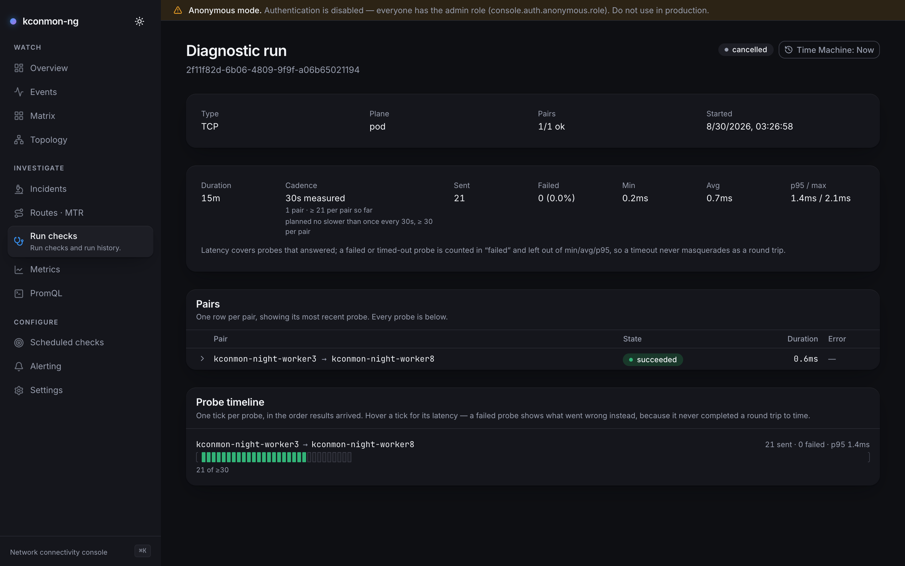

# Checks, runs and schedules

Five words do the work in kconmon-ng, and they are close enough to blur. A
**checker** is a prober built into every agent, running continuously against
the peer mesh. A **check** is a stored definition of a probe you declared in
the Console, and a **target** is the named external destination a check can
point at. A **schedule** decides *when* a check executes; a **run** is one
recorded execution with a status and results.

## Checks

Two layers, configured in two places:

- **Built-in checkers** live in the agents and are configured through Helm
  (`config.checkers.*`): TCP, UDP, ICMP and DNS run out of the box on a 5s
  interval against every peer; HTTP is opt-in because it needs URLs only you
  know; MTR fires reactively on probe failure. They need no database and no
  Console; this is the measurement core described in
  [Architecture](architecture.md).
- **Check definitions** are Console objects (stored in PostgreSQL, managed on
  the [Scheduled checks](../console/scheduled-checks.md) page or via
  `/api/v1/checks`). A definition says *which agents* probe (`all`,
  `per-zone`, or the default `one-per-zone`), *what* they probe (a cluster
  node, a stored **target**, or an ad-hoc address), with which check type and
  parameters.

A guard bounds what one definition may fan out to: at most **400 projected
series**. The number is not arbitrary: it is calibrated as the worst run one
source should be allowed to own, 400 pairs from a single source agent over 24
hours, and the same figure feeds the per-run deadline and the stuck-run
sweep, so the limit, the deadline and the reaper all agree about what "too
big" and "too long" mean. The same function answers the UI's preview, so the
number you see is the number that is enforced.

**Targets** (`/api/v1/targets`, the [external targets
scenario](../scenarios/external-targets.md)) name destinations that are not
fleet peers (a `host` or a `url`), so that metrics and events can carry a
stable operator-chosen name instead of an address. Probing them additionally
requires the agent-side external checker and its CIDR allowlist
(`config.checkers.external`).

## Runs

A run is one execution. Its lifecycle is short and fully enumerable:

1. **created**: the definition is expanded into sources × destinations,
   bounded to 400 pairs, before anything is dispatched.
2. **running**: pairs are dispatched to the source agents, each pair under
   its own timeout. A source agent that is down or slow fails its pairs; it
   cannot hang the run.
3. **terminal**: one of `succeeded`, `failed`, `partial` or `cancelled`.

The verdict rule: a pair counts as OK when its *latest* sample succeeded
(the same rule the run detail page uses to collapse samples into one row per
pair, so the history list and the detail view can never disagree). All pairs
OK means `succeeded`, all failed means `failed`, a mix means `partial`.
`cancelled` covers an operator's cancel and one more case: a run orphaned
mid-flight, say by a console pod dying, is force-finished by a background
sweep that checks every minute and judges each run against its own declared
duration and fan-out. Nothing hangs forever, and nothing sits at "0 of 1 ok"
for a day.

Runs come from three places:

- **On demand** from the [Run checks](../console/run-checks.md) page (or
  `POST /api/v1/runs`): probe a pair right now, mid-incident, with a
  permalink to the result.
- **From a schedule**, when the scheduler fires a due check definition.
- **From the terminal**: `kubectl kconmon check node-1 node-2 --type udp`
  drives the controller's [diagnostics endpoint](../api.md) directly — same
  probes, no Console required.

<figure markdown="span">
  { loading=lazy }
  <figcaption>A finished run on the Run checks page: the fan-out count, per-pair results and the terminal status badge this page's vocabulary describes.</figcaption>
</figure>

Run history (`GET /api/v1/runs`) is what the Run checks page lists, and what
the retention pruner sweeps daily after `database.retentionDays`: 90 days by
default, with `0` keeping everything.

## Schedules

A schedule attaches a cadence to one check definition:

`once`
:   fires at a future timestamp, one time.

`interval`
:   fires at a repeat period, clamped up to a 10s minimum: a one-second
    schedule against a definition fanning out to hundreds of pairs would be a
    self-inflicted DoS.

`continuous`
:   the special kind that creates no runs at all. It tells the reconciler to
    push the definition to agents as a continuously-executing external check;
    the agents then probe on a 30-second interval with a 5-second per-probe
    timeout (the timeout is kept a small fraction of the interval so a hung
    probe cannot overlap the next one), and the reconciler re-asserts the
    desired state every two minutes even when nothing changed.

`cron`
:   refused, for now, with a 422 whose message says where you stand:
    *"cron schedules land in a later milestone: use `kind:interval` with
    `intervalNs`, or `kind:once` with `runAt`"*.

Nothing fires until the schedule loop is on: it is opt-in
(`console.scheduler.enabled`, default `false`, so an upgrade never silently
starts dispatching fleet traffic) and needs both a database and a reachable
controller.

With more than one console replica, each tick is wrapped in a PostgreSQL
advisory lock, so exactly one replica dispatches per tick. The lock is
tick-scoped, not replica-scoped: it rotates, and whichever replica wins the
next tick carries on. A replica dying mid-tick therefore costs at most that
one tick: due schedules stay due, and the next tick (seconds away) picks
them up. The overlap guard asks the database, not replica memory, whether a
schedule's previous run is still mid-flight, precisely because the replica
that fired a run is routinely not the one holding the next tick.

## Results and events

Results and events are separate streams with separate jobs:

- **Results** are measurements. Continuous checker results become Prometheus
  series scraped from each agent; run results are stored rows the Console
  shows next to each run.
- **Events** are facts about the fleet: agents joining and leaving, topology
  changes, diagnostic runs starting and finishing. The controller streams them
  when `controller.events.enabled` is on; the Console's
  [Events](../console/events.md) page is the live feed, the ingested history
  is what the [Time Machine](../console/time-machine.md) folds topology from,
  and Kubernetes core events can be captured alongside
  (`console.kubernetesContext.enabled`) into the
  [incident timeline](../console/incidents.md).
