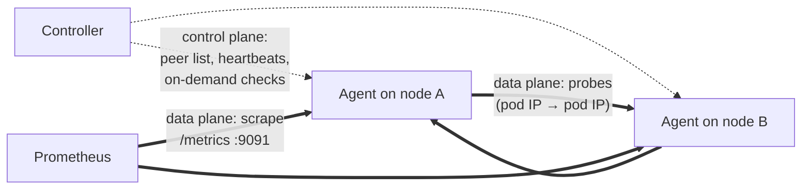

# Mesh and planes

## The probe mesh

Every agent probes every other agent, and every **ordered** pair is measured
separately: `node-1 → node-2` and `node-2 → node-1` are two different series,
because asymmetric failure is common: a firewall rule, a policy, a broken
return path each affect one direction. N nodes make N×(N−1) directed pairs.

Probes travel pod-IP to pod-IP, and each protocol has a fixed rendezvous:

| Probe | Dials | Port (default) |
| --- | --- | --- |
| TCP | the peer agent's HTTP port | `config.httpPort`, 8080 |
| UDP | the peer agent's gRPC/probe port | `config.grpcPort`, 9090 |
| ICMP | the peer's pod IP | — |

Keep this table at hand when you write firewall rules, or when you break them
on purpose as [the demo](../demo/breaking-cni.md) does: blocking the wrong
port silently matches zero packets.

## Control plane vs data plane

The two never mix:

- **Control plane** is the agent ↔ controller gRPC: registration, heartbeats, the
  peer list pushed on every change, and dispatch of on-demand checks. Losing
  it degrades *coordination* only: agents keep probing the last known peer
  list while the controller is away.
- **Data plane** is agent ↔ agent probes and each agent's `/metrics`. Probe
  results never transit the controller; Prometheus scrapes them straight from
  the agents. The controller cannot become a throughput bottleneck for
  measurements, and a controller outage costs you peer-list freshness, not
  data.

### The pod plane, and the traffic it measures

Diagnostic checks carry a lowercase `plane` field, and today `pod` is the
only value that exists: probes are sent from agent pod to agent pod, so what
gets measured is the path pod traffic actually takes through the CNI
datapath. That is the layer a CNI bug, a conntrack overflow or a fabric
problem lives in, and it is why the tool probes pod IPs rather than node
addresses. A workload on `hostNetwork` talks over node addresses instead, a
path these probes do not exercise. A `host` plane is reserved for exactly
that, arriving with the [external agents](../external-agents.md) work, where
an agent advertises a host IP because a bare host has no pod network at all.

## Zones and failure domains

At registration the controller reads each agent's node label named by
`config.failureDomainLabel` (default `topology.kubernetes.io/zone`) and hands
the zone back, so every peer metric carries `source_zone` and
`destination_zone` with no per-agent configuration. This needs
`controller.leaderElection: true`, because the node informer runs only on the
leader. An explicit `agent.zone` value always wins, and a node with no zone
label simply has empty zone labels (the Console's Topology page will say so
out loud).

Zones are also a measurement plane of their own: every peer probe is recorded
a second time under only `(source_zone, destination_zone)`, a family that
grows as Z² instead of N². Two bundled alert rules, `ZoneChecksFailing` and
`ZoneLossHigh`, read only that family, and the `agent.metrics.detail:
zone-only` scrape mode keeps only it. See the
[zone aggregates](../metrics.md#agent-zone-aggregates) reference.

Two design choices in the zone alerts answer questions people rightly ask.
`ZoneLossHigh` computes loss from the zone packet *counters* (sent minus
received over sent) rather than averaging the per-pair loss-ratio gauges,
because an average would weight an idle pair the same as a busy one and
report a number no packet ever experienced. And its default threshold is 0.1
where the per-pair `UDPLossHigh` uses 0.5, because the zone aggregate dilutes
any single link by the pair count: sustained loss at 10% of a whole zone pair
means the fabric is sick, not one node.

<figure markdown="span">
  { loading=lazy }
  <figcaption>The bundled Zone Heatmap Grafana dashboard reading the <code>kconmon_ng_zone_*</code> family on a 10-node, 4-zone stand.</figcaption>
</figure>

## Full mesh and its limits

Per-pair, per-protocol measurement is the point of the tool, and it is also
the bill. Where the ~70 comes from: the four per-pair histograms (TCP
connect, TCP total, UDP RTT, ICMP RTT) cost 16 series each on the shared
13-bucket scale (13 buckets plus `+Inf`, `_sum` and `_count`), for 64, plus
three loss/jitter gauges and three result counters. Roughly 70 active series
per directed pair, growing quadratically: about 690k series at 100 nodes.
**50–100 nodes is the production-proven envelope.**

!!! warning "Version skew: the chart still pins agent 2.0.3"
    Everything zone-flavoured reads the `kconmon_ng_zone_*` family, and that
    family comes from the **agent image**, which at appVersion 2.0.3 does not
    export it. Until your fleet runs an agent that does, the two zone alerts
    are silently inert (their expressions match no series), the Zone Heatmap
    renders empty, and flipping `agent.metrics.detail: zone-only` drops the
    per-pair series with nothing replacing them: Prometheus goes dark on the
    mesh while the console keeps working. Upgrade the agent image first, flip
    the valve second. Details in the
    [v2.2.0 release notes](../reference/release-notes.md).

The levers that exist today, in one line each:

- `agent.metrics.detail: counters-only` drops the per-pair histograms
  (~70 → ~10 series per pair) while every pair alert keeps firing.
- `agent.metrics.detail: zone-only` drops per-pair series entirely and keeps
  the Z² zone plane, subject to the version-skew warning above.
- Disabling a checker removes its families.

One prerequisite on the first two: the valve renders as `metricRelabelings`
on the agent ServiceMonitor, so it needs `serviceMonitor.enabled` and the
chart refuses the combination otherwise. Running plain Prometheus instead,
copy the equivalent `metric_relabel_configs` from
[Levers that exist today](../metrics.md#levers-that-exist-today).

The full arithmetic, what each checker costs and what each mode keeps, is in
[Scaling and cardinality](../metrics.md#scaling-and-cardinality). A sparse
mesh (probing a structured subset of pairs instead of all of them) is on the
roadmap for larger fleets; until it lands, do not plan a 1000-node full mesh.
