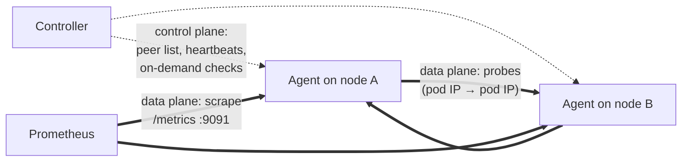

# Mesh and planes

## The probe mesh

Every agent probes every other agent, and every **ordered** pair is measured
separately: `node-1 → node-2` and `node-2 → node-1` are two different series,
because asymmetric failure is common: a firewall rule, a policy, a broken
return path each affect one direction. N nodes make N×(N−1) directed pairs.

Probes travel pod-IP to pod-IP, and each protocol has a fixed rendezvous:

| Probe | Dials | Port (default) |
| --- | --- | --- |
| TCP | the peer agent's HTTP port | the peer's own `config.httpPort`, 8080 |
| UDP | the peer agent's gRPC/probe port | the peer's own `config.grpcPort`, 9090 |
| ICMP | the peer's pod IP | none |
| Path MTU | the peer agent's gRPC/probe port, 64-byte and full-size datagrams with DF set ([Path MTU plane](#the-path-mtu-plane)) | the peer's own `config.grpcPort`, 9090 |

"The peer's own" is literal since 2.4.0: every agent reports its listener
ports at registration and the controller hands them out with the peer list,
so a peer on non-default ports is dialled where it actually listens. An agent
that reports no ports (older than 2.4.0) is dialled on the prober's own
configured values, which is why a fleet keeps one port set until every member
is on 2.4.0 ([External agents](../external-agents.md#ports)).

Keep this table at hand when you write firewall rules, or when you break them
on purpose as [the demo](../demo/breaking-cni.md) does: blocking the wrong
port silently matches zero packets.

## Control plane vs data plane

The two never mix:

- **Control plane** is the agent ↔ controller gRPC: registration, heartbeats, the
  peer list pushed on every change, and dispatch of on-demand checks. Losing
  it degrades *coordination* only: agents keep probing the last known peer
  list while the controller is away.
- **Data plane** is agent ↔ agent probes and each agent's `/metrics`. Probe
  results never transit the controller; Prometheus scrapes them straight from
  the agents. The controller cannot become a throughput bottleneck for
  measurements, and a controller outage costs you peer-list freshness, not
  data.

### The pod plane, and the traffic it measures

Diagnostic checks carry a lowercase `plane` field, and today `pod` is the
only value that exists: probes are sent from agent pod to agent pod, so what
gets measured is the path pod traffic actually takes through the CNI
datapath. That is the layer a CNI bug, a conntrack overflow or a fabric
problem lives in, and it is why the tool probes pod IPs rather than node
addresses. A workload on `hostNetwork` talks over node addresses instead, a
path these probes do not exercise. No separate `host` plane shipped with the
[external agents](../external-agents.md) work: a bare-host agent advertises
a host IP because it has no pod network at all, and its probes are still
recorded under `plane=pod`. Read the field as "the addresses the agents
advertise", not as a statement about which datapath carried the packets.
Any other value is refused up front: the controller's diagnostics endpoint,
a Console run and `GET /api/v1/matrix?plane=` answer 400, a check definition
422, and `kubectl kconmon check --plane` exits 1.

### Host networking

Since 2.4.0 the chart can move the whole agent DaemonSet onto node addresses
with `agent.hostNetwork: true`. Each agent then runs in its node's network
namespace, advertises the node IP, and listens on TCP `httpPort`, UDP
`grpcPort` and TCP `metricsPort` of the node itself. The option exists for
one reason: an [external agent](../external-agents.md#when-the-pod-network-does-not-route)
on a network that cannot route pod CIDRs can reach node IPs, so this is how
external↔cluster cells turn green without BGP or a VPN carrying the pod
network.

It changes the subject of measurement, and that is the cost to weigh before
flipping it. Every in-cluster pair then probes node IP to node IP over the
underlay; the overlay, conntrack and NetworkPolicy enforcement that the pod
plane exercises are out of the path, so a CNI bug that breaks pod traffic
can sit behind a fully green matrix. Diagnostics and the Console keep
reporting `plane=pod`, unchanged, and a 2.4.0 agent image marks itself
`kconmon-ng.io/host-network=true` in its registration so the API can tell a
node address from a pod address. The prerequisites (a `privileged` namespace,
free ports on every node, the `ping_group_range` sysctl from the node OS,
`networkPolicy.nodeCidrs` when policies are on) are listed with the option
in [External agents](../external-agents.md#when-the-pod-network-does-not-route).

## The path MTU plane

Since 2.5.0 every agent also asks each peer, once a minute
(`checkers.pmtu.interval`), whether a full-size datagram crosses. The other
planes cannot answer that. The TCP probe only dials, the UDP probe sends
4-byte payloads and ICMP sends default-size echoes, so a path that carries
small packets and silently drops large ones stays green on all three.

### What it sends

One connected UDP socket per peer, Don't Fragment set, aimed at the peer's
UDP echo port (the same port the UDP probe uses). Each datagram waits
`checkers.pmtu.timeout` (500ms) for its echo.

1. **64 bytes**, up to two tries. If both are lost the pair gets no MTU
   verdict (`unreachable`): whether the peer answers at all is the UDP
   plane's question.
2. **The probe size**, up to two tries. An echo means `ok`. An ICMP
   "fragmentation needed" that names a smaller MTU means `reduced`, with the
   router's number: path MTU discovery works on this path, TCP adapts to it,
   and UDP without its own discovery does not.
3. **Bisection** when both full-size tries vanish with no ICMP: one datagram
   per size between 64 bytes and the probe size, at most 16 steps, inside a
   budget of half the interval.
4. **Confirmation** before a black hole is reported: the probe size once
   more, which must vanish again, and the largest size that crossed once
   more, which must cross again. Only then is the verdict `blackhole`, with
   that size as the path MTU.

The confirmation is there because random loss looks like a black hole:
two full-size tries lost in a row on a congested path is not rare. A lossy
path therefore tends to read `unreachable` rather than red. Every size above
64 bytes lost, the found size lost on its second send, or the budget spent
before anything above 64 bytes crossed all end as `unreachable`, which
writes no result counter; the pair's loss shows on the UDP plane instead. A
truncated search that did find a size is still confirmed and reported as a
black hole at that size.

A failed path MTU probe triggers no MTR trace: a traceroute walks the path
with small packets and cannot show a size problem. External targets are
never probed this way, since they run no echo responder; external agents
are, because VPNs and WAN links are where this failure is most common.

### One direction per series

The echo is 4 bytes whatever size was sent, so `A → B` answers one
question: do A's full-size datagrams reach B. The way back is B's own probe
of A, a separate series, which is how a black hole that exists in one
direction only shows up as one red cell. The echo contract is the UDP
probe's, so a 2.4.x peer answers these datagrams unchanged.

### The probe size comes from the route

With `checkers.pmtu.size: 0` (the default) the probe size is the MTU of the
kernel's route to that peer: the route's `mtu` attribute when the CNI sets
one, never above the egress device's MTU. The lookup asks the FIB for the
configured route (`RTM_F_FIB_MATCH`), so an MTU the kernel learned from an
earlier ICMP does not shrink the next probe and hide a reduced path; kernels
older than 4.13 ignore that flag.

The route is the right question because some CNIs keep the pod's `eth0` at
1500 and put the real limit on the routes. Cilium does exactly that: 1450
with VXLAN, 1405 with native routing plus WireGuard, 1355 with a tunnel plus
WireGuard. Sized from the interface, the probe would send 1500-byte
datagrams that no pod on the node ever sends and report a black hole the
workloads never meet. Under `agent.hostNetwork` the route leads to the node's
egress NIC. Where the route cannot be read, the agent falls back to the MTU
of the interface that owns its address and logs one warning. An explicit
`checkers.pmtu.size` is for networks that deliberately run smaller; a value
above the route MTU is clamped to it, with one warning per peer.

### Why UDP with DF

Two other designs were rejected:

- **ICMP echo with DF.** The reply comes back at the same size, so a lost
  echo cannot be pinned to a direction. Many networks filter ICMP apart from
  data traffic, so its verdict says little about UDP and TCP. And the
  unprivileged ICMP socket needs the `ping_group_range` sysctl.
- **A large TCP echo.** MSS clamping at the network edge shrinks TCP
  segments to fit, which hides exactly the hole that UDP and QUIC fall into.
  It would also need a new echo server and a protocol change.

UDP with DF reuses the echo server every agent already runs, needs nothing
new on the wire, and tests the direction the datagram travels. The failure
it catches, and how to reproduce it, is in
[Catch an MTU black hole](../scenarios/mtu-black-hole.md).

## Zones and failure domains

At registration the controller reads each agent's node label named by
`config.failureDomainLabel` (default `topology.kubernetes.io/zone`) and hands
the zone back, so every peer metric carries `source_zone` and
`destination_zone` with no per-agent configuration. This needs
`controller.leaderElection: true`, because the controller starts its node
informer only with leader election on. An explicit `agent.zone` value always wins, and a node with no zone
label simply has empty zone labels (the Console's Topology page will say so
out loud).

Zones are also a measurement plane of their own: every peer probe is recorded
a second time under only `(source_zone, destination_zone)`. Each agent
exports its own set per destination zone, so the family grows as N×Z
instead of N². Two bundled alert rules, `ZoneChecksFailing` and
`ZoneLossHigh`, read only that family, and the `agent.metrics.detail:
zone-only` scrape mode keeps only it. See the
[zone aggregates](../metrics.md#agent-zone-aggregates) reference.

Two design choices in the zone alerts answer questions people rightly ask.
`ZoneLossHigh` computes loss from the zone packet *counters* (sent minus
received over sent) rather than averaging the per-pair loss-ratio gauges,
because an average would weight an idle pair the same as a busy one and
report a number no packet ever experienced. And its default threshold is 0.1
where the per-pair `UDPLossHigh` uses 0.5, because the zone aggregate dilutes
any single link by the pair count: with N node pairs between two zones, one
dead link reads about 1/N. That only means "the fabric, not one link" once N
is large enough. Below about ten node pairs (up to eight for a UDP-only
break) one dead link crosses 0.1 by itself, and `ZoneChecksFailing` crosses
0.05 below twenty pairs (up to six when only one protocol fails), so both
fire next to `UDPLossHigh` for one pair. On the kind demo stand, zone-a to zone-c is six pairs, and
blackholing UDP on one of them put `ZoneLossHigh` at 13.9% and
`ZoneChecksFailing` at 5.6%. In clusters that small, raise
`prometheusRule.zoneLossHigh.threshold` and
`prometheusRule.zoneChecksFailing.threshold` if you want the zone alerts to
page only for the fabric.

<figure markdown="span">
  { loading=lazy }
  <figcaption>The bundled Zone Heatmap Grafana dashboard reading the <code>kconmon_ng_zone_*</code> family on the kind stand during a staged break, last 15 minutes: zone c is about 69% to 70% as a source and as a destination on UDP loss and both failure ratios, the zone a row sits at about 46% to itself and 23% to zone b, zone b to itself stays at 0.0%, and the c to c cells are empty because zone c has a single node.</figcaption>
</figure>

## Full mesh and its limits

Per-pair, per-protocol measurement is the point of the tool, and it is also
the bill. Where the series come from: the four per-pair histograms (TCP
connect, TCP total, UDP RTT, ICMP RTT) cost 16 series each on the shared
13-bucket scale (13 buckets plus `+Inf`, `_sum` and `_count`), for 64, plus
three loss/jitter gauges, the two path MTU gauges (the size that crossed and
the size probed at), the `probe_intended` plan gauge, and four result
counters split by `result`. That is 78 active series per directed pair,
growing quadratically: about 770k series at 100 nodes. The path MTU probe
(since 2.5.0) accounts for four of them per pair and one gauge per agent,
about 40 thousand series at 100 nodes.
**50–100 nodes is the production-proven envelope.**

!!! warning "Version skew: the zone family comes from the agent image"
    Everything zone-flavoured reads the `kconmon_ng_zone_*` family, and that
    family is exported by the **agent**, from v2.3.0 on. A default install is
    fine, since the chart pins its own appVersion; the trap is a fleet that
    pins an older agent image behind a newer chart. There the two zone alerts
    are silently inert (their expressions match no series), the Zone Heatmap
    renders empty, and flipping `agent.metrics.detail: zone-only` drops the
    per-pair series with nothing replacing them: Prometheus goes dark on the
    mesh while the console keeps working. Upgrade the agent image first, flip
    the valve second. Details in the
    [v2.3.0 release notes](../reference/release-notes.md).

The levers that exist today, in one line each:

- `agent.metrics.detail: counters-only` drops the per-pair histograms
  (78 → 14 series per pair) while every pair alert keeps firing.
- `agent.metrics.detail: zone-only` drops per-pair series entirely and keeps
  the zone plane (N×Z series sets, linear in N), subject to the version-skew
  warning above.
- Disabling a checker removes its families. A `helm upgrade` rolls the
  agents and the families go with the old pods; a hot reload drops the
  checker's gauges at once, while its counters and histograms stop growing
  and stay until the agent restarts.

One prerequisite on the first two: the valve renders as `metricRelabelings`
on the agent ServiceMonitor and, since 2.4.0, on the external-agent
ScrapeConfig too, so it needs `serviceMonitor.enabled` or
`scrapeConfig.externalAgents.enabled`, and the chart refuses the valve
without either. Running plain Prometheus instead, copy the equivalent
`metric_relabel_configs` from
[Levers that exist today](../metrics.md#levers-that-exist-today).

The full arithmetic, what each checker costs and what each mode keeps, is in
[Scaling and cardinality](../metrics.md#scaling-and-cardinality). A sparse
mesh (`topology.mode: sparse`, since v2.3.0) probes a structured subset of
pairs instead of all of them and is the lever for fleets past the full-mesh
envelope; even with it, do not plan a 1000-node full mesh.
