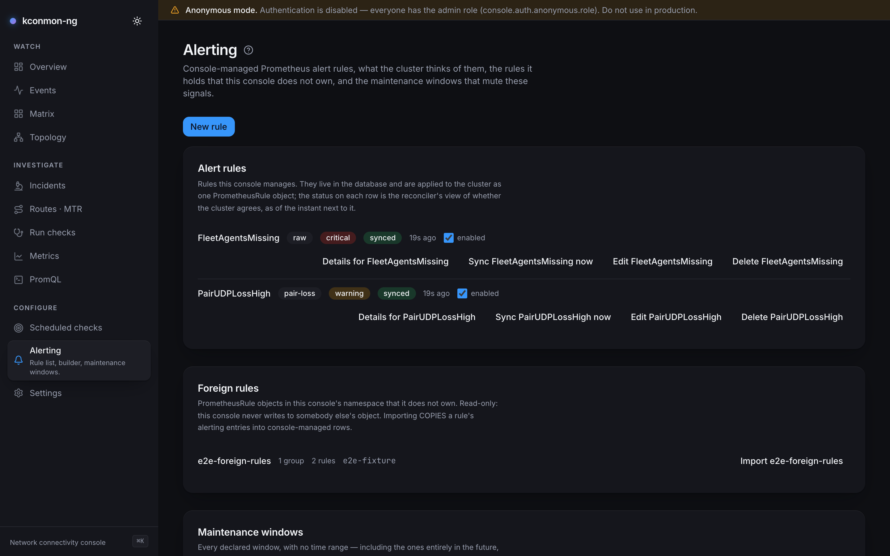
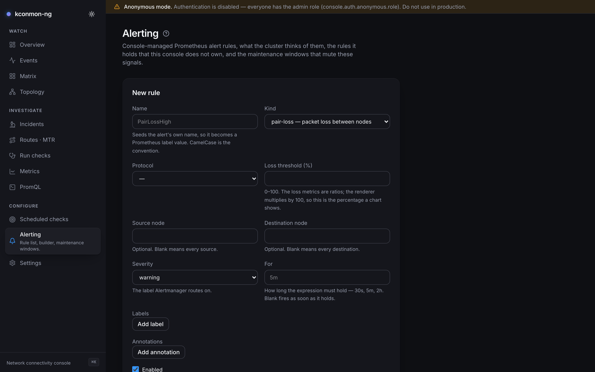

# Alerting

Console-managed Prometheus alert rules: packet-loss and latency alerts without writing PromQL, plus the cluster's view of them. Three sections on one page: **Alert rules**, **Foreign rules**, **Maintenance windows**.

Reading needs `alerts:read`, which every built-in role holds. Managing rules needs `alerts:manage`, held by **operator**, **alert-editor** and **admin**; viewer reads only. (The alert-editor role exists for exactly this page; alerting is its charter.)

<figure markdown>
{ loading=lazy }
<figcaption>The rules list with all three sync verdicts on display, foreign rules beneath, and the unbounded maintenance-window list at the bottom.</figcaption>
</figure>

## How rules reach the cluster

Rules live in the console database. A reconciler renders every *enabled* rule and applies the result to the cluster as **one PrometheusRule object**, named by `console.alerting.bundleName` (default `kconmon-ng-console-rules`), in `console.alerting.namespace` (empty means the release's own), all rules in a single group `kconmon-ng-console`, labelled `app.kubernetes.io/managed-by: kconmon-ng-console`. The apply is a server-side apply under that same field manager, forced, which is correct precisely because the object is the console's end to end.

The whole machinery is **off by default** (`console.alerting.enabled`), because enabling it lets the console write a cluster object. With it off, rules still save to the database and sync actions answer "Prometheus rule sync is disabled".

When on, the reconciler runs immediately at startup, then on every `console.alerting.syncInterval` (default 60 s, jittered ±20%), and on every kick: saving a rule nudges it without waiting out the loop, and *Sync now* on a row requests a pass the same way. With several console replicas, one pass runs at a time behind an advisory lock.

## Sync status

Each rule row shows its enabled state and the reconciler's verdict as of the stamped instant:

| Status | Meaning |
| --- | --- |
| **unsynced** | Not yet applied. Every freshly created or edited rule starts here; it is not an error. |
| **synced** | The cluster object matches this rule. |
| **drift** | Past tense: the cluster *had* diverged as of the stamp, and the pass corrected it. A reconcile always re-asserts the console's bytes, so drift never means "diverged right now and left alone". |
| **error** | The last reconcile failed; the row carries the message, whose first token is a cause class: `crd-missing` (the Prometheus Operator CRD is not served), `forbidden` (the ServiceAccount may not write PrometheusRules), or `other`. The first two are fixable by applying a manifest, which is why they get names. |

Drift is detected mechanically: each pass fetches the live object, diffs it against what the console would render, records the difference on the affected rows, then applies regardless.

Row actions: *Details* (rendered expression, `for` duration, last-applied stamp), *Sync now*, *Edit*, *Delete* (with confirm).

## The rule builder

<figure markdown>
{ loading=lazy }
<figcaption>Building a pair-loss rule: the preview renders the expression and counts matching series before anything is saved.</figcaption>
</figure>

**New rule** opens the builder. *Name* seeds the alert's own name, so it must fit in a Prometheus label value (1–63 bytes); CamelCase is the convention. *Severity* (`info` / `warning` / `critical`) is the label Alertmanager routes on; a fourth value would route nowhere. Extra *Labels* and *Annotations* land on the rendered alert, with two reserved names: `severity` and `kconmon_ng_rule_id` are stamped by the renderer, and supplying either is an error rather than a silent override.

*For* takes Prometheus duration grammar: a number and a unit (`30s`, `5m`, `2h`), units `ms s m h d w y`, composites running largest unit to smallest (`1h30m`). Blank fires as soon as the expression holds. The ceiling is about 292 years, which is not a round number and not the console's: it is where an int64 of nanoseconds ends, which is what Prometheus stores a `for` in.

### Rule kinds and their parameters

Each kind is a template the server renders into PromQL; the parameter set per kind is closed, and an unknown key is a 422, never a default. Every `rate()` below runs over a 5-minute window.

| Kind | Parameters | Renders as |
| --- | --- | --- |
| `pair-loss` | `protocol` (tcp/udp/icmp), `thresholdPercent` (0–100), optional `sourceNode`, `destNode` | UDP/ICMP: the packet-loss ratio gauge `× 100 > threshold`. TCP has no loss gauge (a connect probe sends no packet stream), so its loss is the failed share of `tcp_results_total`: `100 × rate(fail)/rate(all) > threshold`, grouped per pair and zone. |
| `zone-latency` | `protocol`, `quantile` (0.5/0.95/0.99), `thresholdMs` (> 0), optional `sourceZone`, `destZone` | `histogram_quantile(q, …)` over the protocol's RTT histogram, grouped by zone pair, `× 1000 > thresholdMs`; the histograms are in seconds, and the renderer converts so the threshold stays in the units the form asked for. |
| `dns-failures` | `thresholdPercent` (0–100) | Failed share of `dns_results_total`, grouped by host, resolver and source, `> threshold`. |
| `http-ttfb` | `thresholdMs` (> 0), optional `url` | `histogram_quantile(0.95, http_ttfb_seconds_bucket)` (the quantile is fixed) `× 1000 > thresholdMs`, grouped by URL and source. |
| `agent-missing` | none (the form says so: how long the condition must hold is the rule's own `for`) | `registered_agents < expected_agents`, the controller's two gauges compared. |
| `external-target-down` | optional `targetName` | `rate(external_results_total{result="fail"}) > 0` per target and source. A probe the allowlist refused increments a separate denied counter, so refusals never fire this. |
| `raw` | `expr` | Stored verbatim, whitespace included; validity is what the preview reports. Prototype on the [PromQL](promql.md) page first. |

The **Preview** panel renders the expression and evaluates it: "Matches {series} series right now". Zero gets its own sentence saying that is the answer, not a failure. An expression Prometheus refuses **blocks saving**, because a bad entry in the bundle would stop the *other* rules from being applied too; the same check runs server-side at write time, so an unrenderable rule is a 422 naming the parameter instead of a stored row that fails a minute later.

## Foreign rules

PrometheusRule objects in the console's namespace that it does not own. Read-only, since the console never writes to somebody else's object, with an *Import* action that **copies** a rule's alerting entries into console-managed rows. Every adopted rule arrives as kind `raw` with the foreign expression verbatim, and the original object is untouched; the page warns that the same alerts then exist twice until their owner removes theirs.

## Maintenance windows

The full list of declared windows, entirely-future ones included: the only unbounded view of them in the console, since the bars beside the charts are cut to what the chart plots. Declaring a window still happens next to the chart it explains, on [Incidents](incidents.md) or [Metrics](metrics.md#annotations-and-maintenance-windows); this list is for finding and removing one, and managing it needs `maintenance:write`.

## Webhooks

With alerting and [webhook endpoints](settings.md#webhooks) both configured, the console polls Prometheus alert state every `console.webhooks.alertPollInterval` (default 30 s) and delivers the edges as `alert.fired` / `alert.resolved`. A failed poll freezes the firing set: nothing resolves while Prometheus is unreachable. The full delivery contract (signatures, retries, replica duplicates, what to deduplicate on) is on [Settings](settings.md#the-delivery-contract).

## Getting here

The [Overview](overview.md)'s *Firing alerts* panel links each firing alert to its rule here (`/alerting?rule=<id>`); firing state itself is read there and in an investigation's timeline, while this page manages the rules. For the walkthrough, see [Set up alerting](../scenarios/set-up-alerting.md). Chart-shipped (non-console) Prometheus rules are documented in [Metrics and alerting](../metrics.md).

<!-- verified against: internal/console/authz/roles.go (alerts:manage on operator L50, alert-editor L73, admin L77),
     internal/console/alerting/render.go (kind schemas, renderers, RateWindow=5m, TTFBQuantile=0.95, reserved labels,
     GroupName, BundleKind, tcp-loss-as-failure-share comment, seconds→ms conversion), internal/console/promrules/
     promrules.go (Run: immediate + jittered interval + Kick, Compare drift diff, cause classes, FieldManager,
     advisory lock), web/src/lib/i18n/dict/alerting.ts (duration.* grammar incl. ~292y, preview.matchesZero,
     form.rejectedBlock, form.noParams), web/src/lib/api-types.ts (AlertRuleKind, AlertSyncStatus drift semantics,
     name ≤63 bytes, render-then-store order), charts/kconmon-ng/values.yaml (console.alerting.* defaults,
     alertPollInterval 30s), internal/console/webhooks/watcher.go (freeze-on-failure). -->
