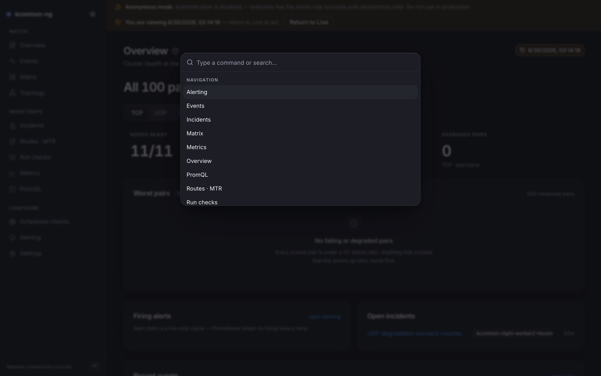

# Command palette

One keystroke to anywhere: two keypresses and a word beat any amount of clicking, and mid-incident it is the fastest route into "run a check" or "start an investigation".

<figure markdown>
{ loading=lazy }
<figcaption>All three command groups, with the Time Machine engaged: write actions stay listed but wear the "Live only" tag.</figcaption>
</figure>

## Opening it

++cmd+k++ (macOS) / ++ctrl+k++, anywhere in the console. The hotkey never steals a keystroke from a field you are typing in, with one deliberate exception: the palette's own input, so the same chord closes what it opened. The [PromQL editor](promql.md) re-binds the key away from CodeMirror's default so it works there too. The sidebar footer shows the hint for your OS ("⌘K — search and commands").

Inside: type to search; ++up++ / ++down++ move, ++enter++ runs, ++esc++ closes.

## The three groups

**Navigation** holds one entry per sidebar page, searchable by its title, its description and its path. The search corpus is bilingual regardless of the interface language: an operator who reads «Матрица» and types "matrix" finds it, and vice versa. The pre-redesign page names (Live, Investigate, Explore, Console, Diagnostics, Targets) also stay in the corpus, because muscle memory keeps typing them; the [old-to-new mapping](overview.md#the-console-chrome) is in the chrome chapter.

**Actions** are deep links to the page that owns the affordance, never inline forms:

| Command | Lands on | Needs |
| --- | --- | --- |
| Run a diagnostic check… | [Run checks](run-checks.md) | `runs:create` |
| Start an investigation… | [Incidents](incidents.md) | — |
| Create an alert rule… | [Alerting](alerting.md) | `alerts:manage` |
| Declare a maintenance window… | [Metrics](metrics.md#annotations-and-maintenance-windows) | `maintenance:write` |
| Add an annotation… | [Metrics](metrics.md#annotations-and-maintenance-windows) | `annotations:write` |

Missing permission and wrong time behave differently, on purpose. An entry whose permission you lack is not listed at all. With the [Time Machine](time-machine.md) engaged, write actions stay visible but disabled, tagged **Live only** — you can see what exists, you just cannot fire it into the past.

**View** holds *Toggle Time Machine — pick a time…* (only while Live, and only on pages that have the picker), *Return to Live* (only while engaged), and *Switch to light/dark theme*. The theme entry's label names the theme it switches **to**, and it is not the only switch: a standing toggle sits at the top of the sidebar, next to the product name.

## How matches are ranked

Each word of your query is scored against every entry, and the entry's best rung wins:

1. The word starts a title.
2. The word sits at a word boundary inside a title ("checks" in "Run checks").
3. The word is a substring of a title.
4. The word sits at a boundary in the keywords (descriptions, paths, old names).
5. The word is a substring of a keyword.

A title hit of any kind outranks every keyword hit, so typing a page's name puts the page above entries that merely mention it. Both languages' titles are scored and the best rung across them counts, and Cyrillic letters are word characters to the boundary check, so the ladder behaves the same in Russian. An empty query lists everything.

## Keyboard surface beyond the palette

The palette is the console's only global keyboard surface; pages do not define single-letter shortcuts. Two page-local bindings exist and are documented on their pages: ++cmd+enter++ / ++ctrl+enter++ runs a query in the [PromQL editor](promql.md), and ++ctrl++ plus the wheel zooms the [Matrix](matrix.md) grid.

<!-- verified against: web/src/lib/commands.ts (scoring ladder TITLE_START/TITLE_BOUNDARY/TITLE_SUBSTRING/
     KEYWORD_BOUNDARY/KEYWORD_SUBSTRING, WORD_CHAR incl. Cyrillic, searchTitles both languages, empty query scores 1),
     web/src/lib/commands.test.ts (ranking fixtures), web/src/components/command-palette.tsx,
     web/src/lib/i18n/dict/palette.ts, web/src/components/theme-toggle.tsx + app-sidebar.tsx (standing toggle,
     footer kbd hint). -->
