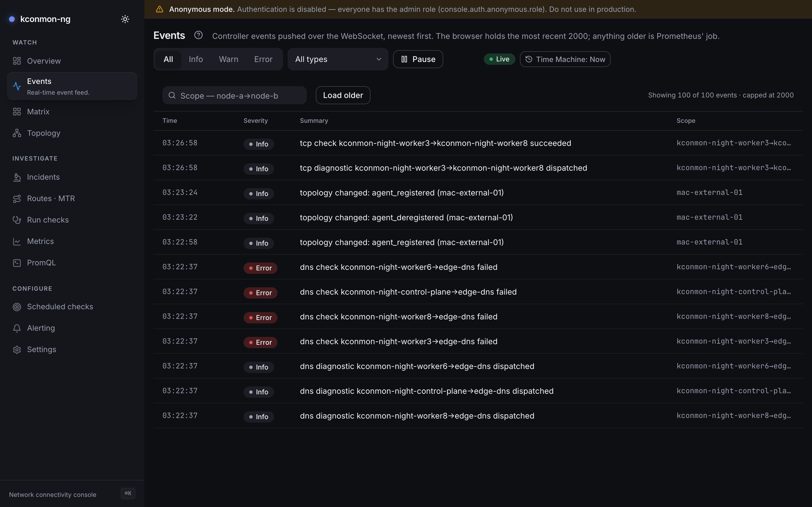
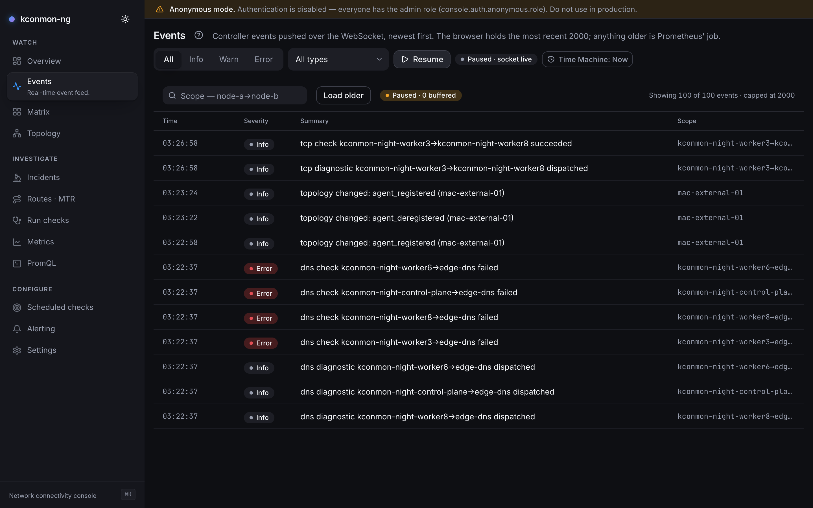

# Events

The controller's event feed, newest first: restarts, readiness flaps, check observations, reactive traceroutes, in the order the controller saw them. When you need the raw record of what happened around 14:32, this is it.

<figure markdown>
{ loading=lazy }
<figcaption>The live feed: severity badges, an operator note interleaved at its own timestamp, and "Showing X of Y · capped at 2000".</figcaption>
</figure>

## How the feed is fed

Live, events are pushed over a WebSocket (topic `live` on `ws(s)://<console-host>/ws`); the header carries a **Live** badge while the stream is up and **Delayed data** when it is not (the [badge's semantics](overview.md#the-console-chrome) are chrome-wide). The browser keeps the most recent **2 000** events in a ring. Anything older is served from event history (`GET /api/v1/events`), which exists only when the console has a database (Helm: `database.existingSecret`, see [Enable the console](../getting-started/enable-the-console.md)).

The stream is sequenced. Every event carries a per-topic sequence number, so the tab can detect holes: a gap in the numbering means something went missing between the controller and this tab, and the feed says how many events *may* have been lost, with a "Why?" disclosure explaining the two causes (numbering holes, and frames a hidden tab dropped because the browser gave it nothing to render in). If the socket drops, the client reconnects with exponential backoff from 1 s up to 15 s and resubscribes with its last-seen sequence number, so the hub replays what the tab missed. That cursor is only honoured by the replica that issued it; after a console rollout the new replica's numbering starts fresh, the cursor is ignored rather than misapplied, and the gap is reported instead of papered over.

With the [Time Machine](time-machine.md) engaged the live tail is off: the feed becomes scrollback ending at the viewed instant, and **Load older** walks back from there.

## Reading the feed

Columns: **Time**, **Severity**, **Summary**, **Scope**. There is no Type column, because the summary opens with the type's own words. Severities are **Info**, **Warn**, **Error**; an unknown wire value still renders raw, since the feed never hides an event it cannot classify.

Operator [annotations](metrics.md#annotations-and-maintenance-windows) are interleaved at their own timestamp with a **Note** badge (ranged ones read *Annotation (span)*). They are not events and the event filters do not touch them.

The **Type** filter offers, besides *All types*:

- **Topology changed**: a node or agent joined, left, or changed readiness.
- **Check observed**: a scheduled or continuous check produced a result worth reporting.
- **MTR triggered**: a probe failure fired a reactive traceroute (see [Routes · MTR](routes-mtr.md#reactive-vs-manual-traces)).
- **MTR completed**: that trace finished and its path was recorded.
- **Diagnostic progress**: a run started from [Run checks](run-checks.md) reported progress.

Filtering: **Severity** and **Type** selects (both default *All*), and **Scope contains**, a case-insensitive substring match on the event's scope. Pair input is normalised, so `node-a->node-b`, `node-a => node-b` and `node-a > node-b` all match the same pair. **Clear filters** resets all three.

**Pause** buffers arrivals ("Paused · 3 buffered") while the badge keeps saying whether the socket is alive; **Resume** drains the buffer into the feed. The counter line reads "Showing {shown} of {held} events · capped at 2000".

<figure markdown>
{ loading=lazy }
<figcaption>Paused with a live socket: arrivals buffer instead of scrolling, and the gap warning explains itself.</figcaption>
</figure>

**Load older** pages history back through `GET /api/v1/events`. When the 2 000-event ring is already full it refuses instead of spending a round trip on rows it would have to drop: "The buffer is full at {cap} events. Older ones cannot be added without dropping newer ones; narrow the filters or reload to start a fresh buffer."

## When the feed degrades

Three distinct cards, three distinct fixes:

**"This replica is not receiving the controller event stream."** The feed is not broken, it is unfed: no events will arrive here while that holds, Matrix and Topology fall back to 15 s polling, and the feed resumes on its own within 15 s of the stream coming back. What to check, in order:

1. `controller.events.enabled` in the Helm values: the domain event stream is **off by default**.
2. Whether the controller actually restarted after you flipped it. Before chart 2.0.3 a values change updated the ConfigMap under a running controller that reads it once at startup, so the stream stayed configured-but-never-started and nothing anywhere logged an error; 2.0.3 added a `checksum/config` annotation so a values change rolls the pods. On an older chart, `kubectl rollout restart` the controller yourself.
3. Replica topology: the stream is served by the controller **leader** only, and with several console replicas each connects independently, so one replica can be fed while another is not.

**"The live topic was rejected."** The WebSocket subscription itself was refused: topics are authorization-gated server-side, and a session whose role lacks the matching read permission cannot subscribe (`events:read` alone does not grant the topology or matrix topics either). This is a permissions conversation, not a networking one.

**"Event history is unavailable."** The history half failed or there is no database; the live half keeps working off the socket regardless.

## Getting here

*open Live* on the [Overview](overview.md) lands here, and event rows appear as timeline entries in [Incidents](incidents.md) whenever their scope matches.

<!-- verified against: web/src/pages/live.tsx, web/src/lib/i18n/dict/live.ts (loadOlder.atCap, missed.title.*,
     noRealtime.*, topicError.*, history.*, counts), web/src/lib/ws.ts (per-topic seq, epoch guard, RECONNECT_MIN/MAX
     1s..15s, resume with lastSeq), charts/kconmon-ng/values.yaml L233-235 (controller.events.enabled, leader-only),
     RELEASE_NOTES.md v2.0.3 (checksum/config fix), internal/console/httpapi/ws_authz_test.go (topic authz). -->
