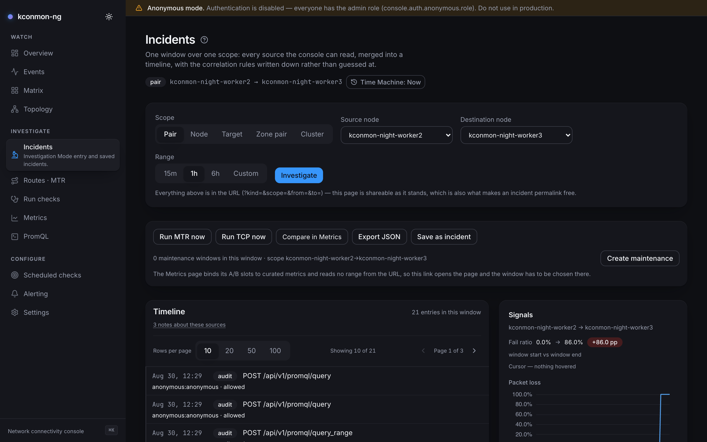
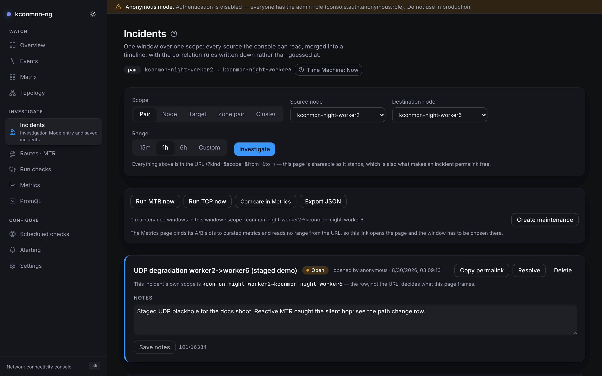

# Incidents

Investigation Mode: one window over one scope, with every source the console can read merged into a single timeline and the correlation rules written down rather than guessed at. A pair went bad at 14:32; this page puts probes, fleet events, Kubernetes events, config changes, route changes and alerts on one axis so you can see what moved first.

<figure markdown>
{ loading=lazy }
<figcaption>A pair investigation: the timeline mixes event, k8s, audit, path-change, threshold and alert rows; Likely causes ranks candidates with their weights.</figcaption>
</figure>

## Scope and window

The entry form commits two things:

- **Scope kind**: *Pair*, *Node*, *Target*, *Zone pair*, or *Cluster*.
- **Range**: the presets `15m` / `1h` / `6h`, or *Custom* with explicit start and end.

Everything lands in the URL (`?kind=&scope=&from=&to=`), which is what makes an investigation shareable and an incident permalink free: copy the address, everything travels. A link with unreadable parameters degrades loudly — the page names the keys it could not read and corrects the address bar.

## The timeline and its sources

The centre pane merges every readable source. Row badges: fleet **event**, **k8s** event, **audit** row, **annotation**, **maintenance** window, diagnostic **run**, MTR **path change**, derived **threshold** crossing, and firing **alert**.

Every absent, bounded or failed source gets one disclosure line naming the source, why it contributed nothing, and where the answer is bounded rather than absent, exactly what the bound is. The bounds, with their numbers:

- **Audit rows** are the newest **200** fetched and filtered client-side. `GET /api/v1/audit` has no time filter, so a busy console can push older in-range rows off that page, and there is no scope filter either, so these rows are every subject's requests, not just this pair's.
- **Fleet events** and **Kubernetes events** are fetched up to 200 per source for the window.
- **Runs** come from a client-side scan of the 20 most recent, the same bound the [object pages](pair-and-node-pages.md) disclose.
- **Path changes** need a pair, node or target scope, because `GET /api/v1/mtr/snapshots` requires a source and destination.
- **Firing alerts** are only the rules this console manages, and only the set firing *now*, since Prometheus keeps no firing history.

Sources gate individually on `events:read`, `audit:read`, `annotations:read`, `mtr:read`, `runs:read`, `maintenance:read`, `alerts:read` and `promql:query`, and most need the database.

**Where the k8s rows come from.** The console runs its own watcher that captures cluster events into the database and serves them back through `GET /api/v1/k8s-events`. It is off by default (`console.kubernetesContext.enabled` in the Helm values), because enabling it adds apiserver egress and an RBAC grant; it watches one namespace (empty means the release's own) with a 10-minute relist backstop against a silently wedged watch.

## Pinned findings and notes

Timeline rows can be **pinned** (needs `incidents:write`) into a *Pinned findings* pane, each with a "why this matters" note. Three row classes cannot be pinned (maintenance windows, threshold crossings and firing alerts), and the pane explains why instead of hiding the control.

Below the causes panel sits a separate **Notes on this scope** card. It is the annotation surface for the investigated scope, frozen to the investigation window: the notes operators dropped on this object during this period, with the same *＋ annotate* control the [Metrics](metrics.md#annotations-and-maintenance-windows) page carries. Pinned findings belong to an incident; these notes belong to the scope.

## Likely causes

The panel ranks candidate rows by how close they sit before the detected onset. The method is four arithmetic steps, no model, and the panel links its own scoring source:

1. **Onset** is the earliest non-info threshold crossing in the window: loss above 1%, or RTT above twice the range median. No onset in range means nothing is ranked: a ranking needs an anchor, and the page will not invent one.
2. **Candidates** are rows in the **5 minutes** before the onset. Long enough to catch a rollout that started before the probes noticed; short enough that an unrelated change an hour earlier cannot claim credit.
3. **Weights** by row kind: path change 3, k8s event 3, fleet event 2, audit row 2, maintenance window 1, everything else 0. A maintenance window scores low deliberately, because it *explains* a degradation rather than implicating anyone. Read-only audit rows are excluded outright: the audit log records authorization decisions, so without that rule the console's own GETs (including the two PromQL queries this very page fires to draw its charts) would arrive as weight-2 "config changes" and out-rank the real causes.
4. **Score** decays linearly across the window: `weight × (1 − delta/window)`. Linear rather than exponential because it is the shape you can verify by eye against the "{delta}s before the onset · weight {weight}" label on each candidate.

## Working an incident

The actions rail: **Run MTR now**, **Run TCP now** (both start a run via `POST /api/v1/runs`, needs `runs:create`), **Compare in Explore** (opens [Metrics](metrics.md); its A/B slots stay bound to curated metrics, so the window is chosen there), **Export JSON**, **Save as incident**, **Create maintenance**.

**Export JSON** downloads the whole investigation, not just the pins: the committed parameters (kind, scope, from, to), every assembled timeline entry (timestamp, kind, severity, title, detail, reference), and the ranked causes with their scores. The filename is derived from the window start, with the ISO colons made filesystem-safe.

**Save as incident** (needs `incidents:write`) stores the scope, window, title and notes; a zone-pair or cluster scope saves as the *global* scope and the dialog says so. A saved incident gets a permalink, `/investigate?incident=<id>`, and reopening it shows the incident strip: status (*Open* / *Resolved*), *Copy permalink*, *Resolve* / *Reopen*, *Delete* (with confirm), and editable notes. Open incidents also surface on the [Overview](overview.md#firing-alerts-open-incidents-recent-events). An incident permalink carries only `?incident=<id>`; the stored row, not the URL, decides what the page frames.

<figure markdown>
{ loading=lazy }
<figcaption>An incident reopened by its permalink: the strip carries status, sharing and lifecycle actions above the frozen investigation.</figcaption>
</figure>

## Getting here

Every *investigate* affordance in the console lands here pre-scoped: [Overview](overview.md)'s worst-pair and alert rows, [Matrix](matrix.md) cells, and the object pages' entry points. For a worked example, see [Diagnose a slow pair](../scenarios/diagnose-a-slow-pair.md).

<!-- verified against: web/src/pages/investigate.tsx (AUDIT_SCAN_LIMIT=200, EVENT_LIMIT=200, RUN_SCAN_LIMIT=20,
     downloadJson/exportFileName/buildExportPayload, notes card L2281), web/src/lib/investigation.ts (CAUSE_WEIGHTS,
     DEFAULT_CAUSE_WINDOW_SECONDS=300, rankCauses linear decay, readOnly exclusion, anomalyOnset),
     web/src/lib/investigation-sources.ts (source bounds, exportFileName, buildExportPayload, READ_ONLY_AUDIT_POSTS),
     web/src/lib/i18n/dict/investigate.ts (source.*, notes.*, pin gating), web/src/lib/api.ts getK8sEvents,
     internal/console/httpapi/server.go L415 (GET /api/v1/k8s-events), charts/kconmon-ng/values.yaml
     console.kubernetesContext (enabled off by default, namespace, resyncInterval 10m). -->
