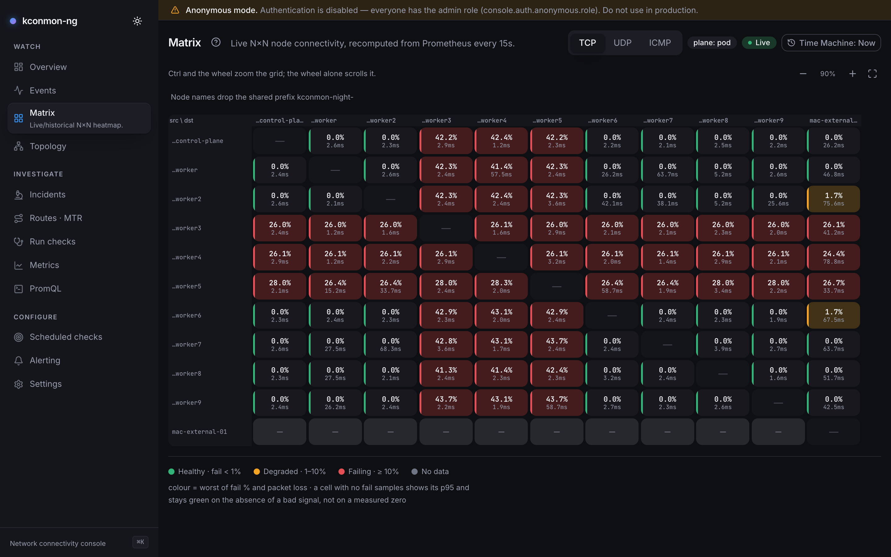
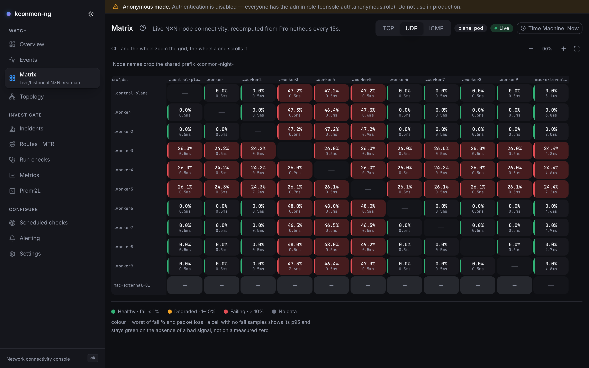

# Matrix

The N×N connectivity heatmap: one cell per directed pair, source rows × destination columns, the corner header reading `src \ dst`. When one node's row or column lights up, you can tell a source-side problem from a destination-side one at a glance.

<figure markdown>
{ loading=lazy }
<figcaption>TCP matrix with one source node failing: its whole row is red, and the tooltip on a cell shows failure ratio, RTT p95 and packet loss.</figcaption>
</figure>

## Reading the heatmap

Each cell prints the pair's failure percentage and its p95 RTT; UDP and ICMP cells add a second line with packet loss ("loss {ratio}"). Hovering opens a tooltip with **Failure ratio**, **RTT p95** and, where measured, **Packet loss**.

Colour is the worst of failure ratio and packet loss:

| Colour | Meaning |
| --- | --- |
| Green | **Healthy · fail < 1%** |
| Amber | **Degraded · 1–10%** |
| Red | **Failing · ≥ 10%** |
| Grey | **No data** — nothing probed this pair |

This page is the canonical home of the console's no-data rule, which every other surface links back to: **silence is never rendered as a zero.** A pair nothing probed is grey and reads "no data". A pair whose failure counter emitted no samples while its RTT did is a different fact: the cell keeps its p95, its second line reads *no fail data*, and it stays green on the absence of a bad signal rather than on a measured zero. A tooltip on such a cell says "no samples" where the ratio would go. The same two readings appear on the [pair and node pages](pair-and-node-pages.md) and feed the measured/scored split on [Overview](overview.md#the-health-statement).

<figure markdown>
{ loading=lazy }
<figcaption>UDP view: cells carry a loss line, a grey cell marks a pair nothing probed, and "no fail data" marks a silent failure counter next to a live p95.</figcaption>
</figure>

## Controls

- **Protocol** switch: **TCP**, **UDP**, **ICMP**. The choice travels in the URL (`?protocol=`), so a matrix view is shareable as it stands, and `?protocol=udp` in a pasted link selects UDP on arrival.
- **Zoom** cluster: *Zoom in*, *Zoom out*, *Fit to view*, with the current level shown as a percentage. ++ctrl++ plus the mouse wheel zooms the grid; the wheel alone scrolls it. Zoom walks fixed steps from 40% to 150% rather than a continuous scale, so a size you liked is a size you can get back to. The 40% floor is deliberate: below it a cell is smaller than the smallest legible figure, and shrinking further would trade a grid you cannot fit for a grid you cannot read. At the floor the container pans instead.
- When all node names share a prefix, the grid drops it and says so ("Node names drop the shared prefix …").

## Cell states

- **Diagonal**: "{node}: self"; a node never probes itself.
- **Measured cell**: click to open [Incidents](incidents.md) scoped to that pair ("Investigate {src} → {dst}").
- **Unmeasured cell**: "No probe data in Prometheus for this pair."
- **Row/column header**: click to open that node's [node page](pair-and-node-pages.md).

Both kinds of link carry `?at=` while the Time Machine is engaged.

## Where the grid comes from

The header also shows a **plane: pod** chip. It states which network plane these probes travel: the pod network, the only plane this release ships (the [Plane field on Scheduled checks](scheduled-checks.md#the-definition-form) is the same fact from the configuration side; the API answers 400 for any other value).

Live, the grid arrives two ways. On a replica receiving the controller event stream, whole matrices are pushed over the WebSocket as snapshot frames on the topic `matrix:<protocol>:pod`; every frame carries the complete grid, so a reconnect needs no replay. Without the stream, the page polls `GET /api/v1/matrix` every 15 seconds; either way each update replaces the grid wholesale, and the server computes it from Prometheus. With the [Time Machine](time-machine.md) engaged, the page skips that endpoint and evaluates the same PromQL directly at the viewed instant.

## When series are missing

The 2.2.0 cardinality valve (`agent.metrics.detail` in `charts/kconmon-ng/values.yaml`) is a scrape-time relabeling, and this grid reads Prometheus, so the valve decides what a cell can show:

- `counters-only` drops the four per-pair histograms (TCP connect, TCP total, UDP RTT, ICMP RTT). Every cell's p95 line goes dark while the failure percentage and loss survive, since counters and gauges stay. A grid that is coloured normally but shows no RTT anywhere is this mode, not a bug.
- `zone-only` drops every series naming a destination node. The whole per-pair mesh blanks: every cell grey, "no probe data". The zone-level families the mode keeps are not drawn here.

A dark p95 column usually gets diagnosed on this page first, which is why the note lives here; [Overview](overview.md#when-series-are-missing) and [Metrics](metrics.md) describe the same modes from their side.

<!-- verified against: web/src/pages/matrix.tsx, web/src/lib/i18n/dict/matrix.ts (plane chip L39, legend, empty states),
     web/src/lib/matrix-zoom.ts (ZOOM_STEPS 0.4..1.5, MIN_ZOOM floor comment), web/src/hooks/use-matrix.ts
     (matrixTopic, MATRIX_POLL_MS=15s, push-over-cache), web/src/lib/ws.ts L52-56 (isSnapshotTopic),
     internal/console/httpapi/data.go handleMatrix (plane=pod only; matrix.Compute against Prometheus),
     web/src/lib/matrix-promql.ts (engaged path), charts/kconmon-ng/values.yaml L159-174 + docs/metrics.md L458
     (the four per-pair histograms), RELEASE_NOTES.md v2.2.0. -->
