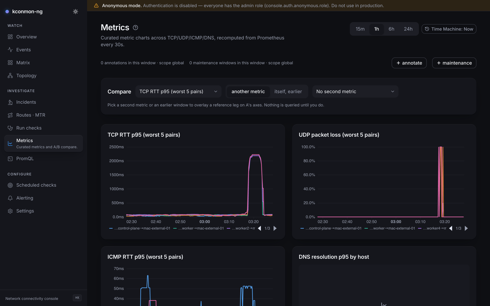

# Metrics

Curated metric charts: the fleet's key series over time, compared with each other or with an earlier window. This is trend context, the page you open when the question is "what did this look like an hour before the alert".

!!! note
    This chapter documents the console's **Metrics** screen. The reference for the exported Prometheus metrics and the chart-shipped alert rules is [Metrics and alerting](../metrics.md).

<figure markdown>
{ loading=lazy }
<figcaption>Compare set to "itself, earlier": solid now against dashed 24 h ago, with the hover cursor crossing all five charts at one instant.</figcaption>
</figure>

## The five charts

- **TCP RTT p95 (worst 5 pairs)**
- **UDP packet loss (worst 5 pairs)**
- **ICMP RTT p95 (worst 5 pairs)**
- **DNS resolution p95 by host**
- **Probe failure rate by protocol**

Each is a fixed PromQL query over the exported `kconmon_ng_*` series; the exact expressions live in [`web/src/lib/curated-metrics.ts`](https://github.com/EsDmitrii/kconmon-ng/blob/main/web/src/lib/curated-metrics.ts), and any of them can be copied onto the [PromQL](promql.md) page and modified freely. An empty chart says so in words: "No series returned for this range — try a longer window above."

A **Time range** switch (`15m` / `1h` / `6h` / `24h`) applies to every chart. Charts poll every 30 seconds through the console's guarded Prometheus proxy (`POST /api/v1/promql/query_range`), with the query step sized for roughly 240 points per series and never finer than 15 s. With the [Time Machine](time-machine.md) engaged, the window ends at the viewed instant and the range is measured back from there.

## The synced cursor

Hover any chart and a vertical time cursor appears on all five at the same instant. The page is the sync group, so a spike on one metric can be eyeballed against its neighbours without lining up pixels by hand. The cursor carries a timestamp, never a pixel position: panels on this page do not share an x-domain (the compare leg below is shifted by hours or days), so each chart converts the instant with its own axis, and the cursor stays truthful across the shift. The same mechanic connects the [Incidents](incidents.md) timeline to its charts.

## Compare

The **Compare** panel overlays a reference leg on metric A's axes:

- **Compare A with**: *another metric* (pick **Metric A** and **Compare with metric**) or *itself, earlier* (**Compare with earlier**: `1h` / `24h` / `7d`). Self-comparison draws "A · now (solid)" against "A · {shift} earlier (dashed)".
- Units are never silently mixed. Comparing a ratio against a seconds axis, the page labels the mismatch and tells you to read the reference leg's shape, not its height.
- A shift past Prometheus's retention answers plainly: "No data {shift} ago — Prometheus's retention does not reach that far back."

## Annotations and maintenance windows

Two bars ride under the charts, scoped to the plotted window. This is the concept's home page; the other surfaces that show them link back here.

- **＋ annotate** drops a note at a moment or over a range ("Rolled the gateway"). Needs `annotations:write`. Annotations appear interleaved in [Events](events.md) with a **Note** badge, as timeline rows in [Incidents](incidents.md), and on the object pages' chart bars.
- **＋ maintenance** declares a maintenance window: start, end, reason. Needs `maintenance:write`. A declared window mutes alert noise attribution and annotates every chart it covers; the full list, future windows included, is managed on [Alerting](alerting.md#maintenance-windows).

Both are create-and-delete surfaces: an annotation or window can be removed (delete asks to confirm), but there is no edit; fix a wrong one by deleting and re-creating it. Both need the database.

## When the p95 charts go dark

Under the 2.2.0 cardinality valve (`agent.metrics.detail`), `counters-only` drops the four per-pair histograms at scrape time. On this page that darkens **TCP RTT p95** and **ICMP RTT p95**, while **UDP packet loss** (a gauge) and **Probe failure rate** (counters) keep drawing — and **DNS resolution p95** survives too, because the DNS family is recorded per host and resolver, not per pair. Under `zone-only` every series naming a destination node is gone; the DNS, HTTP and external families remain. Details on the modes: [Matrix](matrix.md#when-series-are-missing).

## Deep links

- *Compare in Explore* from [Incidents](incidents.md) opens this page; the A/B slots stay bound to curated metrics, so choose the window here. The page says so rather than dropping half the promise.
- The command palette's *Add an annotation…* and *Declare a maintenance window…* actions land here.

<!-- verified against: web/src/pages/explore.tsx (EXPLORE_POLL_MS=30s, TARGET_POINTS=240, MIN_STEP_SECONDS=15),
     web/src/lib/curated-metrics.ts, web/src/lib/i18n/dict/explore.ts, web/src/lib/chart-cursor.tsx (timestamp not
     pixel, page-as-sync-group), web/src/components/page-shell.tsx L10-12, web/src/components/annotations.tsx and
     maintenance.tsx (create + confirm-delete, no edit affordance), charts/kconmon-ng/values.yaml L159-174 +
     docs/metrics.md L458 (which histograms counters-only drops), RELEASE_NOTES.md v2.2.0. -->
