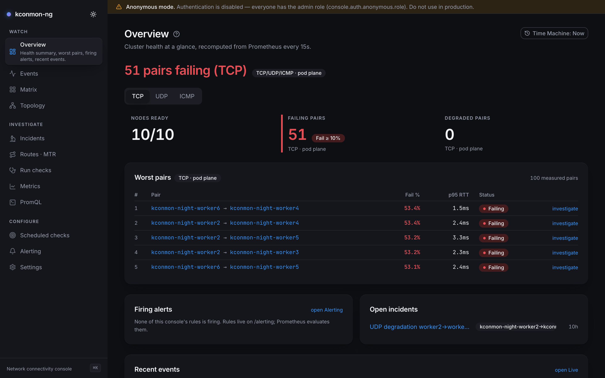
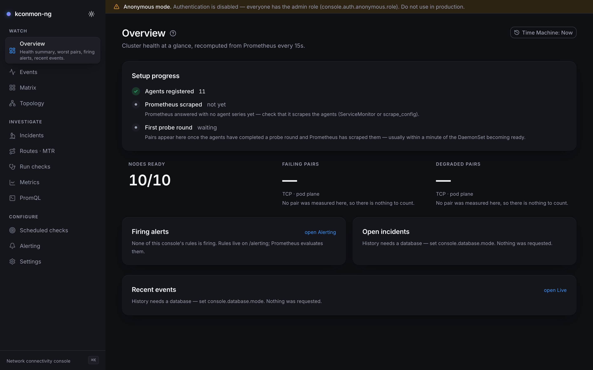

# Overview

The landing page. Before any detail, it gives a verdict: is the fleet healthy right now, and if not, which pairs are the problem? Since this is also the first page of the console guide, the end of this chapter covers [the chrome around every page](#the-console-chrome): the sidebar, the user menu, the command-palette hint and the "?" help buttons.

<figure markdown>
{ loading=lazy }
<figcaption>Overview during an outage: "N pairs failing" in the header, worst pairs ranked, one firing alert in the panel below.</figcaption>
</figure>

Every pair number on this page carries the qualifier **TCP · pod plane**. The numbers rest on one protocol and one network plane, and the qualifier states which: the page summarises the TCP matrix, so a pair failing only on UDP shows up on [Matrix](matrix.md) with the protocol switched, not here. There is exactly one plane in this release; the [Plane field on Scheduled checks](scheduled-checks.md#the-definition-form) explains that scope cut.

While live, the page recomputes from Prometheus every 15 seconds. With the [Time Machine](time-machine.md) engaged nothing refreshes, and the page states cluster health at the instant you are viewing.

## The health statement

The header leads with the verdict in words, computed from the pair matrix: "All 42 pairs healthy", "3 pairs failing", or the scoped variant "All 40 scored pairs healthy" when some measured pairs carry no failure-ratio samples. It only speaks when at least one pair is scored; a health claim needs evidence.

Two words on this page have precise meanings:

- **Measured** means something probed the pair: the cell carries at least one finite sample, whether a failure ratio, an RTT or a packet-loss reading.
- **Scored** means the pair can be ranked: its failure ratio is an actual finite number. This is deliberately stricter than "not null". An absent key arrives as `undefined`, and `NaN` or `Infinity` compare false against every threshold, so any of them counted as scored would pad the healthy total with pairs nobody ranked.

The gap between the two is stated wherever it exists, never smoothed over.

## Cluster health summary

Three stat tiles:

| Tile | Meaning |
| --- | --- |
| **Nodes ready** | Ready nodes out of the Kubernetes node inventory. When the controller has no k8s node view, the tile counts registered agents (or matrix rows) instead and says so; readiness is then unknown. |
| **Failing pairs** | Pairs with a failure ratio **≥ 10%** ("Fail ≥ 10%"). |
| **Degraded pairs** | Pairs with a failure ratio between **1% and 10%** ("Fail 1–10%"). |

On a cluster with no probe data yet the pair tiles show an em dash rather than a `0`. The console never turns "nothing measured" into a measured zero; [Matrix](matrix.md#reading-the-heatmap) is the canonical statement of that rule.

Under the Time Machine, the Nodes-ready tile cannot ask Kubernetes about the past. It is reconstructed by folding stored topology events up to the viewed instant, and it discloses the bounds of that fold when they bite: "The event window was truncated, so this reconstruction is partial", or "{count} events carried no node detail and could not be folded in".

## Worst pairs

The **Worst pairs** table holds at most five rows: scored pairs only, failing or degraded only, ranked by failure ratio with p95 RTT as the tiebreak. Two pairs failing at the same ratio are not equally bad, and the slower one ranks higher. Columns are **Pair**, **Fail %**, **p95 RTT** and **Status** (*Failing* / *Degraded*). The pair name links to that pair's [pair page](pair-and-node-pages.md); each row also carries an *investigate* link that opens [Incidents](incidents.md) pre-scoped to the pair.

When only some measured pairs have a failure ratio, the table says so: "{scored} of {total} pairs have a failure ratio; the rest have no failure samples." An empty list distinguishes three cases: no probe data in Prometheus yet, pairs reporting latency but no failure-ratio samples, and the healthy case where every scored pair sits under a 1% failure ratio.

## Firing alerts, open incidents, recent events

Three summary panels under the table, each with a hard cap:

- **Firing alerts** shows up to **8** firing rules *this console manages* (`GET /api/v1/alerts?managedOnly=true`); beyond that it prints "{count} more firing alerts are not shown here." A quiet list is a fact about this console's rules only — other rules' firing state lives in Alertmanager or Grafana. Needs `alerts:read` and a configured Prometheus, and it is live-only: Prometheus keeps no firing history, so the panel shows nothing under the Time Machine. Each row links to its rule on [Alerting](alerting.md) (`/alerting?rule=<id>`) and offers an *investigate* link.
- **Open incidents** lists the **5** newest open incidents from `GET /api/v1/incidents`, each linking to its [incident permalink](incidents.md#working-an-incident). Needs `incidents:read` and the database.
- **Recent events** shows the **10** newest fleet events from `GET /api/v1/events`, with an *open Live* link to the full [Events](events.md) feed. Needs `events:read`.

## First run

While no pair is measured on a fresh install, a **Setup progress** card replaces the empty state and tracks *Agents registered* → *Prometheus scraped* → *First probe round*. Each unmet step carries a one-line fix, e.g. "Prometheus answered with no agent series yet — check that it scrapes the agents (ServiceMonitor or scrape_config)."

<figure markdown>
{ loading=lazy }
<figcaption>Fresh install, nothing probed yet: the Setup progress card names the next step, and the pair tiles refuse to print a zero.</figcaption>
</figure>

## When series are missing

Since 2.2.0 the chart carries a scrape-time cardinality valve, `agent.metrics.detail` (`full` | `counters-only` | `zone-only`, `charts/kconmon-ng/values.yaml`). It changes what this page can compute:

- `counters-only` drops the four per-pair histograms at scrape time. The failure counters stay, so the health statement, the tiles and the worst-pairs ranking keep working, but the **p95 RTT** column goes dark and the RTT tiebreak has nothing to break ties with.
- `zone-only` drops every series naming a destination node. No pair is measured at all from this page's point of view, and it renders as a fleet with no probe data.

The same valve shapes [Matrix](matrix.md#when-series-are-missing), [Metrics](metrics.md) and the [pair and node pages](pair-and-node-pages.md).

## Deep links

- Pair name → `/pairs/<source>/<destination>` ([pair page](pair-and-node-pages.md))
- *investigate* (worst pair or firing alert row) → [Incidents](incidents.md) scoped to that pair or alert
- *open Alerting* → [Alerting](alerting.md); *open Live* → [Events](events.md)

All links carry the current `?at=` instant when the Time Machine is engaged.

## The console chrome

Everything below wraps every page in the console; it is described once, here.

**Sidebar.** Twelve pages in three groups, and the grouping is the intended workflow: **Watch** (Overview, Events, Matrix, Topology) for standing awareness, **Investigate** (Incidents, Routes · MTR, Run checks, Metrics, PromQL) for digging into a problem, **Configure** (Scheduled checks, Alerting, Settings) for changing what the fleet does. The active entry shows its one-line description under the label; the same description is the hover tooltip and the command palette's search text, kept in one table so they can never disagree.

**Old page names.** A 2.x redesign renamed several pages so no label collides with another surface. The old names still work in the [command palette](command-palette.md)'s search, because muscle memory keeps typing them:

| Old name | Now |
| --- | --- |
| Live | Events |
| Investigate | Incidents |
| Explore | Metrics |
| Console | PromQL |
| Diagnostics | Run checks |
| Targets | Scheduled checks |

**Theme toggle.** Top of the sidebar, next to the product name; its label names the theme it switches *to*. The [palette](command-palette.md) has the same action under View.

**Sidebar footer.** With a signed-in user, the footer shows the **user menu**: display name, the roles the server resolved for you, *Sign out*, and (only with `tokens:manage`) a link to [API token management](settings.md#api-tokens). In anonymous mode the footer is a plain product line instead, since there is nobody to sign out. Beside it sits a `⌘K` / `Ctrl+K` badge: the palette's one visible trace in the chrome.

**Anonymous-mode banner.** When `console.auth.mode` is `anonymous` (the default), a warning banner spans the top of every page: "Anonymous mode. Authentication is disabled — everyone has the {role} role (console.auth.anonymous.role). Do not use in production." It names the actual configured role. [Settings](settings.md#authentication-and-roles) covers the auth modes.

**Live / Delayed data badge.** Pages fed by the realtime stream ([Events](events.md), [Matrix](matrix.md), run permalinks) carry a transport badge. **Live** means pushed WebSocket updates are arriving. **Delayed data** means this console replica is not receiving the controller event stream and has fallen back to REST polling every 15 s — a supported deployment (`controller.events.enabled: false`), not an error, which is why the badge is amber and not red.

**Narrow viewports.** Below 768 px the sidebar becomes a drawer behind an "Open navigation" button, and it closes itself after each navigation.

**The "?" help button.** Every sidebar page has a small `?` after its title. It opens a few sentences of orientation plus a *Learn more* link pointing at that page's chapter in this guide. The URLs are built as `<docs site>/console/<slug>/` from the file names under `docs/console/`, so renaming a file here silently breaks the in-app links. The in-app text is the short form and these pages are the long form; when one changes, check the other (`web/src/components/page-help.tsx` and each page's `help.body` string). Object pages reached by clicking into things (pair, node, target, run) have no help button; their orientation lives on the page that linked to them.

<!-- verified against: web/src/pages/overview.tsx (summarize, compareWorst, isScored, OPEN_INCIDENTS_LIMIT=5,
     RECENT_EVENTS_LIMIT=10, FIRING_ALERTS_LIMIT=8), web/src/lib/i18n/dict/overview.ts (qualifier, health.*,
     setup.*, tiles.nodesReady.bounded.*, alerts.hidden.*), web/src/lib/matrix-cells.ts (isMeasured),
     web/src/components/app-sidebar.tsx (GROUPS, footer, palette kbd), web/src/components/user-menu.tsx,
     web/src/components/anonymous-banner.tsx + dict/chrome.ts (banner.anonymous.*), web/src/components/theme-toggle.tsx,
     web/src/components/realtime-badge.tsx + dict/realtime.ts, web/src/components/page-help.tsx (DOCS_BASE_URL,
     docsConsoleUrl), web/src/components/page-shell.tsx (help prop; detail routes skip it),
     web/src/lib/i18n/dict/chrome.ts (nav renames, M3-8 comment), charts/kconmon-ng/values.yaml L159-174
     (agent.metrics.detail), internal/console/httpapi/data.go L25-31 (reconstruction details).
     APIs: GET /api/v1/matrix, /api/v1/topology, /api/v1/alerts?managedOnly=true, /api/v1/incidents, /api/v1/events. -->
