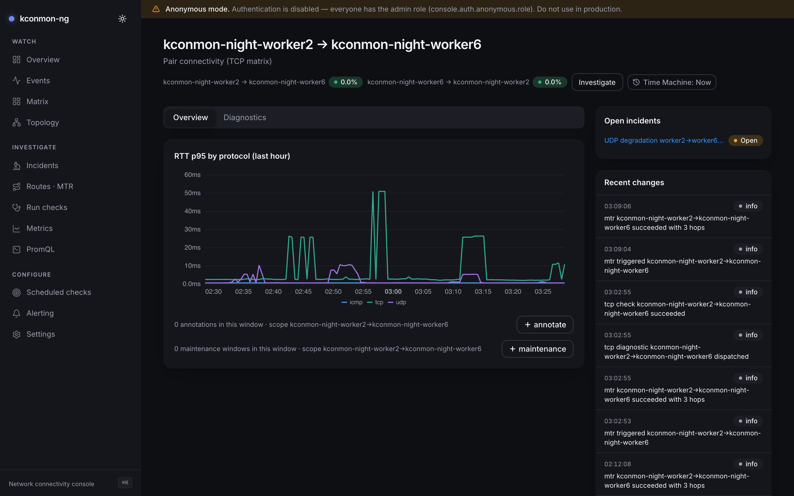
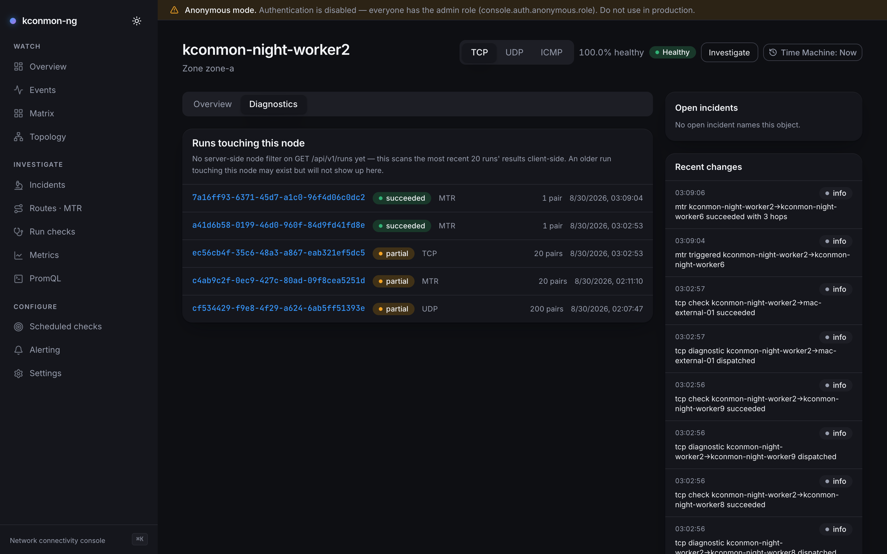
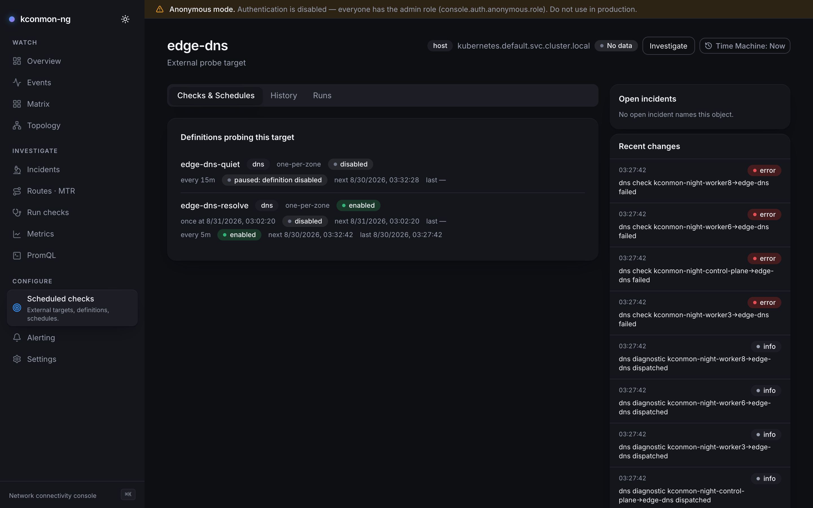

# Pair, node and target pages

The object pages. None of them is in the sidebar; you reach one by clicking the object anywhere in the console. Three of a kind (the **pair page**, the **node page**, the **target card**), each built the same way: an identity header with a health verdict, tabs over the object's own data, and a right rail of related incidents and recent changes. The fourth object page, the run permalink, is covered with [Run checks](run-checks.md#the-run-permalink). All of them honour the [Time Machine](time-machine.md), and none carries the "?" help button; their orientation lives on the pages that link to them.

## The pair page

`/pairs/<source>/<destination>`: one directed pair. The header shows both directed legs as badges, and each badge is a matrix cell's reading — the failure percentage, or *no data* for a pair nothing probed, or *no fail data* for a silent failure counter next to a live p95. That is the matrix's own [two-readings rule](matrix.md#reading-the-heatmap), in the same words.

<figure markdown>
{ loading=lazy }
<figcaption>A pair's Overview tab: the per-protocol RTT chart, with the Overview/Diagnostics strip above it.</figcaption>
</figure>

The header badges read from the **TCP matrix**, and the card says so ("Pair connectivity (TCP matrix)"). The chart below is per-protocol, so the two can disagree: the badge is a matrix cell and the matrix a badge summarises is one protocol's; the chart is a Prometheus query and asks all three. For a per-protocol *verdict* on this traffic, use the protocol switch on the node page or on [Matrix](matrix.md).

Two tabs:

**Overview** holds the **RTT p95 by protocol** chart: one PromQL query pulling the pair's TCP, UDP and ICMP p95 series over the last hour, or the hour ending at the viewed instant. Under it ride the pair's annotation and maintenance bars, scoped to the pair over the same hour. Literally the same resolved window as the chart, anchored once, so the bars cannot drift against what is plotted.

**Diagnostics** holds **Last run for this pair** and a **Run check** button (needs `runs:create`), which starts a TCP run for exactly this source and destination and jumps to its permalink; while the Time Machine is engaged the button is disabled, since a probe started from a view of the past would run now, against the present fleet. The last-run lookup is a client-side scan: `GET /api/v1/runs` has no source/destination filter yet, so the page fetches the 20 most recent runs' details and searches them. The bound is kept small because each candidate costs one extra `GET /api/v1/runs/{id}`, an older matching run may exist without showing here, and the page states both facts. Engaged, the scan also cuts to runs started at or before the viewed instant.

A pair whose endpoints the fleet does not report gets a named 404 ("This fleet has no node called “{name}”") with a *Back to Matrix* link, and it names which half of the URL is the typo. Two design choices behind it: the known-node inventory generously includes both ends of every matrix cell, because a name Prometheus holds a measurement for is a real node whatever the topology lists, and the check runs only while live, since a historical view's inventory is a reconstruction and cannot support the claim "no such node".

## The node page

`/nodes/<name>`: one node, both directions. The header shows the zone, the tier badge, and "{percent}% healthy"; when only part of the evidence is scored, the figure carries its own denominator ("{scored} of {total} pairs scored") rather than presenting a claim about one ninth of the node as a claim about the node.

<figure markdown>
{ loading=lazy }
<figcaption>A node's Diagnostics tab: the protocol switch in the header, and the 20-run scan with its disclosed bound.</figcaption>
</figure>

The header also carries a **protocol switch** (TCP / UDP / ICMP). It changes which matrix the whole card reads: the header's tier and health percentage, and the per-destination table below. The choice is written to `?protocol=`, the same URL key Matrix uses, so the view is shareable and the two surfaces cannot spell it differently. On UDP and ICMP the verdict is worst-of failure ratio and packet loss, and the breakdown table grows a **Packet loss** column whenever the cells carry loss: the vector that can decide the tier is the vector that gets a column.

Two tabs:

**Overview** holds the identity card and the breakdown.

- **Agent identity**: Zone, Agent ID, Pod IP, Ready. Readiness comes from the Kubernetes node informer, and a registered agent is not evidence of it, so on a fleet with no k8s node view the field stays an em dash and the hover says why. Zone falls back to what the agent registered with, so that field has an answer either way.
- **Per-destination breakdown**: a paged table of the node's outgoing pairs (Destination, linking to the pair page; Fail ratio; Packet loss while measured; RTT p95), using the same *no data* / *no fail data* readings as the matrix.

**Diagnostics** holds **Runs touching this node**: the same 20-run client-side scan as the pair page with the same disclosed bound, listing every run with at least one result on either side of this node.

The right rail holds **Related incidents**, the **Recent changes** feed, and **Annotations** (notes pinned to this node over the last 24 hours plus fleet-wide ones, with the maintenance bar beside them so a node under a declared window does not read as simply broken).

**What feeds Recent changes.** The rail merges two halves. History is the newest **50** events for this object from `GET /api/v1/events`, which needs the database; without one the rail says history requires it and keeps working off the socket. Live events arrive over the WebSocket and are matched client-side with the same filter the server applies. The merged ring is capped at **200** rows. The matching matters: probe results and path changes are recorded under pair scopes ("node-a→node-b"), so the node and target rails match their name on *either side* of a pair scope, not just exact-scope rows. That filter was built for exactly this. Under the Time Machine the rail is bounded to the instant and its header says "up to {at}".

## The target card

`/targets/<id>`: one external target, read-only by design; changing targets happens on [Scheduled checks](scheduled-checks.md). The header shows the name, kind, address, and a health verdict computed by an instant Prometheus query: the success share of `kconmon_ng_external_results_total` for this target over 5 minutes. Under the Time Machine that query's evaluation instant moves, which is what "state as of {at}" means for an instant read.

<figure markdown>
{ loading=lazy }
<figcaption>A target's Checks &amp; Schedules tab: definitions probing this target, one of them with no schedule and only ever run by hand.</figcaption>
</figure>

Access is layered, and each layer says what it gates. `targets:read` (operator and admin; deliberately not viewer, which is the role an anonymous session gets) shows the header. The definitions and schedules below need `checks:read`; a cadence tells you nothing the definition it belongs to does not, so schedules ride the same permission. The card needs the database outright, since targets are configuration; only the History tab needs Prometheus, and the card says the other tabs do not.

Three tabs:

**Checks & Schedules** lists the definitions probing this target (`GET /api/v1/checks?targetId=`, a real server-side filter), each with its check type, source selection, enabled state, and its schedules: cadence, state (including *paused: definition disabled*), next/last stamps, and any failure message verbatim. A definition with no schedule is flagged in words: "No schedule — this definition only runs when someone starts it by hand." The empty state is equally direct: until a definition points here, nothing probes this target on a schedule. Engaged, a notice states that configuration is shown as of now; only the probe series time-travel.

**History** draws **External probe duration p95 by source node**: the last hour (or the hour ending at the viewed instant) of `kconmon_ng_external_duration_seconds` for this target. Duration is the one external metric every check type populates (RTT and loss exist only for ICMP, HTTP status only for HTTP), so the chart works for a plain TCP target instead of rendering "not measured" as an outage. Its empty state lists all four ways an hour can be blank: external checks are off fleet-wide (`checkers.external.enabled`), no enabled definition-plus-schedule points here, probing started too recently for a scrape, or every probe failed. That last one is real: the chart is built from durations, and a probe that never completes records none. Annotation and maintenance bars sit under the chart and work even where the chart cannot, since a provider's maintenance on this target does not depend on Prometheus.

**Runs** lists runs whose *spec* names this target. Ad-hoc runs against the same address never count: an operator-typed address did not go through the targets table. Same 20-run scan, same disclosed bound.

The rail's Recent changes note explains its own filter: probe results are recorded per source node ("node-a→{target}"), so the rail matches the target on either side of a pair scope, alongside changes scoped to the target itself.

A bad link gets the same named-404 treatment as the pair page, with one addition the card admits to: an unknown id and a malformed one look identical from the client (both answer 404), so the card says the target may have been deleted or the id may be a typo, and offers *Back to Targets*.

## Getting there

- [Matrix](matrix.md): row/column header → node page; any cell → Incidents for that pair.
- [Overview](overview.md): pair names in **Worst pairs** → pair page.
- [Topology](topology.md): click a node, or press ++enter++ on it.
- [Scheduled checks](scheduled-checks.md): a target row opens its card.
- [Incidents](incidents.md): timeline rows link back to the objects they name, and every card's header carries an *Investigate* entry going the other way.

<!-- verified against: web/src/pages/pair-card.tsx (TABS L386-389, useMatrix("tcp"), pairSeriesQuery, RUN_SCAN_LIMIT=20
     + cost comment, useWindowAnchor shared hour, knownNodes/unknownPairEndpoints incl. live-only judgement),
     web/src/pages/node-card.tsx (TABS L108-111, Segmented PROTOCOLS L533-539, nodeHealth coverage, BreakdownTable
     loss-column rule, RUN_SCAN_LIMIT=20 L288, zone fallback, readiness informer note, NodeAnnotations 24h),
     web/src/pages/target-card.tsx (three TABS L571-575, targetHealthQuery/targetDurationQuery + why-duration comment,
     gates: targets:read/checks:read/db/prometheus, runsTouchingTarget spec-names-target rule, instant query at `at`),
     web/src/lib/i18n/dict/cards.ts (tab.*, cell.noData/noFailData, pair.description "TCP matrix" L140,
     target.checks.noSchedule, target.history.empty four-way, notFound bodies, scanNote strings),
     web/src/components/recent-changes.tsx (RECENT_CHANGES_LIMIT=50, RECENT_CHANGES_CAP=200, matchesScope
     either-side rule, db-degraded note, upTo header) + web/src/lib/i18n/dict/recent-changes.ts,
     web/src/routes.tsx (route paths). -->
