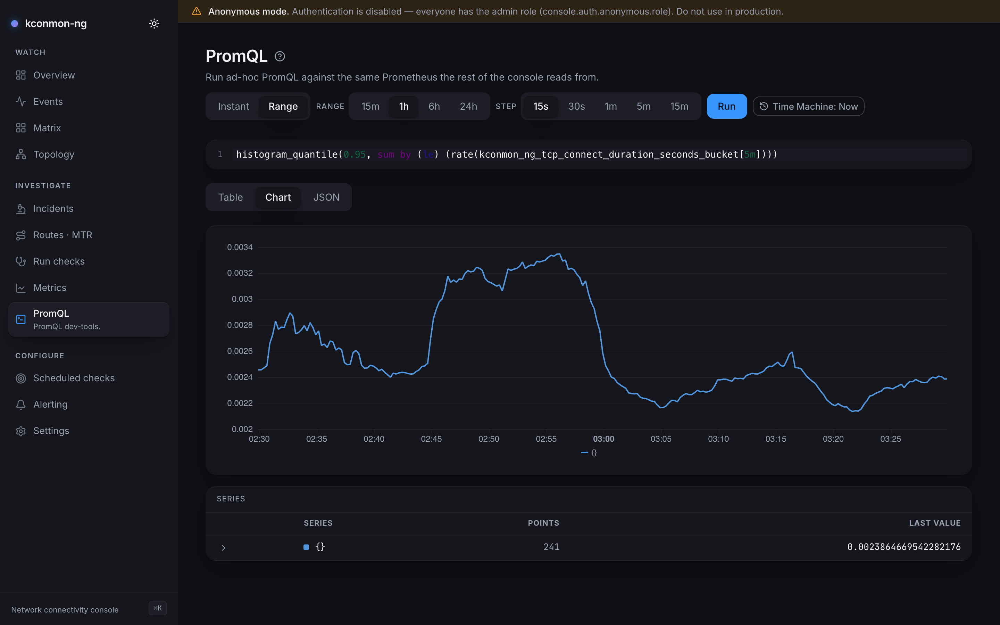

# PromQL

Ad-hoc queries against the same Prometheus the rest of the console reads from. When a curated chart is close but not quite the cut you need, or you are drafting an alert expression and want the series count before saving a rule, write it here and run it — no Grafana required.

<figure markdown>
{ loading=lazy }
<figcaption>A range query charted: the step select preselects a value sized for readable resolution.</figcaption>
</figure>

## The editor

A CodeMirror PromQL editor with three result views under it.

- **Run** executes the query; so does ++cmd+enter++ / ++ctrl+enter++ in the editor.
- **Query mode**: *Instant* or *Range*. Range mode adds **Range** (`15m` / `1h` / `6h` / `24h`) and **Step** (`15s` / `30s` / `1m` / `5m` / `15m`). Unlike [Metrics](metrics.md), the step is yours to control; a suggested step targeting about 240 points per series is preselected.
- The last query is remembered in this browser.
- Inside the editor, ++cmd+k++ / ++ctrl+k++ still opens the [command palette](command-palette.md); the page re-binds it away from CodeMirror's default.

Result views: **Table** (series, last value, point counts; each row expands with *Show all labels* to the full label set, beyond the ones that distinguish the series), **Chart**, and **JSON** (the raw Prometheus envelope). The Chart tab disables itself when the result has no series to draw; the block follows the *result*, not the query mode, so an instant query that returns a matrix still charts. Prometheus's own error text renders verbatim.

With the [Time Machine](time-machine.md) engaged, instant queries are evaluated at the viewed instant and a range ends there.

## Guardrails

Queries go through the console's guarded proxy (`POST /api/v1/promql/query` and `/query_range`), gated on the `promql:query` permission, and the guards answer in words when they bite:

- **Range**: `console.prometheus.maxRange`, default `24h`. A longer range is a 422, "range exceeds maximum".
- **Response size**: `console.prometheus.maxResponseBytes`, default 8 MiB (`8388608`). A result past the cap is a 422 titled "result too large", telling you to narrow the query or shorten the range. High-cardinality selectors over long ranges are what usually hits it.
- **Time**: `console.prometheus.queryTimeout`, default 30 s.
- **Rate**: `console.rateLimit.promqlPerMinute`, default 60 per subject per minute. The proxy forwards arbitrary PromQL to your Prometheus and `promql:query` belongs to the viewer role, so the budget exists. A throttled reply names the knob.

## Useful starting queries

The exported series are documented in [Metrics and alerting](../metrics.md); here are two starting points.

```promql
# TCP RTT p95 per pair over 5m
histogram_quantile(0.95,
  sum by (source_node, destination_node, le)
    (rate(kconmon_ng_tcp_total_duration_seconds_bucket[5m])))
```

```promql
# UDP packet loss ratio per pair (exported as a gauge)
avg by (source_node, destination_node) (kconmon_ng_udp_packet_loss_ratio)
```

The five curated charts on [Metrics](metrics.md) are themselves plain PromQL ([`web/src/lib/curated-metrics.ts`](https://github.com/EsDmitrii/kconmon-ng/blob/main/web/src/lib/curated-metrics.ts)) — copy one here as a starting point.

## Deep links

The *raw* alert-rule kind on [Alerting](alerting.md) stores hand-written PromQL. Prototype it here first; the rule builder's preview runs it through the same proxy, so what evaluates here evaluates there.

<!-- verified against: web/src/pages/promql-console.tsx, web/src/components/promql-editor.tsx,
     web/src/lib/i18n/dict/promql-console.ts (tab.chart.disabled, raw.showFull), internal/console/promql/client.go
     (ErrRangeTooLarge, ErrResponseTooLarge), internal/console/httpapi/data.go (422 mappings, promqlRateLimitDetail),
     charts/kconmon-ng/values.yaml (maxRange 24h, maxResponseBytes 8388608, queryTimeout 30s,
     rateLimit.promqlPerMinute 60), internal/console/httpapi/alertrules.go (preview through the same proxy). -->
