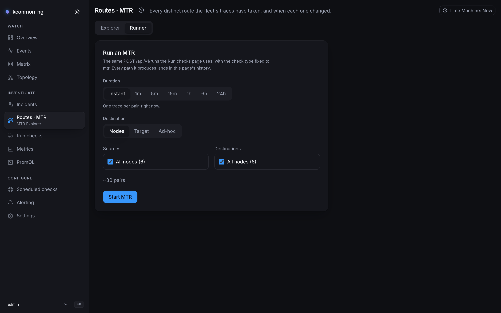

# Routes · MTR

Loss appeared on a pair. Before blaming either endpoint, ask the question this page answers: which routes do packets actually take between these two points, and did the route change when the trouble started? Two views, switched at the top: **Explorer** for the recorded path history, **Runner** for starting new traces.

## Explorer

<figure markdown>
{ loading=lazy }
<figcaption>Explorer: destinations on the left, <code>kc-accept-worker3</code> expanded to its per-source rows, and the chosen pair's path history on the right: the per-plane loss chart with its route marker, then a single route (worker4 → * → 10.244.4.109 → worker3, 2 hops, 2 traces) with a tick box for comparing routes, and the line saying nothing older is retained.</figcaption>
</figure>

Three panes, left to right:

1. **Destinations**: every destination the recorded traces have reached, each card counting distinct paths and total traces ("{paths} · {traces}"). Expanding a destination lists the source nodes that traced it ("from {node}").
2. **Path history**: pick a source under a destination and this pane lists that pair's distinct routes over time, with per-route change summaries ("hop {hop}: {from} → {to}", "hop {hop} added: …", "{count} hops changed") and a *Load older* pager that names the end of retention when it reaches it. Its time axis prints `HH:mm`, and `HH:mm:ss` for a tick between whole minutes.
3. **Trace detail / Path diff**: one route's hops, or, after ticking two routes and pressing **Compare (2/2)**, a side-by-side diff. A third pick replaces the earlier of the two.

The history shows distinct routes, not raw traces: a pair with hundreds of traces may fold down to six paths. Every path change also lands as a timeline row in [Incidents](incidents.md) (kind *path change*), where route flaps can be read against loss.

**What makes two routes "the same path".** A route's identity is a hash over the sequence of hop addresses that answered. Silent hops are skipped, and a trace where *no* hop answered gets a fixed sentinel identity that no real address list can collide with. Latencies never enter the hash. A route is where the packets went; how fast they went varies per trace and is kept on the traces, not the identity.

**How long history is kept.** Path history is a database projection, so it needs the database: without one, a single card in place of both views says so. When the console cannot read its own configuration (`GET /api/v1/config` failed), that card says "Could not read the console configuration, so path history was not requested: {error}" instead. Stored history lives under the same daily pruner as everything else stored: rows older than `database.retentionDays` (default 90; `0` keeps everything) are swept. Reading it needs `mtr:read`, which every built-in role holds, viewer included.

For [Time Machine](time-machine.md) users: the destination and path-history endpoints take no time parameter, so the Explorer stays **live** even while the rest of the console is engaged, and the banner says so rather than implying a cut that never happened.

## Reading a trace

A trace walks up to `checkers.mtr.maxHops` hops (Helm `config.checkers.mtr.maxHops`, default 30, valid 1–64). The hop table shows per-hop addresses with loss and latency statistics per hop. A hop that never answered (`*`) reads a dash in the Loss column, as in its latency columns, rather than a red 100%: no reply there says nothing about loss on the path.

With enrichment enabled, each hop row gains an expandable disclosure with up to three facts about the address: **Reverse DNS**, **Network** (from the MaxMind ASN database) and **Location** (city and country, from the City database). The facts are cached lookups, so a miss is simply an absent line and a partially-known address is a row with holes (a reverse DNS lookup that failed, rather than finding no PTR record, is retried after 5 minutes instead of `mtr.enrichment.ttl`, or after the TTL when that is shorter, whether or not GeoIP answered; the failure is kept in the console's memory, per replica, not in the cache table, so the `resolvedAt` that `GET /api/v1/mtr/snapshots/{id}?enrich=true` returns is the real lookup time, and after a console restart the first view of such a hop asks DNS again); the empty state distinguishes "enrichment is off" from "on, but no source knows this address". Everything is off by default (`console.mtr.enrichment` in the [Helm values](../reference/helm-values.md)) because reverse DNS is an egress footprint: rDNS and GeoIP gate independently, one lookup is bounded to 500 ms, and the GeoLite2 databases come either from a `geoipupdate` sidecar or a volume you mount.

## Reactive vs manual traces

**Reactive.** Agents fire a traceroute automatically when a TCP, UDP or ICMP probe to a peer fails (DNS, HTTP, MTR, path MTU and external failures never trigger one; a trace walks the path with small packets, which is exactly what still crosses an MTU black hole). `checkers.mtr.cooldown` (Helm `config.checkers.mtr.cooldown`, default `60s`) is the minimum interval between traces for the same (source, destination) pair, enforced as a token the trace holds until it finishes. The cooldown exists because a trace is slow by construction (thirty hops at the tracer's timeout is on the order of thirty seconds to an unreachable peer), and it is what bounds how many traces one pair can have in flight. It is per pair, though: an outage that breaks fifty pairs still fires up to fifty traces per cooldown window, one each. Each trace runs in its own goroutine so the probe loop keeps measuring during exactly the outage that triggered it, and a trace that has started is finished and reported even if its probe round ends first. A reactive trace is recorded in the agent's MTR metrics (`kconmon_ng_mtr_triggered_total`, `kconmon_ng_mtr_hops`, `kconmon_ng_mtr_hop_rtt_seconds`, see [Metrics and alerting](../metrics.md#agent-mtr)) and in the agent log (`triggering MTR trace`). It is not an event, and it does not land in this page's path history, which holds the traces the console dispatched itself.

**Manual.** The **Runner** tab is the same `POST /api/v1/runs` the [Run checks](run-checks.md) page uses, with the check type fixed to `mtr`; on-demand traces deliberately bypass the reactive cooldown, since an operator asking explicitly is not a storm. Controls: **Duration** (*Instant* for one trace per pair, or an interval run with the cadence spelled out before you press Start), **Trace interval** (*Auto* or a preset), **Destination** kind (*Nodes* / *Target* / *Ad-hoc*), **Sources** and **Destinations** pickers, and a live "~{count} pairs" estimate. Starting a run needs `runs:create`.

An interval MTR is how you prove a flapping path: a route that alternates shows up as two distinct routes trading places in history, which a single instant trace cannot see.

<figure markdown>
{ loading=lazy }
<figcaption>Runner: an instant run planned across every node the pickers list, with the duration caption and the "~30 pairs" estimate shown before Start.</figcaption>
</figure>

## Deep links

- The Explorer's empty state links to [Run checks](run-checks.md) for starting a first trace.
- Run permalinks link recorded routes back here ("Open in MTR Explorer").

<!-- verified against: web/src/pages/mtr.tsx, web/src/lib/i18n/dict/mtr.ts, web/src/components/mtr-hop-table.tsx
     (enrichmentFacts: rdns/network/location; geoText) + web/src/lib/i18n/dict/mtr-detail.ts (enrichment.empty),
     internal/console/checks/mtrproject.go (TraceFromResult) + internal/console/store HashPath/HashSilentPath,
     internal/console/enrich/enrich.go (ASN/City readers), internal/agent/scheduler.go L255-280 (trigger types,
     TryAcquire cooldown, own-goroutine + WithoutCancel), internal/agent/tasks.go L143 (on-demand bypasses cooldown),
     charts/kconmon-ng/values.yaml (config.checkers.mtr.cooldown 60s, maxHops 30 (1-64), console.mtr.enrichment.*,
     database.retentionDays 90). APIs: GET /api/v1/mtr/destinations, /api/v1/mtr/snapshots, POST /api/v1/runs. -->
