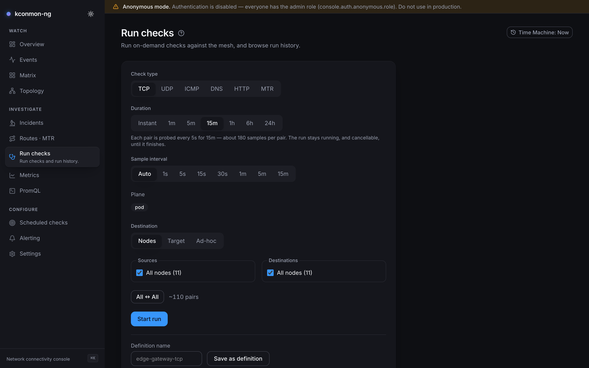
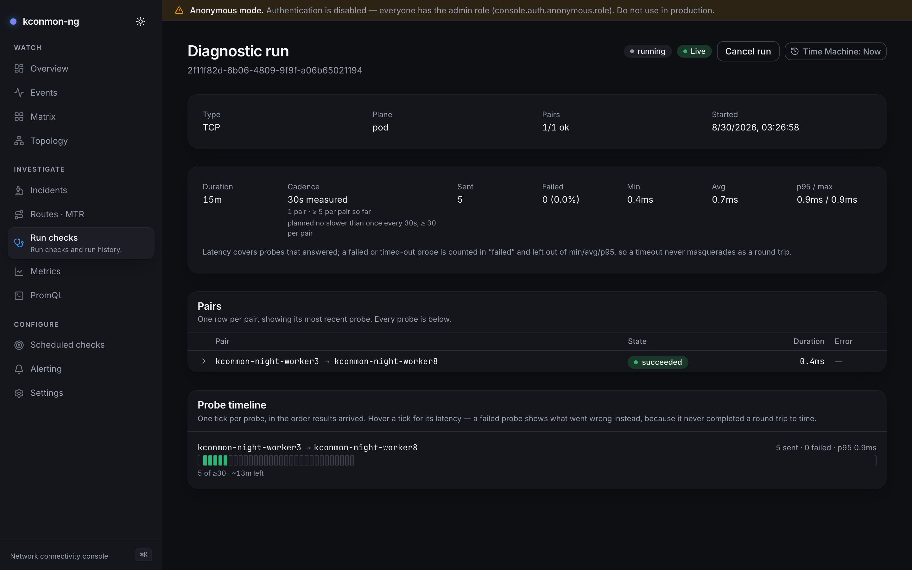

# Run checks

On-demand diagnostics: does this path work right now, from these nodes, with this protocol? A run form sits on top, run history underneath, and every started run gets a permalink page of its own, [documented below](#the-run-permalink), because it is its own screen with its own controls. Starting a run needs `runs:create`; without it the form is replaced by a card and the history stays readable.

<figure markdown>
{ loading=lazy }
<figcaption>An interval run before Start: the caption spells out cadence, length and samples per pair, with the "~N pairs" estimate beside it.</figcaption>
</figure>

## The form

- **Check type**: `tcp`, `udp`, `icmp`, `dns`, `http`, `mtr`.
- **Duration**: *Instant* ("One probe per pair, right now.") or `1m` / `5m` / `15m` / `1h` / `6h` / `24h`. For interval runs the caption spells out the plan before you press **Start run**: probe cadence, run length, expected samples per pair, and that the run stays cancellable throughout. MTR runs plan their own slower cadence, since a trace walks up to 30 hops in sequence. Interval durations are bounded server-side at 10 seconds minimum and 24 hours maximum; the ceiling is a day because "leave it running overnight and show me what happened" is the longest question this tool is for.
- **Sample interval**: *Auto* or a preset. A cadence the server cannot keep is adjusted, and the caption says which limit bit: the 500-samples-per-pair ceiling, or one round over this many pairs cannot finish faster.
- **Plane**: fixed at `pod`. Definitions and runs probe from the pod network; this release ships no second plane, so the field states the scope rather than offering a choice.
- **Destination**: *Nodes* (node picker), *Target* (a saved [external target](scheduled-checks.md)), or *Ad-hoc* (a typed address). Ad-hoc labels adapt to the check type: `tcp` takes `host` or `host:port` (port defaults to 80), `udp` requires `host:port` (there is no default, an address without a port dials nothing), `icmp` and `mtr` take a host only, and `dns`/`http` one-off runs cannot go external at all; the form points you at saving a definition instead, which is the continuous external checker.
- **Sources** / **Destinations**: node pickers, with "All nodes ({count})" as the default and an *All ↔ All* reset.

External destinations must also be allowed fleet-side: `checkers.external.enabled` plus `allowedCidrs` (see [Configuration](../configuration.md)), and the cluster must let the packet out.

**Save as definition** stores the current form as a reusable check definition. It is saved enabled and probing from all agents, which means it starts costing metric series immediately; edit it afterwards on [Scheduled checks](scheduled-checks.md), where the series-projection guard also lives.

## Will a big run melt an agent?

No. Read the throttling model before you point 400 pairs at a small fleet anyway.

The form shows a live "~{count} pairs" estimate, and a run fans out to at most **400 pairs**, enforced server-side on the raw sources×destinations product; anything above is refused up front, and the form warns before you try. Within a run, the dispatcher keeps at most **8** probes in flight, and at most **2** of them against any one source agent. That per-source bound sits deliberately under the agent's own on-demand task semaphore, so a run can never win the race against it: the agent refuses overflow outright rather than queueing it, and a run that raced would turn refusals into failed results.

Each dispatched pair gets a timeout, clamped between 1 s and 120 s, with two raised floors:

- **MTR pairs get at least 90 s.** A trace walks up to 30 hops in sequence and may first wait behind the agent's semaphore; a shorter deadline gives up on work that is still running.
- **UDP pairs get at least 5 s.** The UDP probe waits out a full read deadline per lost packet, so its worst case is packets × timeout: 1.25 s with the chart's defaults, already past the general 1 s floor. A pair losing every packet is exactly the pair the run was started to look at, and without this floor it came back as "dispatch timed out" instead of "100% loss": the measurement replaced by a report that the machinery gave up.

## The run permalink

Every started run lives at `/diagnostics/runs/<id>`: the spec (**Type**, **Plane**, **Pairs**, **Started**), a live summary (**Duration**, **Cadence** — planned vs measured, **Sent**, **Failed**, **Min**, **Avg**, **p95 / max**), a **Live** badge while results are arriving, and a **Cancel run** button while it is in flight.

<figure markdown>
{ loading=lazy }
<figcaption>A run permalink mid-flight: the probe timeline's ticks are clickable, and a recorded route opens in the MTR Explorer.</figcaption>
</figure>

The Pairs table shows one row per pair with its most recent probe ("{ok}/{total} ok"). Expanding a row opens the pair's own record:

- **A probe timeline.** Interval runs draw each pair's probes as ticks on a strip. On an MTR run a tick is clickable ("Show the route this probe took") and opens that probe's route panel, headed "Probe #{seq}". The hops shown belong to the *route*, folded over every trace that walked it, so while the route holds, consecutive probes read the same, and the panel says so rather than letting a strip of identical hop tables read as a stuck control. A probe that failed walked no route at all and says that instead. Recorded routes carry an **Open in MTR Explorer** link into [path history](routes-mtr.md#explorer).
- **A truncation notice, when it applies.** A long interval run records more results than one response can carry, so the page shows the newest slice and states it: "Showing the {count} most recent results — this run recorded more than one page can carry, so the figures above describe that slice, not the whole run." Without that line the summary would be a wrong number wearing a right one's face.
- For non-MTR pairs, the sample's own facts: source, destination, duration, state, and the agent's error sentence in full where there was one.

## Run history

Past runs list under the form with server-side **type** and **status** filters and a *Load older* pager. History needs the database; without one the page says "History is not persisted". Under the [Time Machine](time-machine.md), history is cut to the viewed instant client-side, and the page states the bound: `GET /api/v1/runs` has no time filter, so the cut happens over the loaded pages.

<!-- verified against: web/src/pages/diagnostics.tsx, web/src/pages/run-detail.tsx, web/src/lib/i18n/dict/diagnostics.ts
     (form.plane, duration.caption.adjusted.*, adhoc.* per-type labels), web/src/lib/i18n/dict/targets.ts L123-124
     (planeNote: M4 ships no second plane), web/src/lib/i18n/dict/run-detail.ts (results.truncated, trace.probe,
     trace.sharedRoute, trace.probeFailed, timeline.tick.open, trace.openInExplorer, detail.*),
     internal/console/checks/checks.go (maxPairs=400, maxConcurrency=8, maxPerSourceConcurrency=2,
     min/maxPerPairTimeout 1s/120s, mtrMinPerPairTimeout=90s, udpMinPerPairTimeout=5s with why-comment,
     MinRunDuration=10s, MaxRunDuration=24h, MaxSamplesPerPair=500). -->
