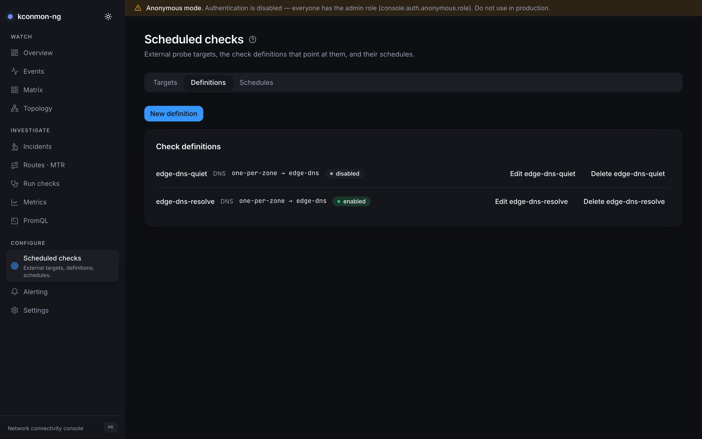
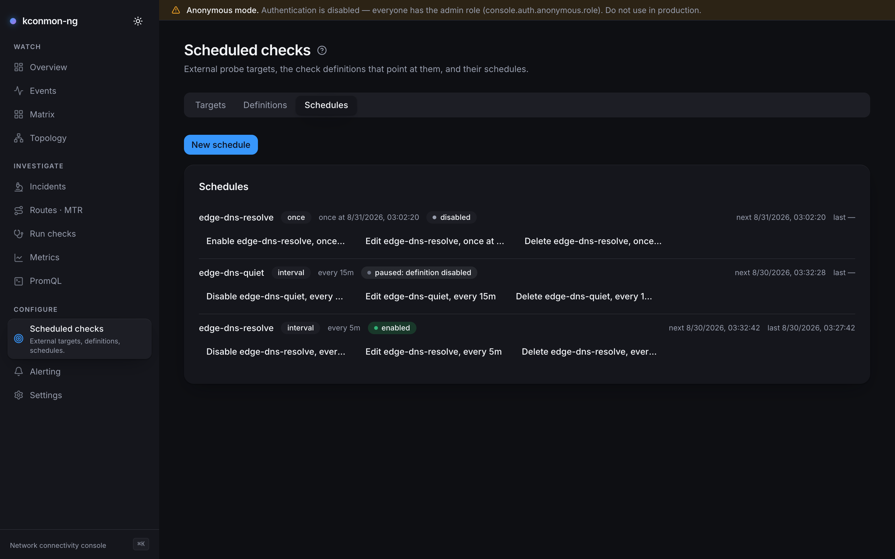

# Scheduled checks

The configuration page for recurring probes: what the fleet probes on its own, from where, and how often. Three tabs over three object kinds, and the path through them is always target → definition → schedule.

The three objects, defined:

- A **target** names a host or URL outside the fleet. Its address is validated against its kind (`host` takes a hostname or IP, optionally with a port; `url` takes an `http(s)://` URL), and external checks probe what is listed here. Each target also has its own page at `/targets/<id>` (the **target card**), documented with the other [object pages](pair-and-node-pages.md#the-target-card).
- A **definition** says what the fleet probes: a check type, which agents send (the source selection), and where the probes go, whether the nodes themselves, a saved target, or an ad-hoc address.
- A **schedule** is the cadence that fires a definition: once, at an interval, or continuously on the agents. A definition without a schedule never fires on its own.

This is configuration, not telemetry. Everything here lives in the database, reading needs `checks:read` / `targets:read` (granted to the operator and admin roles, deliberately not viewer), and writing needs the corresponding write permission. See [Concepts: checks, runs and schedules](../concepts/checks-runs-schedules.md) for how these objects relate to one-off runs.

## The definition form

<figure markdown>
{ loading=lazy }
<figcaption>A definition before saving: the form projects its series cost, and the banner warns that the scheduler loop is off on this install.</figcaption>
</figure>

Fields: *Name*, *Check type*, *Source selection*, *Destination kind* (`node` / `target` / `adhoc`), *Plane*, *Params (JSON)*, *Enabled*. You can also seed one from a filled-in [Run checks](run-checks.md) form via **Save as definition**.

**Source selection** decides which agents run the check, and the three values are not three sizes:

| Value | Agents that probe | Series cost |
| --- | --- | --- |
| `all` | Every agent | One per agent |
| `per-zone` | Every agent, grouped by zone | Same as `all`; grouping shrinks nothing |
| `one-per-zone` | The first agent (sorted by node name) in each zone | One per zone |

Only `one-per-zone` reduces the count, which is why the form defaults to it.

**Plane** is a fixed field, not a choice: definitions probe from the pod network, and this release ships no second plane, so the form states the scope instead of offering an option.

**Params (JSON)** is interpreted by the agent per check type, and unknown keys are warned about and ignored rather than failing the probe (malformed JSON, on the other hand, gets the whole spec rejected at assignment, and rejections are counted in an agent metric so a definition every agent refuses is visible without reading pod logs):

| Check type | Params |
| --- | --- |
| `tcp`, `icmp` | None accepted; leave it empty |
| `dns` | `{"query": "<name to resolve>"}`; required, non-empty |
| `http` | `{"method": "GET"\|"HEAD", "expectStatus": <100–599>, "insecureSkipVerify": <bool>}`; all optional, method defaults to GET |

`udp` and `mtr` are not valid check types for a continuous external definition; the API refuses them at write time.

**The projection guard.** Before an enabled definition is saved, the form projects its metric cost against the live topology: "~{series} series ({agents} agents × {protocols} protocols)". Agents is what the source selection resolves to right now; protocols is 1 today, since a definition names exactly one check type. The bound is **400 projected series per definition**, the same number that caps one run's fan-out, and a projection above it refuses to save enabled, suggesting `one-per-zone` or saving disabled. Saving disabled is the deliberate escape hatch, not a loophole. Because the projection is computed against the live topology, the endpoint answers 503 when `console.controller.url` is not set, and the same definition can project differently as the cluster scales.

## Schedules

<figure markdown>
{ loading=lazy }
<figcaption>Schedule rows in all three states: enabled with its stamps, paused because its definition is off, and failing with the recorded message.</figcaption>
</figure>

Three kinds:

- `once` fires at *Run at*, which must be in the future.
- `interval` fires every N seconds. A value below the floor of **10 seconds** is clamped up server-side rather than rejected; the form says so in advance.[^ceiling]
- `continuous` is pushed to the agents and runs there. No interval, no run-at, and no dependency on the scheduler loop.

A schedule belongs to its definition permanently: to point a cadence at a different definition, create a new schedule. The form states this next to the fixed definition field.

`once` and `interval` schedules are fired by the **console scheduler loop**, and that loop is **off by default** (`console.scheduler.enabled`, tick every 5 s when on; see the [Helm values](../reference/helm-values.md)), so that a chart upgrade can never start dispatching fleet traffic by itself.

!!! warning "Schedules that will never fire"
    With the scheduler loop disabled, the page banners: "These schedules will not fire: the scheduler loop is disabled on this install." Continuous schedules are unaffected — they run on the agents.

Each schedule row shows its state (*enabled*, *disabled*, or *paused: definition disabled*) with *next {at}* / *last {at}* stamps. Paused means the schedule is on but its definition is switched off: nothing fires, the cadence keeps its place, and firing resumes when the definition is re-enabled. When the last fire failed, the row carries the scheduler's own recorded message verbatim ("failing: {message}"), and it stays visible even if the schedule is later disabled, because switching a cadence off does not unmake the failure.

[^ceiling]: There is also a ceiling of roughly 104 days. The box takes seconds and the wire takes nanoseconds; past that product a JavaScript number can no longer represent the value exactly, and the form refuses to store a cadence nobody asked for.

## Where the results land

Fired runs appear in [run history](run-checks.md#run-history) and their series in [Metrics](metrics.md). A target's own card collects everything about that target (the definitions probing it, its probe-duration series, the runs against it) and is documented in [Pair, node and target pages](pair-and-node-pages.md#the-target-card).

External destinations additionally require the fleet-side allowlist: `checkers.external.enabled` and `allowedCidrs` (see [External targets](../scenarios/external-targets.md)). The whole declarative inventory here, targets, definitions and schedules alike, is exportable from [Settings](settings.md#configuration-export-import).

<!-- verified against: web/src/pages/targets.tsx (one-per-zone default L816, MIN_INTERVAL_SECONDS=10,
     MAX_INTERVAL_SECONDS comment, enabled-default comment), web/src/lib/i18n/dict/targets.ts (planeNote,
     definitionFixed, projection.ok/over), web/src/lib/api-types.ts L2110-2114 (SourceSelection why-comment),
     internal/console/checks/assign.go (assignedAgents, protocolsPerDefinitionMirror=1, sorted-first per zone),
     internal/console/httpapi/definitions.go (maxProjectedSeries=400, projectionUnavailableDetail 503,
     guard runs only for definitions arriving enabled), internal/checker/external.go (ParseExternalSpec:
     per-type params, dns query required, http method/expectStatus/insecureSkipVerify, udp/mtr refused,
     lenient unknown keys + rejection metric via internal/agent/agent.go), charts/kconmon-ng/values.yaml
     (console.scheduler.enabled off, tickInterval 5s, checkers.external.*), web/src/pages/target-card.tsx,
     web/src/lib/api-types.ts TargetRequest (address validated against kind). -->
