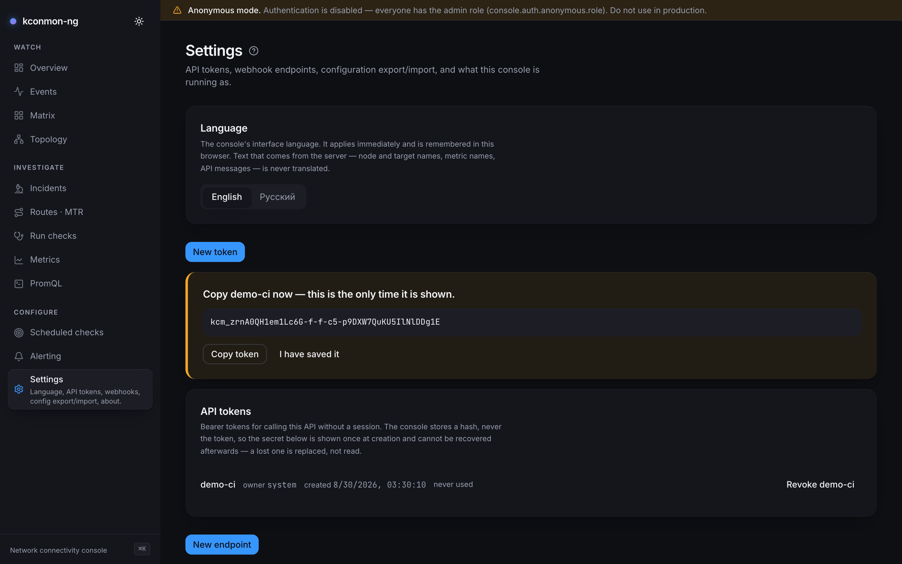
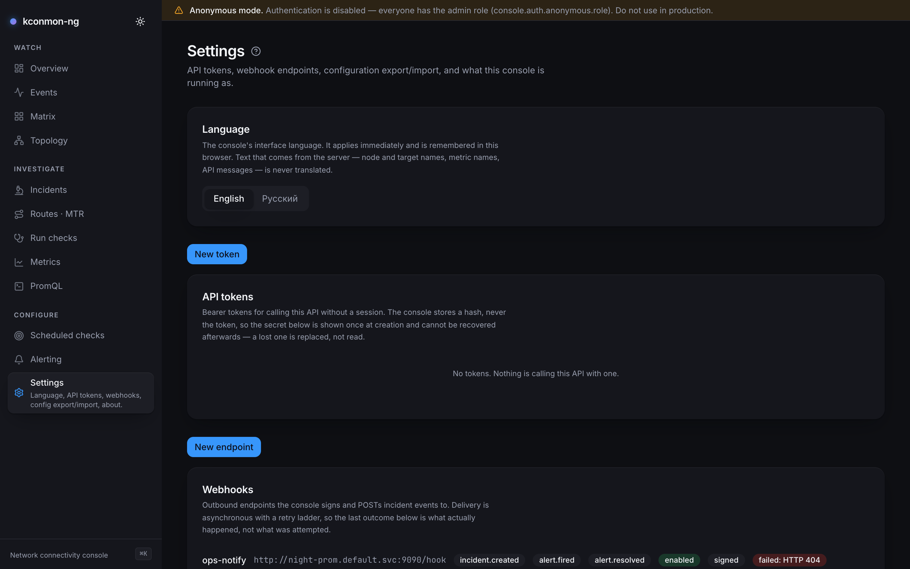

# Settings

The console's own administration: API tokens, webhook endpoints, configuration export/import, and what this instance is running as. Sections appear per permission (API tokens need `tokens:manage`, webhook endpoints `webhooks:manage`, export/import `settings:write`, all three admin-only in the built-in roles), while **Language** and **About** are visible to everyone. Maintenance windows are not here; they moved to [Alerting](alerting.md#maintenance-windows), and the page says so.

## General

**Language** switches the interface between English and Русский. It applies immediately and is remembered in this browser; server data (node and target names, metric names, API messages) is never translated.

**About this console** reports what this instance runs as: *Auth mode*, *Your roles*, *Your subject*, *Console build*, *Commit*, and whether *Controller*, *Prometheus* and *Database* are configured. In anonymous mode it names the fixed role every request gets; with a database it states the retention window (90 days by default) or that pruning is disabled.

## Authentication and roles

Auth is configured in the [Helm values](../reference/helm-values.md), not on this page; what this page administers starts in the next section. `console.auth.mode` picks one of four modes:

`anonymous` (the default)
:   No authentication. Every request gets the fixed role from `console.auth.anonymous.role` (`viewer` unless changed), and a warning [banner](overview.md#the-console-chrome) spans every page. For evaluation and demo installs; not for production.

`local`
:   Username/password accounts stored in the console database (one is required). On first start, while the users table is empty, the account named by `local.bootstrapAdmin` is created with the password from its Secret. The mode for a small install with no identity provider to lean on.

`header`
:   Identity asserted by a trusted in-cluster reverse proxy via headers (`X-Remote-User`, `X-Remote-Groups`). `trustedProxyCIDRs` must be set and non-empty: headers from an untrusted source would be an authentication bypass, so the console refuses the mode without it. Pick this when something like oauth2-proxy already fronts your services.

`oidc`
:   Full OIDC login. Requires the database, and Redis once `console.replicas` exceeds 1. Identity is always `oidc:`, the one claim OIDC allows as an identifier, so RBAC bindings and the audit log survive a display-name change; `usernameClaim` only affects what the user menu shows. Setup walkthrough: [OIDC](../scenarios/oidc-setup.md).

Roles resolve as the union of `groupRoles` (a declarative group→role map in values; an allow-list, and what it grants cannot be revoked through the API, which is the point), any bindings made through the API, and `defaultRole` for an authenticated subject nothing matched. Built-in roles: `viewer`, `operator`, `alert-editor`, `admin`. Sessions for every non-anonymous mode last 12 h absolute with a 1 h sliding idle timeout. See [Configuration](../configuration.md) for the full reference.

## API tokens

Bearer tokens for calling the [HTTP API](../api.md) without a session. The console stores only a hash of the secret: the value is shown once, at creation ("Copy {name} now — this is the only time it is shown"), and a lost token cannot be read back, only revoked and replaced. Rows show owner, created, last used and expiry; live tokens are *revoked*, spent ones deleted.

<figure markdown>
{ loading=lazy }
<figcaption>A token just created: the one moment its secret is visible, above the table that will only ever show its metadata.</figcaption>
</figure>

## Webhooks

Outbound endpoints the console signs and POSTs incident and alert events to. Every endpoint requires a signing secret; each row shows the last delivery outcome, any consecutive-failure streak, and a *Send test* action. Secrets are encrypted at rest with a key the chart supplies (`console.webhooks.existingSecret`); without that key, create and test answer 503.

### The delivery contract

What a receiver's author needs, in one place. The scenario walkthrough is [Set up alerting](../scenarios/set-up-alerting.md).

**Events.** The subscribable set is closed, in two families: `incident.created` / `incident.resolved` / `incident.reopened` are lifecycle changes the console was told about by the request that caused them; `alert.fired` / `alert.resolved` are Prometheus transitions the console *detected* by polling. Each family has its own stable payload shape, every key present on every delivery. One endpoint may subscribe to both; read `event` first, then pick the parser.

**Signature.** Every delivery is a `POST` with `Content-Type: application/json` and `X-Kconmon-Signature: sha256=<hex>`, an HMAC-SHA256 with the endpoint's secret over the raw body bytes, the exact bytes on the wire. Verify the signature before parsing.

**Retries.** Up to three attempts, delayed 0 / ~30 s / ~5 m with ±20% jitter, 10 s timeout each, until the endpoint answers 2xx. The body (and therefore the signature) is identical across retries, so a receiver must be idempotent. *Send test* is deliberately a single attempt: an operator clicking it is asking a question and waiting for the answer on the endpoint row. Delivery lives in the console process: a restart during the retry window loses the remaining attempts, and the ledger for a miss is the row's last status and failure streak, not a replay queue.

**Replicas and deduplication.** Every console replica polls alert state independently, so N replicas deliver N copies of each alert edge. Deduplicate on `(event, alert.ruleId, alert.labels, alert.firedAt)`; all four are stable across replicas and across the retry ladder. `sentAt` is not; it is per delivery. For the incident family, `(event, incident.id, at)` serves the same purpose.

**Timing, and what a pager should expect.** `alert.resolved` is stamped when the console *noticed* the alert was gone, at the granularity of `console.webhooks.alertPollInterval` (30 s by default): an absence has no timestamp of its own, so read it as "resolved at some point in the poll interval ending here". `firedAt`, by contrast, is Prometheus's own `activeAt` and identical on every replica, which is what makes it usable in the dedupe key. Two more deliberate properties: the first successful poll after a console restart is a baseline that delivers nothing (a restart never pages about alerts already firing), and a failed poll freezes the firing set, so nothing resolves while Prometheus is unreachable. Only alerts this console manages (those carrying `kconmon_ng_rule_id`) are delivered, and `pending` alerts are not: pending is not fired.

## Configuration export / import

**Export configuration** downloads a JSON bundle of everything *declared* (targets, check definitions, schedules, alert rules, webhook endpoints, maintenance windows), never anything observed. With `rbac:manage`, custom roles too; bindings are exported for the record and never imported.

Choosing a bundle file runs an immediate **dry run** that predicts, per collection, exactly what *Apply import* would do. Two limits to know going in: each section applies only if you hold that page's own permission, and webhook endpoints are never *created* by an import, since a bundle carries no secrets; create the endpoint first and the import applies its url, events and enabled flag on top.

<figure markdown>
{ loading=lazy }
<figcaption>A bundle dry-run: the predictions say what Apply would change before anything changes.</figcaption>
</figure>

## Retention

History retention is a config value, not a control here: `database.retentionDays` (default `90`; `0` keeps everything, and the daily pruner then never sweeps). The About section reports the active value.

<!-- verified against: web/src/pages/settings.tsx, web/src/lib/i18n/dict/settings.ts, internal/console/authz/roles.go
     (admin-only manage permissions), charts/kconmon-ng/values.yaml console.auth block (mode semantics, groupRoles
     allow-list comment, trustedProxyCIDRs "else headers are an auth bypass", oidc sub comment, session ttl/idle,
     anonymous.role viewer), web/src/lib/api-types.ts L1604-1609 (WebhookEvent two-families comment), L1828-1860
     (WebhookPayload/WebhookAlertPayload transport, ladder, baseline, freeze, N-replica dedupe tuple), L1893-1901
     (firedAt=activeAt, resolvedAt=noticed), internal/console/webhooks/dispatcher.go (retryLadder {0,30s,5m},
     jitterFraction 0.2, attemptTimeout 10s, singleAttempt for /test, sign over raw bytes L619-623),
     docs/scenarios/set-up-alerting.md L98 (linked), charts values (webhooks encryption key -> 503,
     database.retentionDays). APIs: /api/v1/tokens, /api/v1/webhooks, /api/v1/export, /api/v1/import, /api/v1/config. -->
