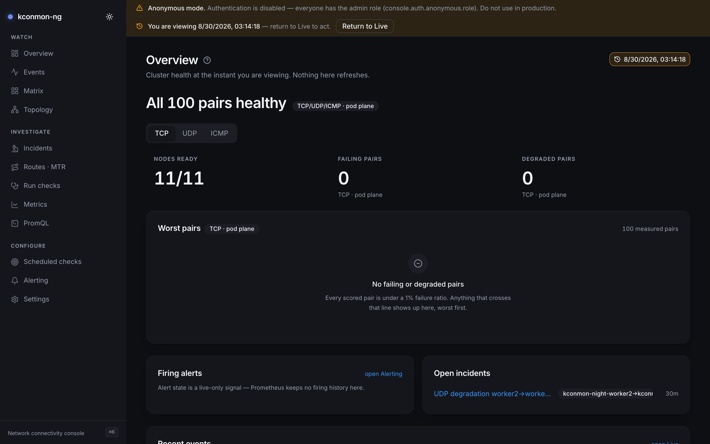

# Time Machine

View the console at a past instant: what did this page say at 03:12 last night? Open the console *as of* the incident and read every page in that moment's terms, or put two tabs on two `?at=` values for a before/after of a change.

<figure markdown>
{ loading=lazy }
<figcaption>Engaged: the amber control shows the viewed instant, the banner offers Return to Live, and the picker popover holds calendar, date and time fields, and Now.</figcaption>
</figure>

## The ?at= parameter

The Time Machine owns exactly one URL key: `?at=`, an RFC 3339 instant (`2026-08-29T14:32:00Z`). Every in-app link on a time-aware page carries it, so navigating stays inside the same instant, and **any console URL with `?at=` is a shareable snapshot address**.

The parameter is strict on purpose, so a shared link means the same thing to the browser and to the Go API (`time.RFC3339`). A malformed value degrades to Live with a console warning. A future instant is clamped to now client-side, and the server backs the same rule independently: `GET /api/v1/topology?at=` answers 400 for a future instant. Values are truncated to the second.

## Entering and leaving

The control lives in the page header, next to the range presets: the presets pick how long the window is, this picks where it ends. Idle it reads **Time Machine: Now**; engaged it shows the viewed instant, turns amber, and a banner appears — "You are viewing {at}", with a **Return to Live** button.

Other routes in and out:

- The [command palette](command-palette.md): *Toggle Time Machine — pick a time…* and *Return to Live*.
- Pasting or following any URL with `?at=`.

## Picking a time

The control opens a popover with a calendar, separate date and time fields, and a **Now** button that jumps both fields to the current moment. The fields speak your local wall clock; the `?at=` they produce is UTC RFC 3339, and the picker does the conversion, so what you aim at is the time you lived through, not its UTC translation.

The time field works to the minute. The Time Machine's own precision is the second, but a seconds spinner buys nothing an operator wants to aim at; if you need a specific second, edit `?at=` in the address bar. Under the hood the two fields are composed through the `Date(y, m, d, h, min)` constructor rather than by parsing a combined string, because some engines parse date-only strings as UTC and others as local time, and a picker that lands on a different hour per browser is worse than no picker.[^compose]

[^compose]: `web/src/components/ui/datetime-picker.tsx` (`composeLocal`), which also renders the date field from the local getters rather than `toISOString()`, so a pick near midnight cannot shift by a day.

## While engaged

**Writes are disabled everywhere.** Every mutating control is disabled with the same sentence: "Time Machine is engaged — return to Live to act." Starting a probe from a view of the past would run it now, against the present fleet, which is the one thing the mode must not let happen by accident. Disabled-by-time is deliberately distinct from missing-permission: permissions *hide* controls, the Time Machine *disables* them.

Live polling stops on every engaged page. Nothing refreshes while you are in the past.

## What is and is not rewound

The control is offered only on pages that resolve their reads through `?at=`; a page that ignores the past never invites it. Time-aware: [Overview](overview.md), [Events](events.md), [Matrix](matrix.md), [Topology](topology.md), [Incidents](incidents.md), [Routes · MTR](routes-mtr.md), [Run checks](run-checks.md), [Metrics](metrics.md), [PromQL](promql.md), and the [pair, node, target and run pages](pair-and-node-pages.md). Not time-aware, because configuration is always now: [Scheduled checks](scheduled-checks.md), [Alerting](alerting.md), [Settings](settings.md).

Even on time-aware pages, some data has no past to travel to, and each page states its own bound in place:

- **Alert firing state** is live-only, since Prometheus keeps no firing history (Overview, Incidents).
- The **MTR Explorer's** route panes are live; those endpoints take no time parameter ([Routes · MTR](routes-mtr.md)).
- **Run history** is cut to the instant client-side over loaded pages, because `GET /api/v1/runs` has no time filter.
- A **Topology** past view is a [reconstruction from topology events](topology.md#the-map-under-the-time-machine), bounded by database retention.

How far back you can go is bounded by `database.retentionDays` (default 90 days) for event-backed views, and by Prometheus's own retention for metric-backed ones.

<!-- verified against: web/src/lib/timemachine.tsx (normalize: clamp + console.warn, truncateToSecond, 400 note),
     web/src/components/timemachine-control.tsx, web/src/components/timemachine-bar.tsx,
     web/src/components/ui/datetime-picker.tsx (toDateInputValue/toTimeInputValue/composeLocal comments,
     minute precision), web/src/lib/i18n/dict/shared.ts (picker.now), web/src/lib/i18n/dict/chrome.ts
     (timemachine.* strings), web/src/pages/timemachine-surfaces.test.ts (per-page opt-in list). -->
