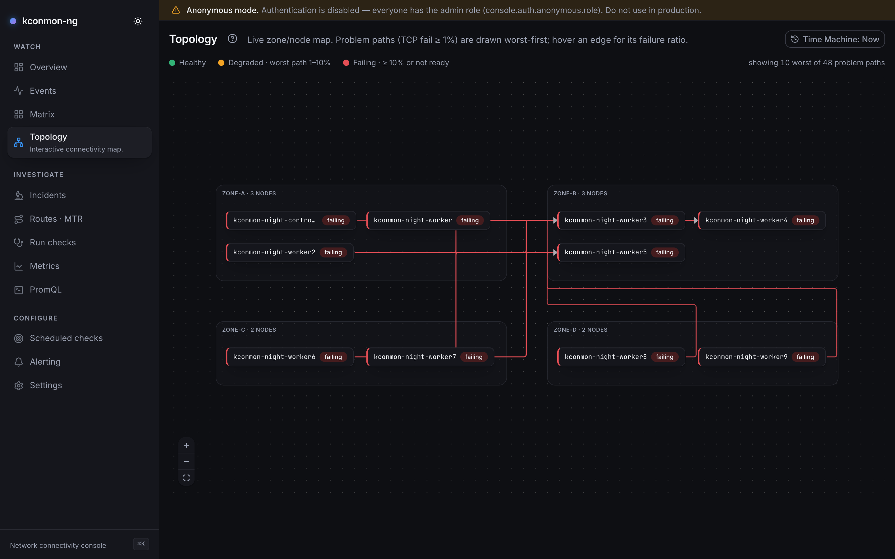
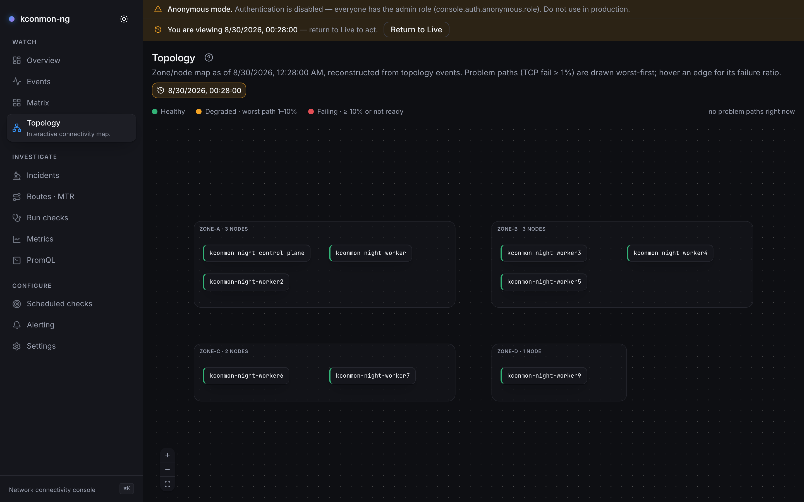

# Topology

An interactive zone and node map. Nodes are boxes grouped into zone lanes; problem paths are drawn as edges between them, worst first. During a zonal incident the tell is visual: cross-zone edges clustering on one lane.

<figure markdown>
{ loading=lazy }
<figcaption>Problem paths across zones: the caption counts "showing 10 worst of N", and a not-ready node carries its badge.</figcaption>
</figure>

## Nodes

Node colour comes from the probe matrix, using the same tiers as the [Matrix](matrix.md) legend: *Healthy*, *Degraded · worst path 1–10%*, *Failing · ≥ 10% or not ready*. A not-ready node carries a "not ready" badge. Selecting a node and pressing ++enter++ (or clicking it) opens its [node page](pair-and-node-pages.md), carrying `?at=` when the Time Machine is engaged.

Each zone is one lane, headed "{zone} · {count} nodes". A big zone wraps into a grid rather than a single column: the column count grows roughly as the square root of the node count and is capped at four, so a zone stays a shape a pane can hold instead of a tall strip the auto-fit has to shrink into illegibility. Nodes whose zone label is absent gather in a lane named **no zone reported** — which is exactly what is true, and also the state you get on a cluster whose nodes lack the `topology.kubernetes.io/zone` label.

Map controls: *Zoom in*, *Zoom out*, *Fit the whole map*. The map is read-only; nodes are not draggable.

## Edges

Edges are drawn only for problem paths (TCP fail ≥ 1%), and there is a budget: at most **10** edges, worst first. The caption counts what the budget hid ("showing {shown} worst of {total} problem paths"), or simply "3 problem paths", or "no problem paths right now". Each edge label names its vector: a plain percentage is a failure ratio, "{pct} loss" is packet loss, and hovering an edge shows its ratio.

One edge per ordered pair, keeping the worst reading. If the matrix somehow carries two cells for the same A→B, drawing both would double-count one path in the caption and collide two drawn edges under one identity, so the map arbitrates worst-of — the same rule every other severity read in the console applies.

## Degraded and stale states

All the map's non-happy paths, in one place:

- **"This map is no longer refreshing"**: the last refresh did not come back. What is on screen is the node set that loaded before it, and the console keeps retrying on its own. Distinct from "Topology is unavailable" on purpose: claiming *nothing* over a map that is visibly on screen would be wrong, what the page has is something older.
- **"Your browser reports no connection"**: the request never left the browser. It goes out by itself once the connection is back.
- **No Kubernetes node view at all**: the map is drawn from registered agents and the zones they registered with, a notice says so, node colour still works, and readiness is unknown.
- **Live empty state**: "No nodes reported by the controller yet" points at the agent DaemonSet.
- **Historical bounds**: see below.

## The map under the Time Machine

Live, the node set refreshes every 15 seconds. Engaged, the map switches mechanism entirely: it is **reconstructed from stored topology events**, folded up to the viewed instant.

Why events rather than Prometheus? Prometheus can answer "what were the series at 03:12", but node identity, readiness transitions and agent registrations are not series: they are facts the controller reported as they happened. The event log is the only record with them in order, so the fold replays it. The trade is stated by the API itself: historical topology needs the database (`GET /api/v1/topology?at=` answers 503 without one, naming `console.database.mode`), and an instant older than what retention kept answers 422, telling you to pick a later time or raise `console.database.retentionDays`.

The reconstruction states its own bounds in place: an instant past the kept window ("This reconstruction is incomplete"), events that name no node ("Nothing to reconstruct at this time"), or simply no nodes at that time.

<figure markdown>
{ loading=lazy }
<figcaption>A reconstruction near the retention edge: the map draws what the event log kept and says the window was cut.</figcaption>
</figure>

<!-- verified against: web/src/pages/topology.tsx (EDGE_CAP=10 L66, worst-of dedupe L248-256, ZONE_MAX_COLS=4 +
     zoneColumns/zoneWidth L43-63), web/src/lib/i18n/dict/topology.ts (stale.*, offline.*, help.body, lane strings),
     web/src/hooks/use-topology.ts (GET /api/v1/topology, ?at=), internal/console/httpapi/data.go L25-31
     (topologyHistoryUnavailableDetail 503, topologyRetentionDetail 422), internal/console/httpapi/topology_at_test.go. -->
