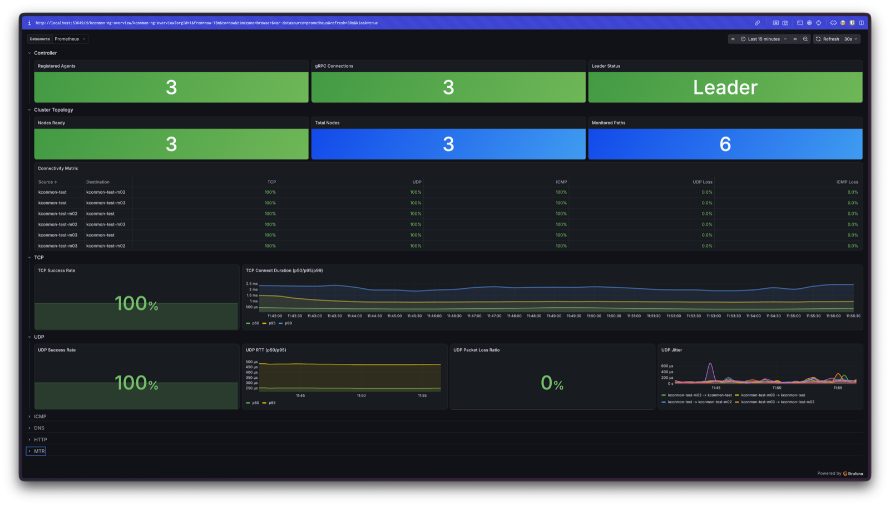
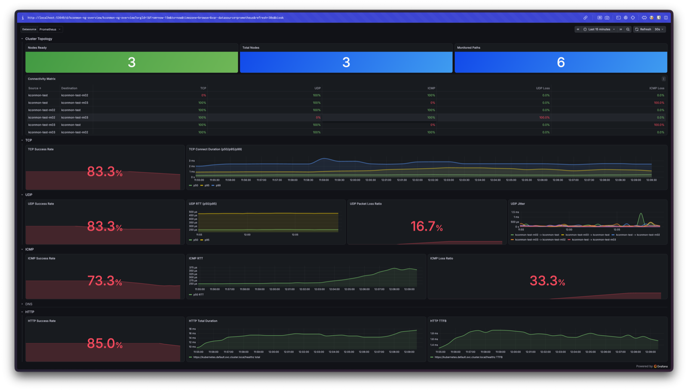

# Breaking the network on purpose: a reproducible kconmon-ng demo

This walkthrough deliberately breaks connectivity between two Kubernetes nodes
and shows how kconmon-ng pinpoints **which protocol, which node pair, and which
hop** is affected — while every other path stays green. It is the hands-on
version of the question kconmon-ng exists to answer: not "is the mesh up?" but
"what exactly degraded, and where?"

Every command and every observed value below was executed on a live 3-node
Minikube stand. Times and counters are from that run; yours will differ
slightly but the shape is the same.

## Prerequisites

A running stand from the repo's helper:

```bash
./hack/local-test.sh up
```

This gives you a 3-node Minikube cluster (`kconmon-test`), kube-prometheus-stack
(Prometheus + Grafana) in the `monitoring` namespace, and kconmon-ng (agent
DaemonSet + controller) in `default`. Label the nodes with zones so the
Zone Heatmap has something to show:

```bash
kubectl label node kconmon-test     topology.kubernetes.io/zone=zone-a --overwrite
kubectl label node kconmon-test-m02 topology.kubernetes.io/zone=zone-b --overwrite
kubectl label node kconmon-test-m03 topology.kubernetes.io/zone=zone-b --overwrite
kubectl rollout restart daemonset/kconmon-ng-agent
```

Open Prometheus and Grafana in separate terminals:

```bash
kubectl port-forward -n monitoring svc/monitoring-kube-prometheus-prometheus 9090:9090
kubectl port-forward -n monitoring svc/monitoring-grafana 3000:80   # admin/admin
```

### Topology used in this run

| node | zone | agent pod IP |
|------|------|--------------|
| kconmon-test     | zone-a | 10.244.0.8 |
| kconmon-test-m02 | zone-b | 10.244.1.10 |
| kconmon-test-m03 | zone-b | 10.244.2.15 |

Agents probe each other **pod-IP to pod-IP**. Mind the ports when writing
firewall rules: **UDP probes target the agent's gRPC/probe port 9090**, while
**TCP probes dial the agent's HTTP port 8080**. Blocking the wrong port silently
matches zero packets — check the iptables `-v` counters.

## Baseline: everything green

Before breaking anything, confirm a clean baseline (PromQL against Prometheus):

```promql
# per-pair UDP loss — all six ordered pairs should be 0
kconmon_ng_udp_packet_loss_ratio

# per-pair ICMP loss — all 0
kconmon_ng_icmp_packet_loss_ratio

# no TCP failures
sum(rate(kconmon_ng_tcp_results_total{result="fail"}[5m]))

# MTR has never had to fire
kconmon_ng_mtr_triggered_total
```

Observed: all six pairs at 0 loss, TCP fail rate empty, `mtr_triggered_total`
empty (no traces ever needed), `controller_registered_agents = 3 = expected_agents`,
no firing or pending alerts. The Overview dashboard is all green.


<!-- screenshot: Grafana Overview top section (kiosk mode), "Last 15 minutes": Controller stats, Connectivity Matrix all green, success rates 100%. MTR panel optional — on a fresh stand it reads 0. -->

## Break: blackhole UDP between two nodes

We drop **only UDP** from `m02` to `m03` (pod-to-pod, port 9090), leaving every
other protocol and every other pair untouched. This simulates the kind of
protocol-specific breakage a firewall/conntrack misconfiguration or an
overlay/offload bug produces — the case a binary reachability check misses.

Cross-node pod traffic transits the **FORWARD** chain on the destination node,
so the rule goes on `m03`:

```bash
minikube -p kconmon-test ssh -n kconmon-test-m03 -- \
  'sudo iptables -I FORWARD 1 -p udp -s 10.244.1.10 -d 10.244.2.15 --dport 9090 \
   -j DROP -m comment --comment "kconmon-demo-udp-blackhole"'
```

Confirm it is matching packets (the counter climbs):

```bash
minikube -p kconmon-test ssh -n kconmon-test-m03 -- \
  'sudo iptables -L FORWARD 1 -v -n --line-numbers | head'
# ~10 packets / 320 bytes dropped within the first 10s
```

> Note: `tcpdump` is absent on Minikube nodes. Use the iptables `-v` packet
> counters or `conntrack -L` to confirm the rule is doing what you think.

## What kconmon-ng shows (within a minute)

Within one scrape cycle plus a probe interval (~15–20s), the picture is
unambiguous:

- **`kconmon_ng_udp_packet_loss_ratio{source_node="kconmon-test-m02", destination_node="kconmon-test-m03"}` = 1** — total UDP loss on exactly that ordered pair.
- **All five other pairs stay at 0** UDP loss.
- **`kconmon_ng_icmp_packet_loss_ratio` for m02→m03 = 0** — ICMP is green.
- **TCP m02→m03**: fail rate 0, success still flowing (~0.2/s) — TCP is green.
- So for the *identical node pair*, UDP is dead while TCP and ICMP are healthy: kconmon-ng isolates both the failing **path** and the failing **protocol**.

Useful PromQL for the panels:

```promql
# the one red pair jumps out
kconmon_ng_udp_packet_loss_ratio > 0

# prove the same pair is fine on other protocols
kconmon_ng_icmp_packet_loss_ratio{source_node="kconmon-test-m02",destination_node="kconmon-test-m03"}
```

### Reactive MTR fires automatically

A full UDP blackhole means `lossRatio = 1.0`, so the check fails hard — and a
failed TCP/UDP/ICMP check auto-triggers an MTR trace for that pair (rate-limited
to once per 60s per pair). No operator action:

```promql
kconmon_ng_mtr_triggered_total{source_node="kconmon-test-m02",destination_node="kconmon-test-m03"}   # = 2
kconmon_ng_mtr_hop_rtt_seconds{source_node="kconmon-test-m02",destination_node="kconmon-test-m03"}
```

The hop series shows the trace toward `10.244.2.15`, ending at the target — the
failing path captured the moment it broke, not after you SSH in to investigate.

### The alert

The bundled `UDPLossHigh` rule (`kconmon_ng_udp_packet_loss_ratio > 0.5`,
`for: 5m`, severity `warning`) went **pending ~26s after the break** (visible at
Prometheus `/alerts`, labelled `source=m02, dest=m03`) and fires after the 5m
hold. The hold is deliberate — it rides out transient blips and only pages on
sustained loss.

Timing summary for this run: loss visible in metrics within ~one scrape
(15s + probe interval); alert `pending` ~26s after the break; `firing` after the
5-minute hold.

## Revert and recovery

Remove the rule:

```bash
minikube -p kconmon-test ssh -n kconmon-test-m03 -- \
  'sudo iptables -D FORWARD -p udp -s 10.244.1.10 -d 10.244.2.15 --dport 9090 \
   -j DROP -m comment --comment "kconmon-demo-udp-blackhole"'
```

The loss gauges are reset every scrape cycle (`ResetPeerGauges`), so recovery is
fast: within ~one scrape the m02→m03 UDP loss drops back to 0, all six pairs
return to 100%, and `UDPLossHigh` clears before it ever reaches `firing` if you
revert inside the 5m window. Confirm:

```bash
# all six pairs back to 100% UDP success
kubectl exec ... # or via Prometheus:
#   sum by (source_node,destination_node)(rate(kconmon_ng_udp_results_total{result="success"}[2m]))
#   / sum by (source_node,destination_node)(rate(kconmon_ng_udp_results_total[2m])) * 100
```

## Going further: break every protocol differently at once

For the full "which protocol, which pair" effect, run several protocol-specific
breaks simultaneously (all verified on the same stand; adjust pod IPs to your
topology table):

```bash
# UDP blackhole m02 -> m03 (UDP probes target the gRPC/probe port 9090)
minikube -p kconmon-test ssh -n kconmon-test-m03 -- \
  'sudo iptables -I FORWARD 1 -p udp -s 10.244.1.10 -d 10.244.2.15 --dport 9090 \
   -j DROP -m comment --comment kconmon-demo-udp-blackhole'

# ICMP block m03 -> test (matches echo replies too, so BOTH directions degrade)
minikube -p kconmon-test ssh -n kconmon-test -- \
  'sudo iptables -I FORWARD 1 -p icmp -s 10.244.2.15 -d 10.244.0.8 \
   -j DROP -m comment --comment kconmon-demo-icmp-block'

# TCP block test -> m02 (TCP probes dial the agent HTTP port 8080, not 9090)
minikube -p kconmon-test ssh -n kconmon-test-m02 -- \
  'sudo iptables -I FORWARD 1 -p tcp -s 10.244.0.8 -d 10.244.1.10 --dport 8080 \
   -j DROP -m comment --comment kconmon-demo-tcp-block'

# HTTP checker failure from one node (blocks the apiserver healthz target, port 8443 on minikube)
minikube -p kconmon-test ssh -n kconmon-test-m03 -- \
  'sudo iptables -I FORWARD 1 -p tcp -s 10.244.2.15 --dport 8443 \
   -j DROP -m comment --comment kconmon-demo-http-block'
```

Within a minute the Overview reads like an incident report: TCP dead for exactly
one pair, UDP blackholed on another, ICMP loss on a third (both directions —
the reply path is filtered too), HTTP failing from a single node — and every
remaining path still green. Four different failures, four different blast radii,
one dashboard:


<!-- screenshot: Overview (kiosk), matrix showing TCP 0% on test->m02, UDP 0% + 100% loss on m02->m03, ICMP 0% + 100% loss on test<->m03, HTTP Success Rate ~85%, everything else green -->

Note the HTTP checker is node-local (it probes configured URL targets such as
the apiserver healthz, not peers), so HTTP degradation shows per *source node*
rather than per pair.

## Cleanup

Verify no demo rules remain on any node (leftover DROP rules will quietly break
your next run):

```bash
for n in kconmon-test kconmon-test-m02 kconmon-test-m03; do
  echo "$n:"; minikube -p kconmon-test ssh -n "$n" -- 'sudo iptables -S | grep kconmon-demo || echo "  clean"'
done
```

Tear the whole stand down when finished:

```bash
./hack/local-test.sh down
```

## What this proves

A binary reachability tool answers "can node A reach node B?" — and here the
answer is *yes*, because TCP and ICMP between m02 and m03 never stopped. It would
show green while UDP-based workloads on that pair silently fail.

kconmon-ng answers the operational question instead:

- **which protocol** — UDP, specifically, with TCP/ICMP proven healthy on the same pair;
- **which node pair** — m02→m03, with the other five pairs proven unaffected;
- **which hop** — captured automatically by the reactive MTR trace;
- **and it pages** on sustained loss via a rule that ships with the chart.

That is the difference between "the mesh looks connected" and "here is the exact
failing protocol, path, and hop."

## Further experiments

- **Latency injection** (not covered in this validated run): `netem` is available
  on the nodes (`/sbin/tc`, `sch_netem` module present). Adding
  `tc qdisc add dev <iface> root netem delay 100ms` on a node makes the RTT panels
  react without any loss — a clean way to demo latency-vs-loss separation. Apply
  it narrowly and revert with `tc qdisc del` promptly, since node-level netem
  affects all traffic on the interface, including kubelet/apiserver.
- **DNS-only failure**: block egress to the cluster DNS service and watch
  `kconmon_ng_dns_results_total{result="fail"}` and `DNSChecksFailing` react while
  TCP/UDP/ICMP peer checks stay green.
