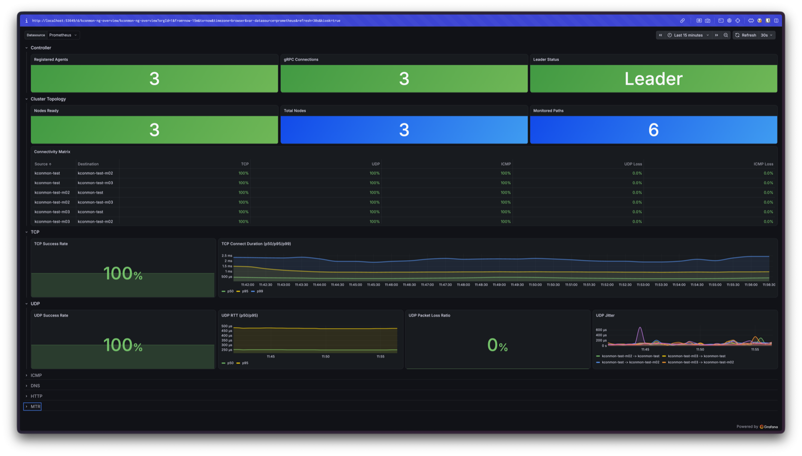
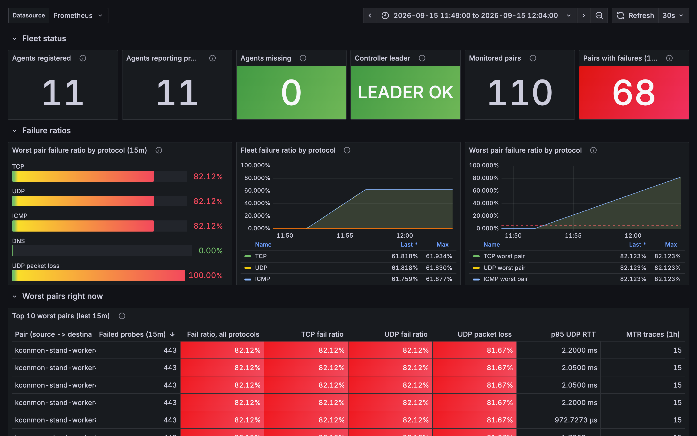

# Breaking the network on purpose: a reproducible kconmon-ng demo

This walkthrough deliberately breaks connectivity between two Kubernetes nodes
and shows how kconmon-ng pinpoints **which protocol, which node pair, and which
hop** is affected — while every other path stays green. It is the hands-on
version of the question kconmon-ng exists to answer: not "is the mesh up?" but
"what exactly degraded, and where?"

Every command and every number below came off a live 3-node Minikube stand.
Your digits will differ. The shape will not.

## Prerequisites

A running stand from the repo's helper:

```bash
./hack/local-test.sh up
```

This gives you a 3-node Minikube cluster (`kconmon-test`), kube-prometheus-stack
(Prometheus + Grafana) in the `monitoring` namespace, and kconmon-ng (agent
DaemonSet + controller) in `default`. Label the nodes with zones so the
Zone Heatmap has something to show:

```bash
kubectl label node kconmon-test     topology.kubernetes.io/zone=zone-a --overwrite
kubectl label node kconmon-test-m02 topology.kubernetes.io/zone=zone-b --overwrite
kubectl label node kconmon-test-m03 topology.kubernetes.io/zone=zone-b --overwrite
kubectl rollout restart daemonset/kconmon-ng-agent
```

Open Prometheus and Grafana in separate terminals:

```bash
kubectl port-forward -n monitoring svc/monitoring-kube-prometheus-prometheus 9090:9090
kubectl port-forward -n monitoring svc/monitoring-grafana 3000:80   # admin/admin
```

### Optional: bring up the Console too

Everything below works without it, and the Console section near the end of this
walkthrough needs it. It is a second Deployment in the same release:

```bash
kubectl create secret generic console-webhook-key \
  --from-literal=encryptionKey="$(openssl rand -base64 32)"

helm upgrade -i kconmon-ng ./charts/kconmon-ng \
  -f hack/values-local.yaml \
  --set-string agent.image.tag=local \
  --set-string controller.image.tag=local \
  --set console.enabled=true \
  --set console.replicas=1 \
  --set console.valkey.mode=bundled \
  --set console.database.mode=cnpg \
  --set controller.events.enabled=true \
  --set console.prometheus.url=http://monitoring-kube-prometheus-prometheus.monitoring:9090 \
  --set console.alerting.enabled=true \
  --set console.webhooks.encryptionKeySecret.name=console-webhook-key \
  --wait --timeout 5m

kubectl port-forward svc/kconmon-ng-console 8081:8080
```

Four things that flag matters for, so nothing below is a surprise:

- **`console.database.mode=cnpg` needs the CloudNativePG operator** in the
  cluster. Without a database the Console still serves topology, matrix and
  Explore — but incidents, saved alert rules and the audit log all answer `503`,
  and the alerting reconciler is skipped rather than running against nothing.
  Use `external` with your own PostgreSQL if you prefer.
- **`console.alerting.enabled=true` needs the `PrometheusRule` CRD**, which
  kube-prometheus-stack installs. It also renders a namespaced `Role` letting
  the Console write exactly that one resource, in this namespace.
- **Your Prometheus must select the object the Console writes.**
  `hack/local-test.sh` passes `ruleSelectorNilUsesHelmValues=false`, so this
  stand's Prometheus picks up every `PrometheusRule` in every namespace. On a
  stack that scopes `ruleSelector` by label, the Console's bundle will be
  ignored until you widen it — the rules will show as `synced` and never fire,
  which looks like a Console bug and is not one.
- **This stand runs with `alertmanager.enabled=false`.** That is fine: the
  Console's webhooks are dispatched by the Console itself off Prometheus' alert
  state, not by Alertmanager.

Default auth is anonymous-viewer, which is read-only. For the alert-rule step
you need write permissions:

```bash
helm upgrade -i kconmon-ng ./charts/kconmon-ng --reuse-values \
  --set console.auth.anonymous.role=admin
```

That is a demo shortcut on a disposable cluster, not a deployment pattern.

### Topology used in this run

| node | zone | agent pod IP |
|------|------|--------------|
| kconmon-test     | zone-a | 10.244.0.8 |
| kconmon-test-m02 | zone-b | 10.244.1.10 |
| kconmon-test-m03 | zone-b | 10.244.2.15 |

Agents probe each other **pod-IP to pod-IP**. Mind the ports when writing
firewall rules: **UDP probes target the agent's gRPC/probe port 9090**, while
**TCP probes dial the agent's HTTP port 8080**. Blocking the wrong port silently
matches zero packets — check the iptables `-v` counters.

## Baseline: everything green

Before breaking anything, confirm a clean baseline (PromQL against Prometheus):

```promql
# per-pair UDP loss — all six ordered pairs should be 0
kconmon_ng_udp_packet_loss_ratio

# per-pair ICMP loss — all 0
kconmon_ng_icmp_packet_loss_ratio

# no TCP failures
sum(rate(kconmon_ng_tcp_results_total{result="fail"}[5m]))

# MTR has never had to fire
kconmon_ng_mtr_triggered_total
```

Observed: all six pairs at 0 loss, TCP fail rate empty, `mtr_triggered_total`
empty (no traces ever needed), `controller_registered_agents = 3 = expected_agents`,
no firing or pending alerts. The Overview dashboard is all green.


<!-- screenshot: Grafana Overview top section (kiosk mode), "Last 15 minutes": Controller stats, Connectivity Matrix all green, success rates 100%. MTR panel optional — on a fresh stand it reads 0. -->

## Break: blackhole UDP between two nodes

We drop **only UDP** from `m02` to `m03` (pod-to-pod, port 9090), leaving every
other protocol and every other pair untouched. That is what a firewall typo, a
conntrack table filling up, or an overlay offload bug actually looks like in
production: one protocol, one direction, one pair — and every health check in
the cluster still green.

Cross-node pod traffic transits the **FORWARD** chain on the destination node,
so the rule goes on `m03`:

```bash
minikube -p kconmon-test ssh -n kconmon-test-m03 -- \
  'sudo iptables -I FORWARD 1 -p udp -s 10.244.1.10 -d 10.244.2.15 --dport 9090 \
   -j DROP -m comment --comment "kconmon-demo-udp-blackhole"'
```

Confirm it is matching packets (the counter climbs):

```bash
minikube -p kconmon-test ssh -n kconmon-test-m03 -- \
  'sudo iptables -L FORWARD 1 -v -n --line-numbers | head'
# ~10 packets / 320 bytes dropped within the first 10s
```

> Note: `tcpdump` is absent on Minikube nodes. Use the iptables `-v` packet
> counters or `conntrack -L` to confirm the rule is doing what you think.

## What kconmon-ng shows (within a minute)

Within one scrape cycle plus a probe interval (~15–20s), the picture is
unambiguous:

- **`kconmon_ng_udp_packet_loss_ratio{source_node="kconmon-test-m02", destination_node="kconmon-test-m03"}` = 1** — total UDP loss on exactly that ordered pair.
- **All five other pairs stay at 0** UDP loss.
- **`kconmon_ng_icmp_packet_loss_ratio` for m02→m03 = 0** — ICMP is green.
- **TCP m02→m03**: fail rate 0, success still flowing (~0.2/s) — TCP is green.
- So for the *identical node pair*, UDP is dead while TCP and ICMP are healthy: kconmon-ng isolates both the failing **path** and the failing **protocol**.

Useful PromQL for the panels:

```promql
# the one red pair jumps out
kconmon_ng_udp_packet_loss_ratio > 0

# prove the same pair is fine on other protocols
kconmon_ng_icmp_packet_loss_ratio{source_node="kconmon-test-m02",destination_node="kconmon-test-m03"}
```

### Reactive MTR fires automatically

A full UDP blackhole means `lossRatio = 1.0`, so the check fails hard — and a
failed TCP/UDP/ICMP check auto-triggers an MTR trace for that pair (rate-limited
to once per 60s per pair). No operator action:

```promql
kconmon_ng_mtr_triggered_total{source_node="kconmon-test-m02",destination_node="kconmon-test-m03"}   # = 2
kconmon_ng_mtr_hop_rtt_seconds{source_node="kconmon-test-m02",destination_node="kconmon-test-m03"}
```

The hop series shows the trace toward `10.244.2.15`, ending at the target — the
failing path captured the moment it broke, not after you SSH in to investigate.

### The alert

The bundled `UDPLossHigh` rule (`kconmon_ng_udp_packet_loss_ratio > 0.5`,
`for: 5m`, severity `warning`) went **pending ~26s after the break** (visible at
Prometheus `/alerts`, labelled `source=m02, dest=m03`) and fires after the 5m
hold. The hold is deliberate — it rides out transient blips and only pages on
sustained loss.

Timing summary for this run: loss visible in metrics within ~one scrape
(15s + probe interval); alert `pending` ~26s after the break; `firing` after the
5-minute hold.

## The same break, through the Console

Everything above is PromQL and Grafana. The same minute looks like this in the
Console at <http://localhost:8081>.

### Watch it go red on `/matrix`

Open **Matrix**, protocol **UDP**. Five cells stay green and the
`m02 → m03` cell turns red — the same single-cell failure the PromQL above
proves, without writing a query. The badge in the top bar reads **Live** while
the event stream is connected. Switch the protocol selector to TCP or ICMP and
the same cell is green: the Console is showing you the protocol isolation, not
just a red square.

Clicking the cell opens the **pair card**: the pair's loss and RTT charts, its
recent MTR path history, and a "Recent changes" rail of the topology and
diagnostic events around it.

### Correlate it on `/investigate`

From the pair card, **Investigate**. The page arrives already scoped to
`m02 → m03` over a window around now, and it assembles a merged timeline from
every source it has permission and data for: the threshold crossing it derives
from the loss series, the MTR path change, the diagnostic runs, topology and
K8s events, audit writes, maintenance windows, annotations, and any firing
alerts.

Two things worth noticing rather than skipping past:

- **The candidate-causes panel ranks by documented arithmetic**, not by
  cleverness: class weight times a linear decay over the five minutes before
  onset. A path change outranks a config write outranks a maintenance window,
  and the threshold crossing itself scores zero — a symptom is not its own
  cause. The weights are plain exported constants in the scoring source
  ([`web/src/lib/investigation.ts`](../../web/src/lib/investigation.ts)), and
  the panel links straight to them.
- **Sources you have not enabled say so.** With `kubernetesContext` off, the
  K8s-events row is one muted line naming the flag, not a silent absence you
  could read as "nothing happened in the cluster".

In this demo the honest answer is that nothing in the timeline caused it —
you typed an iptables rule on a node, and the Console has no source that sees
that. That is the correct outcome to see once: the ranking does not invent a
culprit when there is none.

Press **Save as incident**, give it a title, and the incident appears on
Overview with a permalink that rehydrates this exact scope and window.

### Declare an alert rule for it

Open **Alerting** → **New rule**:

- **Kind**: `pair-loss`
- **Protocol**: `udp`
- **Threshold**: `50` (percent — the builder takes operator units and converts
  to the metric's ratio at render time)
- **Scope**: source `kconmon-test-m02`, destination `kconmon-test-m03`
- **For**: `2m` (shorter than the bundled rule's 5m so this demo does not
  outlast your patience)
- **Severity**: `warning`

The **preview** panel renders the PromQL and runs it against Prometheus right
now, reporting how many series it currently matches. That is the validation:
there is no expression parser in this codebase, so "is this valid" is answered
by the server that will evaluate it. While the blackhole is in place the
preview matches the pair; after you revert it matches nothing.

Save. The Console renders every enabled rule into **one** `PrometheusRule`
object and server-side-applies it:

```bash
kubectl get prometheusrule kconmon-ng-console-rules -o yaml
```

The rule row shows `synced` with a timestamp. Prometheus picks the object up on
its next config reload, and `/alerts` in the Console — and the Overview page's
firing-alerts card — show it `firing` once the `for` window elapses. Pending
alerts are deliberately not shown: inside `for`, nothing has fired.

If the row shows `error` instead, the message's first word is the cause class:
`crd-missing` (no Prometheus Operator), `forbidden` (the `Role` did not apply),
or `other`. The rule stays in the database either way — a failed sync costs you
the alerting, not the rule.

### Get it delivered

Settings → **Webhooks** → add an endpoint pointed at anything that will accept
a POST, with `alert.fired` and `alert.resolved` selected. **Test** sends an
incident-shaped probe that answers "can I reach you", and the row records the
outcome verbatim.

When the rule fires, the Console POSTs a signed payload — `X-Kconmon-Signature:
sha256=…`, HMAC over the exact body bytes. When it stops firing, an
`alert.resolved` follows with a `resolvedAt`.

Two properties to know before you wire this to a pager:

- **`resolvedAt` is only as precise as `console.webhooks.alertPollInterval`**
  (30s by default). A resolution is detected by the alert's absence from a poll,
  so the timestamp means "somewhere in the interval ending here".
- **Every replica delivers.** There is no leader election on the watcher, so
  `console.replicas: 2` means two copies of each edge. The payload carries a
  stable `(event, ruleId, labels, firedAt)` tuple precisely so a receiver can
  dedupe on it.

### Adopt rules you already have

If your cluster already has hand-written `PrometheusRule` objects in this
namespace, **Alerting → Foreign rules** lists them read-only, and **Import**
copies one into the builder. It never touches the object it read — which means
that until you delete one of the two, **the same alerts now exist twice and
both evaluate**. The import report says so, and lists every rule it skipped
(recording rules, unparseable `for` values, names already taken) with the
reason.

## Revert and recovery

Remove the rule:

```bash
minikube -p kconmon-test ssh -n kconmon-test-m03 -- \
  'sudo iptables -D FORWARD -p udp -s 10.244.1.10 -d 10.244.2.15 --dport 9090 \
   -j DROP -m comment --comment "kconmon-demo-udp-blackhole"'
```

The loss gauges are reset every scrape cycle (`ResetPeerGauges`), so recovery is
fast: within ~one scrape the m02→m03 UDP loss drops back to 0, all six pairs
return to 100%, and `UDPLossHigh` clears before it ever reaches `firing` if you
revert inside the 5m window. Confirm:

```bash
# all six pairs back to 100% UDP success
kubectl exec ... # or via Prometheus:
#   sum by (source_node,destination_node)(rate(kconmon_ng_udp_results_total{result="success"}[2m]))
#   / sum by (source_node,destination_node)(rate(kconmon_ng_udp_results_total[2m])) * 100
```

## Going further: break every protocol differently at once

For the full "which protocol, which pair" effect, run several protocol-specific
breaks simultaneously (all verified on the same stand; adjust pod IPs to your
topology table):

```bash
# UDP blackhole m02 -> m03 (UDP probes target the gRPC/probe port 9090)
minikube -p kconmon-test ssh -n kconmon-test-m03 -- \
  'sudo iptables -I FORWARD 1 -p udp -s 10.244.1.10 -d 10.244.2.15 --dport 9090 \
   -j DROP -m comment --comment kconmon-demo-udp-blackhole'

# ICMP block m03 -> test (matches echo replies too, so BOTH directions degrade)
minikube -p kconmon-test ssh -n kconmon-test -- \
  'sudo iptables -I FORWARD 1 -p icmp -s 10.244.2.15 -d 10.244.0.8 \
   -j DROP -m comment --comment kconmon-demo-icmp-block'

# TCP block test -> m02 (TCP probes dial the agent HTTP port 8080, not 9090)
minikube -p kconmon-test ssh -n kconmon-test-m02 -- \
  'sudo iptables -I FORWARD 1 -p tcp -s 10.244.0.8 -d 10.244.1.10 --dport 8080 \
   -j DROP -m comment --comment kconmon-demo-tcp-block'

# HTTP checker failure from one node (blocks the apiserver healthz target, port 8443 on minikube)
minikube -p kconmon-test ssh -n kconmon-test-m03 -- \
  'sudo iptables -I FORWARD 1 -p tcp -s 10.244.2.15 --dport 8443 \
   -j DROP -m comment --comment kconmon-demo-http-block'
```

Within a minute the Overview reads like an incident report: TCP dead for exactly
one pair, UDP blackholed on another, ICMP loss on a third (both directions —
the reply path is filtered too), HTTP failing from a single node — and every
remaining path still green. Four different failures, four different blast radii,
one dashboard:


<!-- screenshot: Overview (kiosk), matrix showing TCP 0% on test->m02, UDP 0% + 100% loss on m02->m03, ICMP 0% + 100% loss on test<->m03, HTTP Success Rate ~85%, everything else green -->

Note the HTTP checker is node-local (it probes configured URL targets such as
the apiserver healthz, not peers), so HTTP degradation shows per *source node*
rather than per pair.

## Cleanup

Verify no demo rules remain on any node (leftover DROP rules will quietly break
your next run):

```bash
for n in kconmon-test kconmon-test-m02 kconmon-test-m03; do
  echo "$n:"; minikube -p kconmon-test ssh -n "$n" -- 'sudo iptables -S | grep kconmon-demo || echo "  clean"'
done
```

Tear the whole stand down when finished:

```bash
./hack/local-test.sh down
```

## What this proves

"Can m02 reach m03?" was *yes* for the whole run — TCP and ICMP between those
two nodes never stopped. Ask only that question and this outage stays invisible
while every UDP workload on the pair quietly fails.

The run answered the question you actually need:

- **which protocol** — UDP, with TCP and ICMP proven healthy on the same pair;
- **which node pair** — m02→m03, with the other five pairs proven unaffected;
- **which hop** — captured by the MTR trace that fired on its own;
- **and it paged** on sustained loss, from a rule that ships with the chart.

Four facts, no SSH, no guessing.

## Further experiments

- **Latency injection** (not covered in this validated run): `netem` is available
  on the nodes (`/sbin/tc`, `sch_netem` module present). Adding
  `tc qdisc add dev <iface> root netem delay 100ms` on a node makes the RTT panels
  react without any loss — a clean way to demo latency-vs-loss separation. Apply
  it narrowly and revert with `tc qdisc del` promptly, since node-level netem
  affects all traffic on the interface, including kubelet/apiserver.
- **DNS-only failure**: block egress to the cluster DNS service and watch
  `kconmon_ng_dns_results_total{result="fail"}` and `DNSChecksFailing` react while
  TCP/UDP/ICMP peer checks stay green.
