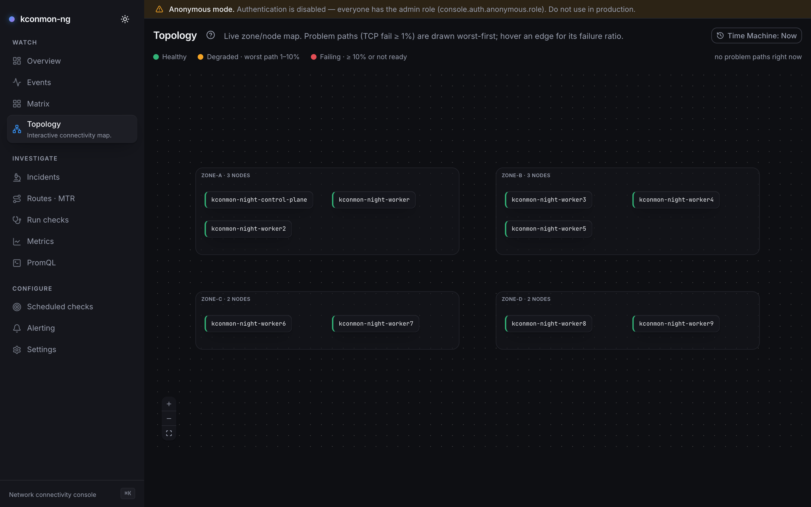

# External agents

kconmon-ng measures node-to-node connectivity, and not every node worth
measuring is a Kubernetes node. A bare-metal machine, a VM in another
network, the far end of a VPN. Install the agent there and it joins the
same mesh as the in-cluster DaemonSet: same binary, same checkers, same
metrics, one matrix with every vantage point on it.

<figure markdown>
  { loading=lazy }
  <figcaption>One matrix, every vantage point: a bare-host agent (zone "external") probing the in-cluster fleet and being probed back.</figcaption>
</figure>

What differs is trust and delivery. In-cluster agents dial the controller's
plaintext gRPC port, which is safe only because that port is never exposed
(and the optional NetworkPolicy pins it further). An external agent gets
neither guard, so it connects to a **separate TLS gateway** on the
controller and authenticates with a bootstrap token, optionally proving
*which* agent it is with a client certificate. The in-cluster listener is
untouched by all of this; exposing it directly remains the thing not to do
(see [Architecture](concepts/architecture.md)).

## Before you start: versions and NetworkPolicy

Two prerequisites bite before any of the configuration below does.

!!! warning "Upgrade the controller image before enabling the gateway"
    Chart 2.2.0 ships the gateway values but still pins `appVersion: 2.0.3`,
    and a 2.0.3 controller **rejects the `externalGateway` config key and
    crashloops**. The chart emits the key only when the gateway is enabled,
    which is exactly why the safe order is: roll a controller image that
    understands the gateway first, flip `controller.externalGateway.enabled`
    second. The same skew logic applies to the agent-side keys
    (`agent.tls`, `agent.bootstrapTokenFile`): a 2.0.3 agent binary does not
    know them either, so install a current package on the host.

With `networkPolicy.enabled`, there is a second, quieter trap. The chart's
agent policy admits probe ingress and egress **only from and to this
release's agent pods**, a pod-selector match. An external agent's host IP
matches no pod selector, so every external↔cluster probe is dropped by the
CNI even after the host firewall is satisfied, and
`networkPolicy.externalAgentCidrs` does not help: that list opens only the
**gateway port on the controller**, nothing on the agents. The chart has no
knob for the agent-side rules today. Until it does, add your own
NetworkPolicy alongside the chart's, allowing the external agents' CIDRs
to and from the agent pods on TCP `httpPort` (8080), UDP `grpcPort` (9090),
and ICMP (a ports-less rule, since NetworkPolicy v1 cannot name ICMP as a
port). Without it the gateway registration succeeds and every probe cell
stays red.

## The trust model

The gateway is a second gRPC listener (default port 9443) serving the same
services on the same registry, so an external agent is an ordinary fleet
member the moment it authenticates. Three layers stack:

1. **TLS.** The gateway serves a certificate you provide; agents verify it
   against a CA file or the system trust pool. TLS 1.2 is the floor.
2. **A bootstrap token** proves fleet membership. Every RPC carries it as a
   bearer credential; the controller compares in constant time and answers
   `Unauthenticated` to anything else. Tokens shorter than 16 characters are
   refused at controller startup; this is the gateway's only shared secret,
   and a short one turns it into an online brute-force target.
3. **An optional client CA** proves identity. When configured, every
   connection must present a certificate signed by that CA, and the
   certificate's CN (or a URI SAN) is pinned against the identity each
   request claims: registration must claim exactly the certified node name,
   and every later call may only speak for agent IDs that extend it. A
   mismatch is `PermissionDenied`; a missing certificate fails the TLS
   handshake itself (the agent sees `Unavailable`).

Without the client CA the gateway runs in **token-only mode**: membership is
authenticated, but agents cannot be told apart. See
[the v1 limitations](#what-v1-does-not-do) before choosing it.

One nuance of the pinning layer is security-relevant even when you enable
it: pinning applies to messages that *claim* an identity (registration, and
everything carrying an `agent_id`). A message that carries no identity (an
event-stream subscription, for instance) passes on the token alone. Any
token holder can therefore subscribe to domain events even with a client CA
configured; the CA constrains who can *act as* an agent, not who can listen.

## Cluster side: enable the gateway

The controller config block, with every key it accepts:

```yaml
controller:
  externalGateway:
    enabled: true
    # Must differ from httpPort, grpcPort and metricsPort.
    port: 9443
    tls:
      # Serving pair; both REQUIRED when the gateway is enabled.
      certFile: /etc/kconmon-ng/gateway/tls.crt
      keyFile: /etc/kconmon-ng/gateway/tls.key
      # Optional: CA that signed the agent CLIENT certificates. Setting it
      # turns on mandatory verified client certs plus identity pinning.
      clientCaFile: /etc/kconmon-ng/gateway/ca.crt
    # REQUIRED. Content is trimmed; shorter than 16 characters is refused.
    bootstrapTokenFile: /etc/kconmon-ng/gateway/token
```

An enabled gateway refuses to start half-configured: missing cert, key or
token file is a startup error, never a silently-open listener. When
`controller.events.enabled` is on, the domain event stream is served on the
gateway too, gated by the same token.

!!! warning "Rotation needs a controller restart, and the restart has a cost"
    The gateway reads the certificate and the token **once at startup**; the
    config hot-reload does not rebuild the listener. After rotating either,
    restart the controller (`kubectl rollout restart deployment/...`). Budget
    the blast radius: on a leader change agents re-register over roughly 15
    seconds (lease acquisition plus their reconnect backoff), each
    re-registration broadcasts a full peer-list resync to the whole fleet,
    and any Console diagnostics run in flight records the pairs dispatched
    into that window as failed. The agent side is friendlier: agents re-read
    their certificate and token files on every dial, so a reconnect picks up
    rotated material without a restart.

### Helm values

The chart wires the same thing from two Secrets you create (or let
cert-manager maintain):

```yaml
controller:
  externalGateway:
    enabled: true
    port: 9443
    service:
      # NodePort | LoadBalancer — the rendered Service exposes the gateway
      # port ALONE, never the plaintext in-cluster gRPC port.
      type: LoadBalancer
      annotations: {}
      loadBalancerSourceRanges: []
      # Local preserves agent source IPs (what the NetworkPolicy matches);
      # Cluster NATs them to node IPs. See networkPolicy.externalAgentCidrs.
      externalTrafficPolicy: ""
    tls:
      # kubernetes.io/tls Secret with the serving pair (tls.crt/tls.key).
      secretName: kconmon-ng-gateway-tls
      # Key in that same Secret holding the client CA bundle; empty = token-only.
      clientCaKey: ca.crt
    bootstrapToken:
      secretName: kconmon-ng-gateway-token
      key: token

networkPolicy:
  # With the chart's NetworkPolicy enabled, name the external agents' source
  # CIDRs (plain strings) or the rendered gateway is unreachable by design.
  externalAgentCidrs:
    - 203.0.113.0/24
```

Generate a token once and store it:

```bash
kubectl create secret generic kconmon-ng-gateway-token \
  --from-literal=token="$(openssl rand -hex 32)"
```

Mind NAT when the NetworkPolicy is on: behind a NodePort or a LoadBalancer
with `externalTrafficPolicy: Cluster`, the source IP the policy sees is the
**node's**, not the agent's. Either cover the node CIDR in
`externalAgentCidrs` or set `externalTrafficPolicy: Local`. The full knob
list is in the [Helm values reference](reference/helm-values.md).

## Host side: install the agent

Each release publishes the agent as a deb and an rpm for `amd64` and
`arm64` (assets named `kconmon-ng-agent_<version>_<arch>.deb` and
`kconmon-ng-agent-<version>.<arch>.rpm` on the
[releases page](https://github.com/EsDmitrii/kconmon-ng/releases)):

=== "Debian / Ubuntu"

    ```bash
    sudo dpkg -i kconmon-ng-agent_<version>_amd64.deb
    ```

=== "RHEL family"

    ```bash
    sudo rpm -i kconmon-ng-agent-<version>.x86_64.rpm
    ```

The package installs:

- `/usr/bin/kconmon-ng-agent` — the binary.
- `/usr/lib/systemd/system/kconmon-ng-agent.service` — a hardened unit: a
  dedicated `kconmon-ng` system user, `NoNewPrivileges`,
  `ProtectSystem=strict`, and `CAP_NET_RAW` granted back via ambient
  capabilities so MTR hop tracing works unprivileged.
- `/usr/lib/sysctl.d/50-kconmon-ng.conf` — opens
  `net.ipv4.ping_group_range`, which the kernel requires for the ICMP
  checker's unprivileged datagram socket (`CAP_NET_RAW` does not cover it).
  The shipped range is wide because the package user's GID is allocated
  dynamically; narrow it in `/etc/sysctl.d` if your policy requires.
- `/etc/kconmon-ng/config.yaml` — a commented example config, marked as a
  conffile so upgrades never overwrite your edits.

The service is installed but **not started**: the shipped config points at a
placeholder gateway. Edit the config (next section), then:

```bash
sudo systemctl enable --now kconmon-ng-agent
```

No packages for your platform? The same binary ships in the release
tarballs `kconmon-ng_<version>_linux_amd64.tar.gz` /
`..._linux_arm64.tar.gz` (alongside the controller binary). You then own the
unit file and the sysctl yourself — copy them from
[`packaging/agent/`](https://github.com/EsDmitrii/kconmon-ng/tree/main/packaging/agent)
in the repository. The agent reads `/etc/kconmon-ng/config.yaml` by default;
`KCONMON_NG_CONFIG` overrides the path.

## Configure the agent

A complete external-agent config, with every gateway-related key:

```yaml
# The controller's EXTERNAL GATEWAY — not the in-cluster gRPC port. The host
# part is also the name the server certificate is verified against, unless
# agent.tls.serverName overrides it.
controllerAddress: gateway.example.com:9443

agent:
  # Identity in the mesh; empty = this host's hostname. When the gateway
  # pins identities, the client cert CN (or a URI SAN) must equal this
  # name EXACTLY.
  nodeName: edge-host-01
  # The IP peers probe — an IP literal, no hostname, no port. Empty =
  # autodetected from the route towards controllerAddress. Set it
  # explicitly on NATed or multi-homed hosts.
  advertiseAddress: 203.0.113.10
  # Failure domain. In-cluster agents inherit it from the node label; an
  # external host has no node object, so an empty value here lands the
  # agent in the "" zone. Set it.
  zone: external
  tls:
    # CA that signed the GATEWAY's serving cert; empty = system trust pool.
    caFile: /etc/kconmon-ng/ca.crt
    # Client pair — both or neither. Required when the gateway sets
    # tls.clientCaFile.
    certFile: /etc/kconmon-ng/client.crt
    keyFile: /etc/kconmon-ng/client.key
    # Verify the server cert against this name instead of the dialed host —
    # for dialing by IP or through a load balancer.
    serverName: ""
  # Same content as the controller's bootstrapTokenFile. Keep it mode 0600,
  # owned by the service user.
  bootstrapTokenFile: /etc/kconmon-ng/bootstrap-token

checkers:
  dns:
    # The default probe host is kubernetes.default.svc.cluster.local, which
    # no bare host resolves — point the checker at names that matter here,
    # or disable it.
    hosts:
      - example.internal
```

Note the `checkers.dns` override is not decoration. The **packaged** config
file carries no `checkers.dns` block at all, so a stock install probes the
built-in default host, `kubernetes.default.svc.cluster.local`, a name no
bare host resolves, and the DNS checker fails from first start until you
set `hosts` or disable it. That failure is on the checker only; the mesh
probes are unaffected.

Rules the config loader enforces, so they fail at startup with a message
rather than at registration:

- `agent.bootstrapTokenFile` **without** an `agent.tls` block is refused:
  the token never rides plaintext. (The credential itself also refuses
  insecure transport at runtime, as a second net.)
- `agent.tls.certFile` and `keyFile` go together; one without the other is
  an error.
- `agent.advertiseAddress` must be an IP literal; the controller publishes
  it fleet-wide as a probe target and rejects anything else.

The `agent.tls` block is itself the switch: setting any key in it moves the
dial to TLS, while an empty block keeps the plaintext in-cluster dial
byte-identical.

Identity resolution (env over file over fallback) is shared with in-cluster
agents and spelled out in
[Configuration → Agent identity](configuration.md#agent-identity). Two
external-specific notes. Identity is resolved once at startup, so changes to
the `agent` block take a service restart. And an agent running outside any
Pod is automatically labeled `kconmon-ng.io/external=true` in its
registration metadata; the label comes back verbatim in every
`GET /api/v1/topology` response (`agents[].labels`), which is how API
consumers tell bare-host agents apart, while in the Console the agent simply
appears under whatever `zone` you configured.

When the gateway pins identities, issue each host a certificate whose **CN
equals its `nodeName`** (the resolved one: the hostname, if you did not set
the key). URI SANs work too, matched verbatim. v1 relies on a CA you already
operate: there is no CSR flow and no SPIFFE. A token store with per-agent
issuance, rotation and revocation is a project of its own, and a shared CA
covers the fleets this feature targets.

## Open the firewall

Probes are peer-to-peer (results never transit the controller), so the
mesh needs more than the gateway port:

| Path | Protocol / port | Purpose |
| --- | --- | --- |
| agent ↔ agent | TCP `httpPort` (default 8080), both directions | TCP connect probes; agent health endpoints |
| agent ↔ agent | UDP `grpcPort` (default 9090), both directions | UDP loss/RTT probes (each agent's echo server) |
| agent ↔ agent | ICMP echo, both directions | ICMP RTT/loss; MTR hop tracing |
| agent → controller | TCP `controller.externalGateway.port` (default 9443) | registration, peer list, heartbeats, tasks, results |
| Prometheus → agent | TCP `metricsPort` (default 9091) | metrics scrape |

"Both directions" is literal: every fleet member probes every other, so the
external host must accept these from the cluster's agents, and the cluster
must accept them from the external host.

That table hides the real prerequisite: **addresses must be routable both
ways.** The external agent's `advertiseAddress` must be reachable from the
in-cluster agent pods, and the pod IPs the cluster agents advertise must be
routable from the external host. Without a routable pod network (BGP-
announced pods, cloud-native routing, a VPN that carries pod CIDRs), every
external↔cluster cell shows red. That is an accurate measurement of a
network that genuinely cannot deliver those packets, not a kconmon-ng bug.
Prometheus must likewise be able to reach the external host's
`metricsPort`, or the new vantage point produces no metrics at all.

## What v1 does not do

The limits, so they are a decision you make up front:

- **One port set for the whole fleet.** Peer records carry no per-agent
  ports: every agent probes its peers on its *own* configured `httpPort`
  and `grpcPort`. External agents must therefore use the same two values as
  the in-cluster fleet, and both must be free on the host.
- **Token-only mode allows impersonation inside the fleet.** Any token
  holder can register under any node name, or attach to another agent's
  subscriptions and heartbeats. The token authenticates membership, nothing
  finer. That is acceptable when every token holder is equally trusted;
  otherwise set the client CA and get per-agent pinning, remembering the
  identity-less-message caveat in the trust model above.
- Pinning has one inherent ambiguity. Agent IDs join node and pod name
  with `-`, so a certificate for node `node-1` may also speak for IDs of a
  node literally named `node-1-0` (the prefix rule cannot tell
  `node-1` + pod `0-x` from `node-1-0` + pod `x`). It can never act for
  `node-10`, though: the separator is part of the match. Avoid node names
  that are dash-prefixes of each other.
- WAN timing needs config. Agents heartbeat every 5 seconds (fixed),
  and the controller evicts after `controller.agentTtl`: 30s by default,
  tuned for a LAN. On WAN or VPN links that default turns every blip into
  an evict/re-register cycle, and each re-registration triggers a full
  peer-list resync for the whole fleet. Raise the TTL to minutes
  (`controller.agentTtl: 5m`; Helm: `config.controllerAgentTtl`) for fleets
  with external members.
- Rotation is asymmetric: gateway cert and token need a controller restart,
  agent cert and token are picked up on the next reconnect.

## The reverse direction

If what you actually need is *probing* an external destination (a DNS
server, a storage array, a SaaS endpoint), you do not need an external
agent at all: in-cluster agents can probe outward continuously via
[external checks](scenarios/external-targets.md), with no new trust
surface. External agents are for when the *vantage point* must be outside
the cluster.
