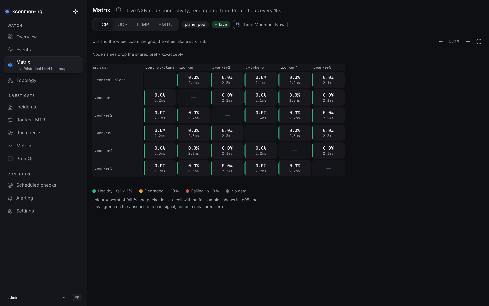

# External agents

kconmon-ng measures node-to-node connectivity, and not every node worth
measuring is a Kubernetes node. A bare-metal machine, a VM in another
network, the far end of a VPN. Install the agent there and it joins the
same mesh as the in-cluster DaemonSet: the same Linux binary, the same
checkers, the same metrics, one matrix with every vantage point on it.

<figure markdown>
  { loading=lazy }
  <figcaption>One matrix of cluster nodes, all 30 pairs green on TCP. No external agent was registered on this stand, so the frame has no extra row or column; an external agent adds one of each, the column for the cluster probing the host and the row for the host's own probes, which reach the console because Prometheus <a href="#scraping-external-agents">scrapes the external agent</a>.</figcaption>
</figure>

What differs is trust and delivery. In-cluster agents dial the controller's
plaintext gRPC port, which is safe only because that port is never exposed
(and the optional NetworkPolicy pins it further). An external agent gets
neither guard, so it connects to a **separate TLS gateway** on the
controller and authenticates with a bootstrap token, optionally proving
*which* agent it is with a client certificate. The in-cluster listener is
untouched by all of this; exposing it directly remains the thing not to do
(see [Architecture](concepts/architecture.md)).

## Before you start: versions and NetworkPolicy

Two prerequisites bite before any of the configuration below does.

!!! warning "Keep the images at least as new as the chart"
    The gateway shipped in kconmon-ng v2.3.0: the controller understands the
    `externalGateway` config key from that release on, and the agent knows
    `agent.tls` and `agent.bootstrapTokenFile` from the same one. The chart
    emits the gateway key only when the gateway is enabled, because a
    controller image that predates it **rejects the unknown key and
    crashloops**. A default install pins matching images; if yours pins the
    controller image behind the chart, roll the image first and flip
    `controller.externalGateway.enabled` second. The same skew logic applies
    on the host: an agent binary older than the gateway does not know the TLS
    keys either, so install a current package there.

With `networkPolicy.enabled`, there is a second, quieter trap. The chart's
agent policy admits probe ingress and egress **only from and to this
release's agent pods**, a pod-selector match. An external agent's host IP
matches no pod selector, so every external↔cluster probe is dropped by the
CNI even after the host firewall is satisfied, and
`networkPolicy.externalAgentCidrs` does not help on its own: that list opens
only the **gateway port on the controller**, registration and nothing else.
The probe half is `networkPolicy.externalPeerCidrs` (since 2.4.0): the CIDRs
you list there are spliced as `ipBlock` peers into the agent↔agent rules of
the agents' own NetworkPolicy (the controller has a separate one that
never sees this list), ingress and egress, UDP `grpcPort` (9090) and TCP
`httpPort` (8080) plus the ports-less ICMP/MTR rule (NetworkPolicy v1 cannot
name ICMP as a port), and never into the gateway rule. Set both lists.
Without `externalAgentCidrs` the agent cannot register; without
`externalPeerCidrs` it registers fine and every cell between it and the
cluster stays red.

On Cilium, a source that is a node IP matches no `ipBlock`: Cilium tags it
with the `remote-node` or `host` entity first. That is what the gateway sees
behind a NodePort or an `externalTrafficPolicy: Cluster` LoadBalancer, so
there `externalAgentCidrs` admits nothing. With the gateway on,
`networkPolicy.ciliumKubeAPIEgress` (`auto` on a cluster that serves
`CiliumNetworkPolicy`) renders `<fullname>-node-ingress`, which admits those
entities to the controller's gateway port and nothing else; see
[NetworkPolicy on Cilium, Calico and Antrea](configuration.md#networkpolicy-and-cilium).

A third list, `networkPolicy.nodeCidrs`, belongs to
[`agent.hostNetwork`](#when-the-pod-network-does-not-route) rather than to
external agents as such: host-network agents register from node IPs, and the
chart refuses to render the policy without the list. On Cilium that list
matches nothing either, and the same `<fullname>-node-ingress` policy admits
the nodes to the controller's `grpcPort`. Read that section before turning
the option on.

## The trust model

The gateway is a second gRPC listener (default port 9443) serving the same
services on the same registry, so an external agent is an ordinary fleet
member the moment it authenticates. Three layers stack:

1. **TLS.** The gateway serves a certificate you provide; agents verify it
   against a CA file or the system trust pool. TLS 1.2 is the floor.
2. **A bootstrap token** proves fleet membership. Every RPC carries it as a
   bearer credential; the controller compares in constant time and answers
   `Unauthenticated` to anything else. Tokens shorter than 16 characters are
   refused at controller startup; this is the gateway's only shared secret,
   and a short one turns it into an online brute-force target.
3. **An optional client CA** proves identity. When configured, every
   connection must present a certificate signed by that CA, and the
   certificate's CN (or a URI SAN) is pinned against the identity each
   request claims: registration must claim exactly the certified node name
   and an agent ID that extends it with a `-` suffix (`edge-host-01-…`), and
   every later call may only speak for such agent IDs. A
   mismatch is `PermissionDenied`; a missing certificate fails the TLS
   handshake itself (the agent sees `Unavailable`).

Without the client CA the gateway runs in **token-only mode**: membership is
authenticated, but agents cannot be told apart. See
[the v1 limitations](#what-v1-does-not-do) before choosing it.

The token is checked per RPC, so since 2.5.0 the gateway also bounds what a
client that has not proven membership can hold. None of these limits is
configurable, and none touches a working agent, which authenticates with its
first RPC and then holds its Watch stream:

- the TLS handshake and the HTTP/2 preface must finish within 10 seconds;
- a connection must authenticate, with a first RPC carrying a valid token,
  within 30 seconds of connecting, or it is closed; a failing RPC does not
  extend that;
- at most 128 connections may be unauthenticated at once. Past that, the new
  connection is still admitted and one unauthenticated connection of the
  source holding the most (an IPv4 address or an IPv6 /64, the new
  connection counted) is closed. Within that source a connection still in
  its TLS handshake goes before one that finished TLS, oldest first, so a
  flooding source pushes out its own connections first, and bare TCP
  sockets push out each other rather than an agent. The controller logs
  `external gateway closing the oldest unauthenticated connections: too many have not authenticated yet`
  at WARN, at most once a minute, with the number `closed` since the last
  line and the `source` of the last one;
- a connection with no RPC in flight for 2 minutes is closed (gRPC keepalive
  `MaxConnectionIdle`).

Behind a NodePort or an `externalTrafficPolicy: Cluster` LoadBalancer every
client arrives from a node IP, so the gateway sees only a few sources. A
client there can still push an agent's connection out, by opening more than
128 connections from the agent's source while the agent is in its TLS
handshake, or by completing more than 128 TLS handshakes before the agent's
first RPC; the agent then reconnects. `loadBalancerSourceRanges`, or
`externalTrafficPolicy: Local` with tight `externalAgentCidrs`, narrows who
can try.

Pinning applies to messages that *claim* an identity (registration, and
everything carrying an `agent_id`). The one service whose calls carry no
identity, the domain event stream, is not served on the gateway at all since
2.5.0: `WatchEvents` there answers `Unimplemented`, and the console
subscribes on the in-cluster gRPC port. Diagnostics results are accepted
only from the agent a task was dispatched to.

Token-only mode has one more consequence since 2.4.0, and it deserves its own
paragraph. The controller now publishes every external agent's advertised
address as a Prometheus scrape target
([Scraping external agents](#scraping-external-agents)), so a token holder
who registers a fictitious external agent with an address of their choosing
makes Prometheus connect to that `host:port` from the monitoring namespace:
an SSRF-shaped primitive, built from a credential that was only ever meant
to prove membership. Client-certificate pinning closes it, since a
registration then needs a certificate your CA issued for exactly that node
name. If you would rather write scrape targets by hand,
`controller.prometheusSD.enabled: false` closes the publishing side
altogether.

## Cluster side: enable the gateway

The controller config block, with every key it accepts:

```yaml
controller:
  externalGateway:
    enabled: true
    # Must differ from httpPort, grpcPort and metricsPort.
    port: 9443
    tls:
      # Serving pair; both REQUIRED when the gateway is enabled.
      certFile: /etc/kconmon-ng/gateway/tls.crt
      keyFile: /etc/kconmon-ng/gateway/tls.key
      # Optional: CA that signed the agent CLIENT certificates. Setting it
      # turns on mandatory verified client certs plus identity pinning.
      clientCaFile: /etc/kconmon-ng/gateway/ca.crt
    # REQUIRED. Content is trimmed; shorter than 16 characters is refused.
    bootstrapTokenFile: /etc/kconmon-ng/gateway/token
```

An enabled gateway refuses to start half-configured: missing cert, key or
token file is a startup error, never a silently-open listener. The gateway
serves the agent registry only: the domain event stream stays on the
in-cluster gRPC port even with `controller.events.enabled` on.

!!! warning "Rotation needs a controller restart, and the restart has a cost"
    The gateway reads the certificate and the token **once at startup**; the
    config hot-reload does not rebuild the listener. After rotating either,
    restart the controller (`kubectl rollout restart deployment/...`). Budget
    the blast radius: on a leader change agents re-register within a few
    heartbeats (a clean restart hands the lease over in about 2 seconds, a
    crashed leader's lease runs out after 15), each
    re-registration broadcasts a full peer-list resync to the whole fleet,
    and any Console diagnostics run in flight records the pairs dispatched
    into that window as failed. The agent side is friendlier: agents re-read
    their certificate and token files on every dial, so a reconnect picks up
    rotated material without a restart.

### Helm values

The chart wires the same thing from two Secrets you create (or let
cert-manager maintain):

```yaml
controller:
  externalGateway:
    enabled: true
    port: 9443
    service:
      # NodePort | LoadBalancer; the rendered Service exposes the gateway
      # port ALONE, never the plaintext in-cluster gRPC port.
      type: LoadBalancer
      annotations: {}
      loadBalancerSourceRanges: []
      # Local preserves agent source IPs (what the NetworkPolicy matches);
      # Cluster NATs them to node IPs. See networkPolicy.externalAgentCidrs.
      externalTrafficPolicy: ""
    tls:
      # kubernetes.io/tls Secret with the serving pair (tls.crt/tls.key).
      secretName: kconmon-ng-gateway-tls
      # Key in that same Secret holding the client CA bundle; empty = token-only.
      clientCaKey: ca.crt
    bootstrapToken:
      secretName: kconmon-ng-gateway-token
      key: token

networkPolicy:
  # With the chart's NetworkPolicy enabled, name the external agents' source
  # CIDRs (plain strings) or the rendered gateway is unreachable by design.
  externalAgentCidrs:
    - 203.0.113.0/24
```

Generate a token once and store it:

```bash
kubectl create secret generic kconmon-ng-gateway-token \
  --from-literal=token="$(openssl rand -hex 32)"
```

Mind NAT: behind a NodePort or a LoadBalancer with
`externalTrafficPolicy: Cluster` (the apiserver default), the source IP the
gateway and the NetworkPolicy see is the **node's**, not the agent's. The
policy then needs the node CIDR in `externalAgentCidrs`, and the gateway's
per-source eviction of unauthenticated connections (above) cannot tell apart
the agents behind one node. Prefer `externalTrafficPolicy: Local` with tight
`networkPolicy.externalAgentCidrs`, at the cost of only the nodes running a
controller pod answering, or `loadBalancerSourceRanges` on a LoadBalancer.
The chart's install notes list the gateway under STILL TO DECIDE while it
runs with any other policy and no source ranges. The full knob list is in the
[Helm values reference](reference/helm-values.md).

## Host side: install the agent

Each release publishes the agent as a deb and an rpm for `amd64` and
`arm64` (assets named `kconmon-ng-agent_<version>_<arch>.deb` and
`kconmon-ng-agent-<version>.<arch>.rpm` on the
[releases page](https://github.com/EsDmitrii/kconmon-ng/releases)):

=== "Debian / Ubuntu"

    ```bash
    sudo dpkg -i kconmon-ng-agent_<version>_amd64.deb
    ```

=== "RHEL family"

    ```bash
    sudo rpm -i kconmon-ng-agent-<version>.x86_64.rpm
    ```

The package installs:

- `/usr/bin/kconmon-ng-agent`: the binary.
- `/usr/lib/systemd/system/kconmon-ng-agent.service`: a hardened unit, a
  dedicated `kconmon-ng` system user, `NoNewPrivileges`,
  `ProtectSystem=strict`, and `CAP_NET_RAW` granted back via ambient
  capabilities so MTR hop tracing works unprivileged.
- `/usr/lib/sysctl.d/50-kconmon-ng.conf`: opens
  `net.ipv4.ping_group_range`, which the kernel requires for the ICMP
  checker's unprivileged datagram socket (`CAP_NET_RAW` does not cover it).
  The shipped range is wide because the package user's GID is allocated
  dynamically; narrow it in `/etc/sysctl.d` if your policy requires. The
  package applies its file at install only when no `/etc/sysctl.conf`,
  `/etc/sysctl.d` or `/run/sysctl.d` file sets the key (in the dotted or the
  slash form, `net/ipv4/ping_group_range`), so a narrowed range survives
  upgrades. With systemd it applies the file by name through
  `systemd-sysctl`, which honours a same-name file in `/etc/sysctl.d` or
  `/run/sysctl.d` and a `/dev/null` mask; without systemd it skips when such
  a same-name file exists.
- `/etc/kconmon-ng/config.yaml`: a commented example config, marked as a
  conffile so upgrades never overwrite your edits.

The service is installed but **not started**: the shipped config points at a
placeholder gateway. Edit the config (next section), then:

```bash
sudo systemctl enable --now kconmon-ng-agent
```

No packages for your platform? The same binary ships in the release
tarballs `kconmon-ng_<version>_linux_amd64.tar.gz` /
`..._linux_arm64.tar.gz` (alongside the controller binary). You then own the
unit file and the sysctl yourself; copy them from
[`packaging/agent/`](https://github.com/EsDmitrii/kconmon-ng/tree/main/packaging/agent)
in the repository. The agent reads `/etc/kconmon-ng/config.yaml` by default;
`KCONMON_NG_CONFIG` overrides the path.

## Configure the agent

A complete external-agent config, with every gateway-related key:

```yaml
# The controller's EXTERNAL GATEWAY, not the in-cluster gRPC port. The host
# part is also the name the server certificate is verified against, unless
# agent.tls.serverName overrides it.
controllerAddress: gateway.example.com:9443

agent:
  # Identity in the mesh; empty = this host's hostname. When the gateway
  # pins identities, the client cert CN (or a URI SAN) must equal this
  # name EXACTLY.
  nodeName: edge-host-01
  # The IP peers probe: an IP literal, no hostname, no port. Empty =
  # autodetected from the route towards controllerAddress. Set it
  # explicitly on NATed or multi-homed hosts.
  advertiseAddress: 203.0.113.10
  # Failure domain. In-cluster agents inherit it from the node label; an
  # external host has no node object, so an empty value here lands the
  # agent in the "" zone. Set it.
  zone: external
  tls:
    # TLS with nothing else set, verified against the system trust pool; not
    # needed here, since caFile below turns TLS on by itself.
    # enabled: true
    # CA that signed the GATEWAY's serving cert. Empty = the system trust
    # pool, but an empty caFile alone does not turn TLS on.
    caFile: /etc/kconmon-ng/ca.crt
    # Client pair: both or neither. Required when the gateway sets
    # tls.clientCaFile.
    certFile: /etc/kconmon-ng/client.crt
    keyFile: /etc/kconmon-ng/client.key
    # Verify the server cert against this name instead of the dialed host:
    # for dialing by IP or through a load balancer.
    serverName: ""
  # Same content as the controller's bootstrapTokenFile. Keep it mode 0600,
  # owned by the service user. Refused unless TLS is on (enabled, caFile,
  # the client pair or serverName): a token never rides plaintext.
  bootstrapTokenFile: /etc/kconmon-ng/bootstrap-token

checkers:
  dns:
    # Off in the packaged config: the default probe host,
    # kubernetes.default.svc.cluster.local, resolves only inside a cluster.
    # Turn it on with names this host must resolve.
    enabled: true
    hosts:
      - example.internal
```

Note the `checkers.dns` block. The **packaged** config ships
`checkers.dns.enabled: false`, because the built-in default host,
`kubernetes.default.svc.cluster.local`, is a name no bare host resolves and
the checker would fail from the first start. To check DNS from the host, set
`enabled: true` and a `hosts` list of names it must resolve, as above. An
installation from before 2.5.0 keeps its own config file on upgrade (it is a
conffile), so its DNS checker keeps failing until you do the same.

Rules the config loader enforces, so they fail at startup with a message
rather than at registration:

- `agent.bootstrapTokenFile` **without** TLS is refused: set
  `agent.tls.enabled`, a `caFile`, a client certificate or a `serverName`.
  An empty `caFile` alone leaves the dial plaintext, and the token never
  rides plaintext. (The credential itself also refuses insecure transport
  at runtime, as a second net.)
- `agent.tls.certFile` and `keyFile` go together; one without the other is
  an error.
- `agent.advertiseAddress` must be an IP literal peers can reach; the
  controller publishes it fleet-wide as a probe target and rejects anything
  else. The unspecified address (`0.0.0.0`, `::`), loopback, multicast and
  `255.255.255.255` are refused at load; link-local, private and IPv6
  addresses are fine. Without it, an autodetect that finds a loopback source
  (a `controllerAddress` through a local tunnel, `127.0.0.1:<port>`) stops
  startup with `set agent.advertiseAddress explicitly`.

The `agent.tls` block is itself the switch: `enabled: true` or any other key
set in it moves the dial to TLS, while an empty block keeps the plaintext
in-cluster dial byte-identical. A gateway with a publicly trusted
certificate needs only `enabled: true` (2.5.0 or newer): the system trust
pool verifies it against the `controllerAddress` host.

### Ports

`httpPort`, `grpcPort` and `metricsPort` are top-level keys, the same three
the in-cluster agents use (`grpcPort` is the UDP echo port on an agent; the
name is an old overload). Since 2.4.0 an agent reports all three at
registration and its peers probe it on the ports it reported, so an external
host may run on ports of its own: a host that registered `httpPort: 18080` is
dialled on 18080 whatever the cluster pods listen on. `metricsPort` is never
probed; it is published for [scrape discovery](#scraping-external-agents).
Ports are read once at startup with the rest of the identity, so a change
takes a service restart and reaches the peers with the re-registration. The
agent never adopts ports from the controller's registration reply; zone is
the only field it takes from there.

The rule that comes with it: **keep one port set for the whole fleet until
every agent, deb/rpm hosts included, runs 2.4.0.** An older agent reports no
ports and, worse, ignores the ports its peers report: it dials every peer on
its *own* configured values, on-demand diagnostics included. In a fleet where
ports differ, each old agent fails one way toward every peer on other ports,
and the matrix shows one-way red on exactly those rows. A 2.3.x controller
drops the port fields at registration, so behind an old controller the whole
fleet stays on the fleet-wide contract as well.

Identity resolution (env over file over fallback) is shared with in-cluster
agents and spelled out in
[Configuration → Agent identity](configuration.md#agent-identity). Two
external-specific notes. Identity is resolved once at startup, so changes to
the `agent` block take a service restart. And every agent that registers
through the gateway is labeled `kconmon-ng.io/external=true` in its
registration metadata. Since 2.5.0 the controller's listener sets the label,
not the agent: the gateway always adds it, and the in-cluster gRPC port drops
it if an agent claims it. A bare host registering through the plaintext
in-cluster port, which is not supported, counts as an in-cluster agent. The
label decides `kconmon_ng_controller_external_agents`, the Prometheus SD
target list and the missing-agents arithmetic, and it comes back verbatim in
every `GET /api/v1/topology` response (`agents[].labels`), which is how API
consumers tell bare-host agents apart.

Since 2.4.0 the Console reads that label too. The Topology map draws the host
beside the cluster nodes with a neutral **external** badge and "readiness
unknown" (a bare host has no Kubernetes node to be ready); the node page
swaps *Pod IP* for *Advertised address*, notes that readiness is not reported
for an external host, and lists the probe planes the agent advertised
(TCP, UDP, ICMP, PMTU, MTR chips; "unknown" for an agent older than 2.4.0, which
advertises none); the Matrix marks the row and column header "external
agent"; Overview badges the name in *Worst pairs* and adds "+N external
agent(s)" beside the *Nodes ready* tile without counting them in, since that
count is Kubernetes readiness. When Prometheus is not scraping the host, the
Matrix says so instead of leaving a bare grey row: the tooltip on every cell
of that row and a note above the grid name the agent and link to
[Scraping external agents](#scraping-external-agents). The CLI follows:
`kubectl kconmon agents` gained an `EXTERNAL` column and
`kubectl kconmon topology` prints bare-host rows after the node rows, with
`-o json` carrying labels and capabilities verbatim. All of it rides on the
label, so a 2.3.x console in front of a 2.4.0 controller shows the agent as
one more row under its zone with nothing marking it as external, and the
Time Machine can badge only history a 2.4.0 controller recorded, since older
topology events carry no labels.

When the gateway pins identities, issue each host a certificate whose **CN
equals its `nodeName`** (the resolved one: the hostname, if you did not set
the key). URI SANs work too, matched verbatim. v1 relies on a CA you already
operate: there is no CSR flow and no SPIFFE. A token store with per-agent
issuance, rotation and revocation is a project of its own, and a shared CA
covers the fleets this feature targets.

## Open the firewall

Probes are peer-to-peer (results never transit the controller), so the
mesh needs more than the gateway port:

| Path | Protocol / port | Purpose |
| --- | --- | --- |
| agent ↔ agent | TCP `httpPort` (default 8080; each peer's own reported port since 2.4.0), both directions | TCP connect probes; agent health endpoints |
| agent ↔ agent | UDP `grpcPort` (default 9090; likewise per peer since 2.4.0), both directions | UDP loss/RTT probes (each agent's echo server) |
| agent ↔ agent | ICMP echo, both directions | ICMP RTT/loss; MTR hop tracing |
| agent → controller | TCP `controller.externalGateway.port` (default 9443) | registration, peer list, heartbeats, tasks, results |
| Prometheus → agent | TCP `metricsPort` (default 9091; the port the SD body publishes) | metrics scrape |

"Both directions" is literal: every fleet member probes every other, so the
external host must accept these from the cluster's agents, and the cluster
must accept them from the external host.

That table hides the real prerequisite: **addresses must be routable both
ways.** The external agent's `advertiseAddress` must be reachable from the
in-cluster agent pods, and the pod IPs the cluster agents advertise must be
routable from the external host. Without a routable pod network (BGP-
announced pods, cloud-native routing, a VPN that carries pod CIDRs), every
external↔cluster cell shows red. That is an accurate measurement of a
network that genuinely cannot deliver those packets, not a kconmon-ng bug.
Prometheus must likewise be able to reach the external host's `metricsPort`;
how it learns the address is the [next section](#scraping-external-agents).

### When the pod network does not route

The alternative to routing pod CIDRs to the host is `agent.hostNetwork: true`
in the chart: the agent DaemonSet moves into each node's network namespace,
advertises the node IP, and listens on TCP `httpPort`, UDP `grpcPort` and TCP
`metricsPort` of the node itself. An external host that can reach the nodes
can then reach every agent, with no BGP and no VPN carrying pod CIDRs.

The price is loud, and it is why the option is off by default: it changes
**what is measured** for the whole DaemonSet, not only where the pods listen.
Every in-cluster pair then probes node IP to node IP over the underlay, and
the CNI datapath (overlay, conntrack, NetworkPolicy enforcement) is no longer
exercised, so the failure class this tool exists to catch hides behind a
green matrix. Diagnostics keep reporting `plane=pod` either way; read the
field as "the addresses the agents advertise", as
[Mesh and planes](concepts/mesh-and-planes.md#host-networking) explains.
Turn it on only when the goal is visibility between external agents and a
cluster whose pod network the hosts cannot route to.

What must already be true, because each miss fails in its own quiet way:

- The namespace runs at PSS `privileged` or is exempted: `baseline` refuses
  `hostNetwork` at admission while the release still looks healthy.
- TCP `httpPort`, UDP `grpcPort` and TCP `metricsPort` are free on **every**
  node (`ss -lntup` first; Calico's Felix metrics also default to 9091 when
  enabled). An occupied port crash-loops the agent on that node alone and
  fires `KconmonAgentsMissing`. The kubelet's liveness and readiness probes
  now hit the node's port 8080 as well.
- `net.ipv4.ping_group_range` is set by the node OS (a `sysctl.d` file, the
  same line the deb/rpm ships): the kubelet refuses `net.*` pod sysctls under
  host networking, so the chart stops rendering it.
- `networkPolicy.nodeCidrs` is set when `networkPolicy.enabled`: registrations
  now arrive from node IPs, which no pod selector matches, and the chart
  refuses to render the policy without the list. On Cilium the list matches
  nothing, since node IPs are the `remote-node` and `host` entities there;
  the `<fullname>-node-ingress` `CiliumNetworkPolicy` that
  `networkPolicy.ciliumKubeAPIEgress` renders under `agent.hostNetwork`
  admits them to the controller's `grpcPort`.
- `agent.dnsPolicy` can stay empty: the chart renders
  `ClusterFirstWithHostNet` under host networking, because `controllerAddress`
  is a bare Service name that only cluster DNS resolves.

`hostNetwork` and `dnsPolicy` are pod-template fields, so flipping them rolls
the DaemonSet; during the rollout a mixed fleet (node IPs next to pod IPs)
keeps working, with some transient `PairWentSilent` noise. A host-network
agent from a 2.4.0 image also labels itself `kconmon-ng.io/host-network=true`,
so `GET /api/v1/topology` tells the two address kinds apart.

One rule closes the section: **a machine cannot run both a host-network
agent pod and a bare-host external agent.** They would share one IP and the
same three ports: the agents' self filter skips any peer with their own node
name or address, so neither would probe the other, and the second one to
start cannot bind its listeners anyway. One agent per machine.

## Scraping external agents

An in-cluster agent is found by the chart's `ServiceMonitor` through its
Service. A bare host has no Service, so before 2.4.0 nothing scraped it: the
agent's column in the Matrix filled in (the cluster probes it), its row
stayed grey (nobody read its own probes), and its zone metrics and worst
pairs were blind to everything it measured. Since 2.4.0 the controller, the
one party that knows a host registered and on which address, tells
Prometheus itself: `GET /api/v1/prometheus/sd` answers in the
[HTTP service discovery](https://prometheus.io/docs/prometheus/latest/configuration/configuration/#http_sd_config)
format with one target group per external agent, served on `metricsPort`
(the port the chart's scrape NetworkPolicy already opens) and on `httpPort`
alike. The body and its rules are in the
[API reference](api.md#get-apiv1prometheussd).

### With the Prometheus Operator

The chart renders a `ScrapeConfig` (the `scrapeconfigs.monitoring.coreos.com`
CRD; `kubectl get crd scrapeconfigs.monitoring.coreos.com` tells you whether
your operator ships it) pointing at the endpoint:

```yaml
scrapeConfig:
  externalAgents:
    enabled: true
    # Selector labels YOUR Prometheus requires. kube-prometheus-stack selects
    # only ScrapeConfigs labelled release=<its release name>; an operator with
    # an empty scrapeConfigSelector needs nothing here.
    labels:
      release: kube-prometheus-stack
    # Empty = <release>-agent-external. Keep "kconmon" in it: the bundled
    # dashboards filter on job=~".*kconmon.*".
    jobName: ""
    # How often Prometheus re-reads the target list; matches config.controllerAgentTtl.
    refreshInterval: 30s
    # Scrape interval; empty falls back to serviceMonitor.interval.
    interval: ""
```

The object is named `<release>-agent-external`, carries the chart labels plus
whatever you put in `labels`, and applies the same `agent.metrics.detail`
cardinality valve as the agent ServiceMonitor, so an external host never
returns per-pair detail the valve dropped for the pods. Two guards refuse
combinations that cannot work: the ScrapeConfig without
`controller.externalGateway.enabled` (no gateway, no external agents, an
empty target list forever) and without `controller.prometheusSD.enabled`
(the endpoint would answer 404 on every refresh). The install notes print a
reminder when the gateway is on and the ScrapeConfig is not, and another when
`labels` is empty, since a kube-prometheus-stack Prometheus silently ignores
an unlabelled object.

### Plain Prometheus

Without the operator, the same discovery is one `http_sd_configs` job. Keep
`agent-external` in the job name (the optional `KconmonExternalAgentDown`
alert matches on it) and `kconmon` (the dashboards filter on it):

```yaml
- job_name: kconmon-ng-agent-external
  http_sd_configs:
    - url: http://kconmon-ng-controller.kconmon-ng.svc:9091/api/v1/prometheus/sd
      refresh_interval: 30s
  # The agent.metrics.detail valve by hand; drop the block to keep full detail.
  metric_relabel_configs:
    # counters-only: drop the four per-pair histograms.
    - source_labels: [__name__]
      regex: kconmon_ng_(tcp_connect_duration|tcp_total_duration|udp_rtt|icmp_rtt)_seconds_(bucket|sum|count)
      action: drop
    # zone-only instead: a per-pair series is exactly one naming a destination node.
    # - source_labels: [destination_node]
    #   regex: .+
    #   action: drop
```

Adjust the Service name and namespace to your release
(`<release>-controller.<namespace>.svc:<config.metricsPort>`). The targets
arrive labelled `node`, `zone`, `external="true"` and `agent_id`, and nothing
else: an agent's own labels never reach Prometheus.

### What to expect

- **Leader only.** The endpoint answers `503 not the leader` from a standby,
  never an empty list, because Prometheus treats every `200` as the complete
  new target set and a standby's `[]` would wipe every external target. On a
  non-200 Prometheus keeps the list it has. With `controller.replicaCount > 1`
  the Service spreads refreshes over all replicas, so roughly half of them
  land on a standby: `prometheus_sd_http_failures_total` climbs for the job
  while the targets stay correct. Cosmetic, and written down here so nobody
  chases it.
- **Reachability is yours.** The chart's NetworkPolicy admits the scraper to
  `metricsPort`; egress from the monitoring namespace to the hosts is your
  policy, not the chart's. On most CNIs a pod's egress is NATed to the node
  IP, so the host firewall must admit the **node CIDR**, not "the Prometheus
  pod's IP". A target the controller lists but Prometheus cannot reach sits
  at `up == 0`; `prometheusRule.externalAgentDown.enabled` turns that into a
  warning after 5 minutes.
- **A 2.3.x host in a 2.4.0 fleet** reports no metrics port, so the
  controller assumes its own `config.metricsPort` and logs
  `metrics port assumed from controller config` once per agent. A host on a
  different port then shows `up == 0` with that log line as the clue: upgrade
  the package, or move the host to the fleet port.
- **`KconmonAgentsMissing` no longer counts external agents.** Registered
  agents include them and expected agents (schedulable nodes) never did, so
  one external agent used to mask one missing cluster node. Since 2.4.0 the
  controller exports `<prefix>_controller_external_agents` and the rule
  subtracts it.

## What v1 does not do

The limits, so they are a decision you make up front. Per-agent ports,
scraping and console awareness were the v1 gaps 2.4.0 closed; what remains:

- **Linux only.** The agent builds for Windows, and TCP, UDP, DNS and HTTP
  would work as written, but ICMP and MTR would not: the ICMP checker sits on
  a datagram ICMP socket that `golang.org/x/net/icmp` supports only on Linux
  and Darwin by its own contract, and raw ICMP on Windows needs the
  Administrators group, so an agent that also runs on-demand probes for the
  controller would run as SYSTEM. Go's monotonic clock on Windows is also
  interrupt-tick granular (up to 15.6 ms), so a sub-millisecond LAN round
  trip would read as zero or as one tick while the histograms looked valid. A
  Windows vantage point (TCP, UDP, DNS and HTTP, with ICMP and MTR explicitly
  unsupported) is designed but not scheduled; the trigger is a concrete host
  that needs it. CI keeps `GOOS=windows go vet` green on the agent and
  checker trees so the door stays open at no cost.
- **Token-only mode allows impersonation inside the fleet.** Any token
  holder can register under any node name, or attach to another agent's
  subscriptions and heartbeats. The token authenticates membership, nothing
  finer. That is acceptable when every token holder is equally trusted;
  otherwise set the client CA and get per-agent pinning, remembering the
  identity-less-message caveat in the trust model above.
- Pinning has one inherent ambiguity. Agent IDs join node and pod name
  with `-`, so a certificate for node `node-1` may also speak for IDs of a
  node literally named `node-1-0` (the prefix rule cannot tell
  `node-1` + pod `0-x` from `node-1-0` + pod `x`). It can never act for
  `node-10`, though: the separator is part of the match. Avoid node names
  that are dash-prefixes of each other.
- WAN timing needs config. Agents heartbeat every 5 seconds (fixed),
  and the controller evicts after `controller.agentTtl`: 30s by default,
  tuned for a LAN. On WAN or VPN links that default turns every blip into
  an evict/re-register cycle, and each re-registration triggers a full
  peer-list resync for the whole fleet. Raise the TTL to minutes
  (`controller.agentTtl: 5m`; Helm: `config.controllerAgentTtl`) for fleets
  with external members.
- Rotation is asymmetric: gateway cert and token need a controller restart,
  agent cert and token are picked up on the next reconnect.

## The reverse direction

If what you actually need is *probing* an external destination (a DNS
server, a storage array, a SaaS endpoint), you do not need an external
agent at all: in-cluster agents can probe outward continuously via
[external checks](scenarios/external-targets.md), with no new trust
surface. External agents are for when the *vantage point* must be outside
the cluster.
