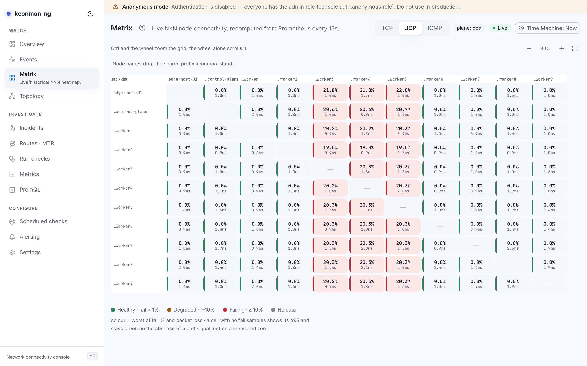

# Catch a breakage

Fifteen more minutes: break one protocol on one node pair, on a disposable
cluster, and watch the Console isolate it. This page keeps to the short,
console-only path. The full demo,
[Breaking the network on purpose](../demo/breaking-cni.md), runs the same
break with PromQL proof at every step, reads the MTR trace, breaks three more
protocols at once, and wires an alert rule and a webhook to the failure; go
there for the complete script.

## Stand up the disposable cluster

```bash
./hack/local-test.sh up
```

Know what that command does to your machine before running it. It starts a
3-node Minikube cluster (profile `kconmon-test`) on the Docker driver, each
node sized at 2 CPUs and 4 GB of memory, then builds the three images locally
and loads them into Minikube. The console image is by far the slowest, since
it builds the SPA in a Node stage first, so expect the first `up` to take a
while. It installs kube-prometheus-stack into `monitoring`, applies a
throwaway single-Pod PostgreSQL and a generated webhook-key Secret, installs
kconmon-ng (Console included, anonymous auth with the admin role) into
`default`, runs smoke tests, imports the Grafana dashboards and prints access
URLs. The script wants `minikube`, `docker`, `helm`, `kubectl`, `openssl`,
`python3` and `curl` on the PATH, and refuses to start without them.
`make local-up` runs the same script, and `./hack/local-test.sh down` deletes
the whole cluster afterwards.

Reach the Console:

```bash
kubectl port-forward svc/kconmon-ng-console 8081:8080
```

## Break one pair

We will blackhole **only UDP** from node `m02` to node `m03`. Every other
protocol and every other pair stays untouched, which is the realistic shape
of a production failure: one direction dead on one protocol while the HTTP
health checks stay green.

Agents probe each other pod-IP to pod-IP, and each protocol has its own
rendezvous port: **UDP probes target the agent's gRPC/probe port 9090**
(that is where the agent's UDP echo listens), while **TCP probes dial the
agent's HTTP port 8080**. Keep that in mind when you later switch protocols
in this experiment: block the wrong port and the rule silently matches zero
packets. The [rendezvous table](../concepts/mesh-and-planes.md#the-probe-mesh)
lists all three.

Find the agent pod IPs first:

```bash
kubectl get pods -l app.kubernetes.io/component=agent -o wide
```

The drop rule goes on `m03`, and on its FORWARD chain, for a reason worth one
sentence: cross-node pod traffic is routed rather than locally delivered, so
it transits FORWARD on the node hosting the destination pod. An OUTPUT rule
on the source node would match nothing, because OUTPUT only sees traffic the
node's own network stack originates and pod traffic arrives over a veth.
Substitute the two pod IPs from your own listing: the source agent's on
`m02` and the destination agent's on `m03`:

```bash
minikube -p kconmon-test ssh -n kconmon-test-m03 -- \
  'sudo iptables -I FORWARD 1 -p udp -s 10.244.1.10 -d 10.244.2.15 --dport 9090 \
   -j DROP -m comment --comment "kconmon-demo-udp-blackhole"'
```

To confirm the rule is actually eating packets, check its iptables counters;
the [demo page](../demo/breaking-cni.md) shows the exact command and the
counter values to expect.

## Watch it surface in the console

Open **Matrix**, protocol **UDP**. The delay before the cell turns has real
arithmetic behind it: the UDP checker fires every 5 s, so within at most one
interval a probe fails and the agent publishes loss 1.0; Prometheus then
picks it up on its next scrape (this stand scrapes every 10 s, set by
`serviceMonitor.interval` in `hack/values-local.yaml`; the chart default is
15 s). Around 15–20 seconds after the break, five cells stay green and the
`m02 → m03` cell turns red. The frame below is the same exercise at a larger
scale on the stand the screenshots were taken on, with UDP dropped on its way
into the three zone-b nodes, `worker3`, `worker4` and `worker5`:

<figure markdown="span">
  { loading=lazy }
  <figcaption>The Matrix mid-break with UDP dropped on its way into zone-b: UDP selected, the worker3, worker4 and worker5 columns red for all ten sources, the external agent <code>edge-host-01</code> among them, while the zone-b rows stay green toward every node outside zone-b. The Live badge confirms the event stream is up.</figcaption>
</figure>

Now flip the protocol selector to TCP or ICMP: the same cell is green. That
switch is the point of the exercise — the Console has isolated a single
protocol on a single ordered pair, which no "can A reach B" check would ever
tell you.

Clicking the red cell opens the **pair card**: the pair's loss and RTT
charts, its recent MTR path history, and a rail of the topology and
diagnostic events around it. You never asked for a trace; a failed probe
auto-triggers MTR for the pair, and the demo page walks
[reading that trace](../demo/breaking-cni.md) hop by hop. The bundled
`UDPLossHigh` alert goes *pending* within about half a minute and fires
after its 5-minute hold.

The pair page below was shot during a different, larger break on the same
stand, with zone-c (`worker6` and `worker7`) blackholed on TCP, UDP and ICMP.
That is why `worker3 → worker6` fails on TCP and in both directions, which
the UDP drop into zone-b above would never produce:

<figure markdown="span">
  { loading=lazy }
  <figcaption>The pair page for worker3 → worker6 on the kind stand during the zone-c blackhole, not the zone-b UDP drop: per-direction verdicts in the header (TCP, both failing at 100.0%), the RTT p95 by protocol chart for the last hour, and the Recent changes rail listing the pair's diagnostic timeouts and failed checks as they happen.</figcaption>
</figure>

Prefer proof in PromQL over pictures? The
[demo's baseline and verification queries](../demo/breaking-cni.md) cover the
same minute series by series.

## Clean up

Remove the rule; the next successful probe overwrites the loss gauge, so the
cell is green again within one probe interval plus one scrape:

```bash
minikube -p kconmon-test ssh -n kconmon-test-m03 -- \
  'sudo iptables -D FORWARD -p udp -s 10.244.1.10 -d 10.244.2.15 --dport 9090 \
   -j DROP -m comment --comment "kconmon-demo-udp-blackhole"'
```

A leftover DROP rule quietly breaks your next run, so audit all three nodes
before tearing down; the [demo's cleanup section](../demo/breaking-cni.md)
has a loop that checks every node in one go. Then:

```bash
./hack/local-test.sh down
```

**Keep going:** the [full demo](../demo/breaking-cni.md) blackholes UDP on a
single pair, correlates it on the Incidents page, declares an alert rule scoped
to that pair and points a signed webhook at it, then cuts off a whole zone and
two more nodes at once on TCP, UDP and ICMP.
