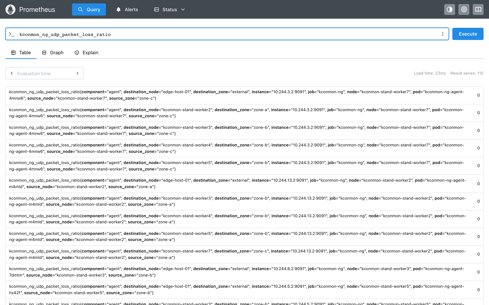

# Install in 15 minutes

From `helm install` to per-pair, per-protocol metrics in Prometheus. Nothing on
this page needs the Console; that is the [next page](enable-the-console.md).

## Prerequisites

- **Kubernetes 1.31+** (CI runs against 1.36).
- **Helm 4**, or Helm 3 from 3.14 up, the floor every project doc states. The
  chart ships as an OCI artifact, which both pull natively.
- **Prometheus** somewhere to scrape the metrics. The Prometheus Operator is
  optional: with it you get the bundled `ServiceMonitor` and alert rules; a
  [plain `scrape_config`](#no-prometheus-operator) works too.

The agent needs **no added capabilities**. ICMP and MTR ride the unprivileged
ICMP socket that the `net.ipv4.ping_group_range` sysctl opens; the chart sets
that sysctl (a kubelet *safe* one) along with RBAC for the controller's node
watch. Every component drops `ALL` capabilities and passes restricted Pod
Security Standards unchanged.

??? note "If your admission policy still objects to the sysctl"
    The sysctl has its own switch, `agent.pingGroupRange: false`, precisely so
    you can opt out without touching `agent.podSecurityContext`. The old
    opt-out was nulling that whole block, which deleted `runAsNonRoot`,
    `runAsUser` and `seccompProfile` with it — exactly the keys a namespace
    enforcing restricted PSS demands, so the DaemonSet got rejected at
    admission. With the sysctl off, ICMP and MTR need another door: add
    `NET_RAW` under `agent.securityContext.capabilities` and make it
    effective. That buys intermediate MTR hops on kernels that withhold them
    from ping sockets, and costs you the restricted PSS profile.

!!! tip "No cluster at hand?"
    `make local-up` in a repo clone brings up Minikube with Prometheus, Grafana
    and kconmon-ng in one command, and
    [the demo](../demo/breaking-cni.md) then breaks the network on purpose so
    you can watch the tool catch it.

## Install the chart

The chart is published as an OCI artifact on GHCR. With the Prometheus
Operator objects, which is what most installs want:

```bash
helm upgrade --install kconmon-ng oci://ghcr.io/esdmitrii/charts/kconmon-ng \
  --set serviceMonitor.enabled=true \
  --set prometheusRule.enabled=true
```

Without the operator, drop both `--set` flags. The examples track the latest
published chart; pass `--version` if you need a pinned, reproducible install.

Expect one controller pod plus one agent per node. The agent DaemonSet
tolerates every taint by default (`tolerations: [{operator: Exists}]`), so
control-plane nodes get one too:

```bash
kubectl get pods -l app.kubernetes.io/name=kconmon-ng -o wide
```

### What the fleet costs

Per node, the agent requests 50m CPU and 64Mi memory, with limits at 200m and
128Mi. The controller carries the same defaults, and can afford to: it is
coordination only, no probe result ever flows through it. On a 100-node
cluster the whole fleet therefore asks for about 5 CPU and 6.25Gi of requests.
The real capacity question is on the Prometheus side — see
[Scaling and cardinality](../metrics.md#scaling-and-cardinality).

### Keeping agents off some nodes

Narrow the blanket toleration (replace `agent.tolerations`) or pin the
DaemonSet with `agent.nodeSelector` / `agent.affinity`. One side effect to
know: the controller derives `kconmon_ng_controller_expected_agents` from the
count of *schedulable* nodes, each of which it expects to run an agent. Keep
agents off schedulable nodes and registered stays below expected, so the
bundled `KconmonAgentsMissing` alert fires about a gap you created on
purpose. Cordoned nodes are excluded from the count; selector-excluded ones
are not.

## Verify agents are probing

Metrics start flowing within seconds of the agents registering. To look at
them raw, port-forward any agent and read its `/metrics`:

```bash
AGENT=$(kubectl get pods -l app.kubernetes.io/component=agent -o jsonpath='{.items[0].metadata.name}')
kubectl port-forward "$AGENT" 8080 &
curl -s http://localhost:8080/metrics | grep '^kconmon_ng' | head
```

You should see per-pair series naming real node pairs —
`kconmon_ng_udp_packet_loss_ratio{source_node="…",destination_node="…"}` and
friends. If the list is empty, check that more than one agent is running: a
one-node cluster has no peers to probe.

Why port 8080 here when the scrape target is 9091? Both listeners serve
`GET /metrics`. Port 8080 is the agent's HTTP port and the handy one for a
quick port-forward; `config.metricsPort` (9091) is a dedicated listener that
exists because the controller's API shares the HTTP port and authenticates
nothing, so the scrape NetworkPolicy opens only 9091. The
[FAQ entry](../faq.md#why-does-prometheus-scrape-a-separate-port) has the
full reasoning.

## Look at the metrics

Ask your Prometheus the three questions that matter on day one:

```promql
# Is any pair losing UDP packets? (all pairs should read 0)
kconmon_ng_udp_packet_loss_ratio

# Is any TCP probe failing anywhere?
sum(rate(kconmon_ng_tcp_results_total{result="fail"}[5m]))

# Is the fleet complete? (both numbers should match)
kconmon_ng_controller_registered_agents
kconmon_ng_controller_expected_agents
```

The first query returns one series per ordered pair, so N nodes give
N×(N−1) rows; on the stand these screenshots come from, ten in-cluster agents plus one external agent, that is 110:

<figure markdown="span">
  { loading=lazy }
  <figcaption>A healthy install of ten in-cluster agents plus one external agent: <code>kconmon_ng_udp_packet_loss_ratio</code> returns 110 series, every one at 0, each with source/destination node and zone labels; the external agent shows up as <code>destination_zone="external"</code>.</figcaption>
</figure>

Every exported family, its labels and the thirteen bundled alert rules (twelve on
by default) are in the [metrics and alerting reference](../metrics.md).

### Grafana dashboards

Three dashboards ship with the project — cluster overview, zone heatmap,
per-node detail. If your Grafana runs the dashboard sidecar, let the chart
install them as ConfigMaps:

```bash
helm upgrade kconmon-ng oci://ghcr.io/esdmitrii/charts/kconmon-ng \
  --reuse-values --set dashboards.enabled=true
```

Otherwise import the JSON files from the repo's
[`dashboards/`](https://github.com/EsDmitrii/kconmon-ng/tree/main/dashboards)
directory through the Grafana UI.

The cluster-overview dashboard below was captured on the same stand while
it was healthy, so this is the baseline a clean fleet gives you:

<figure markdown="span">
  { loading=lazy }
  <figcaption>The bundled cluster-overview dashboard on a healthy stand: Fleet status (11 registered, 11 reporting, 0 missing, leader OK, 110 monitored pairs, 0 with failures), the failure-ratio bars and charts flat at 0 on a 0-100% axis, and every visible row of the top-10 worst pairs table at 0.00%.</figcaption>
</figure>

## No Prometheus Operator?

Skip `serviceMonitor.enabled` and add one scrape job instead. The agent and
the controller both expose a dedicated `metrics` port (`config.metricsPort`,
`9091` by default) on their Services, kept separate from the unauthenticated
API port, so a single endpoints-role job covers the whole fleet:

```yaml
scrape_configs:
  - job_name: kconmon-ng
    kubernetes_sd_configs:
      - role: endpoints
        namespaces:
          names: [default] # the namespace kconmon-ng is installed into
    relabel_configs:
      - source_labels: [__meta_kubernetes_service_label_app_kubernetes_io_name]
        regex: kconmon-ng
        action: keep
      - source_labels: [__meta_kubernetes_endpoint_port_name]
        regex: metrics
        action: keep
      - source_labels: [__meta_kubernetes_pod_node_name]
        target_label: node
```

The bundled alert rules are plain PromQL: if `PrometheusRule` is not an option
either, lift them from the
[default alerting rules](../metrics.md#default-alerting-rules) into your own
`rule_files`.

## Next steps

The natural next move is **[enabling the console](enable-the-console.md)**:
the web UI is a flag on the release you just installed. After that,
**[catch a breakage](catch-a-breakage.md)** breaks a node pair on a test
cluster and lets you watch the tool isolate it. When you start tuning, the
[Helm values reference](../reference/helm-values.md) documents every knob
inline, and [Scaling and cardinality](../metrics.md#scaling-and-cardinality)
is required reading before a large-cluster rollout: pairs grow as N×(N−1).
