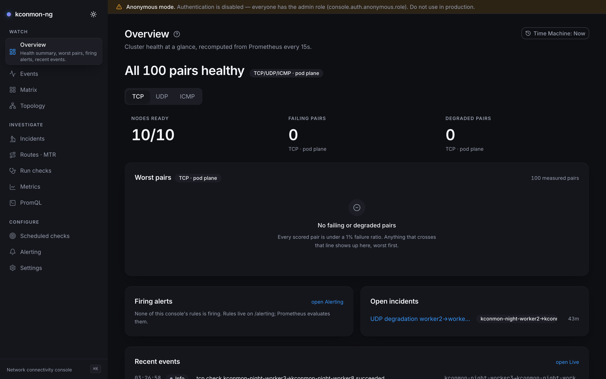
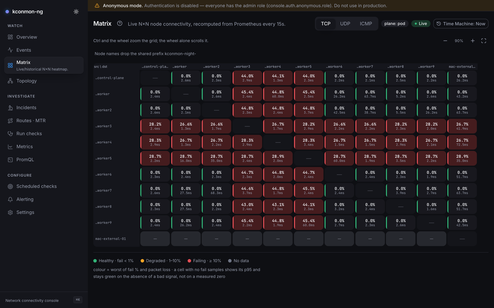
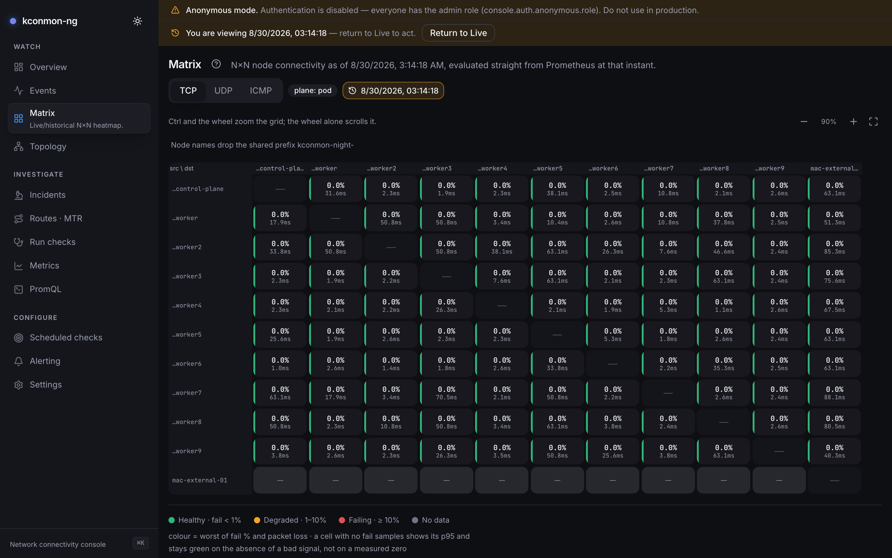

# kconmon-ng

**When someone says "the network is fine", answer with data.**

kconmon-ng turns inter-node connectivity into a measured fact. An agent runs
on every Kubernetes node and probes every other node over TCP, UDP and ICMP
every five seconds; it also resolves DNS from each node and can check HTTP
endpoints you configure. Each probe is a specific act: a UDP probe sends a
burst of 5 packets with a 250 ms reply timeout and computes loss as sent
minus received over sent, while a TCP probe dials the peer with a 1 s
timeout. The default DNS check resolves
`kubernetes.default.svc.cluster.local` through the pod's own resolver, and
explicit upstreams can be named instead.

Every ordered node pair gets its own latency, jitter and packet-loss series,
per protocol. A partial failure shows up as exactly that, instead of
vanishing into a green aggregate: UDP dropping on one pair while TCP stays
clean, or DNS timing out from a single node. When a TCP, UDP or ICMP probe
fails, the agent fires an MTR trace to that peer, so the bad hop is on record
before anyone starts looking. One caution before a big rollout: pairs grow as
N×(N−1) and each directed pair keeps roughly 70 series, so read
[Scaling and cardinality](metrics.md#scaling-and-cardinality) before pointing
this at a large cluster.

On top of the measurements sit an N×N matrix, a topology map, MTR path
history, incident timelines, Prometheus-evaluated alert rules, and a Time
Machine: a `?at=` on the URL rewinds every console page to the minute it
broke.

[Install in 15 minutes](getting-started/install-15-min.md){ .md-button .md-button--primary }

<figure markdown="span">
  { loading=lazy }
  <figcaption>The Overview page on a live 3-node cluster: health tiles, worst pairs, a firing alert and an open incident.</figcaption>
</figure>

<figure markdown="span">
  { loading=lazy }
  <figcaption>The Matrix on UDP with one pair blackholed: a single red cell, five green.</figcaption>
</figure>

<figure markdown="span">
  { loading=lazy }
  <figcaption>The same Matrix rewound with <code>?at=</code>: the Time Machine bar marks the viewed instant.</figcaption>
</figure>

## Where to go

-   **[Install in 15 minutes](getting-started/install-15-min.md)**

    ---

    From `helm install` to first metrics, then
    [enable the console](getting-started/enable-the-console.md) and
    [catch a breakage](getting-started/catch-a-breakage.md) on a test
    cluster.

-   **[Concepts](concepts/architecture.md)**

    ---

    Agent, controller and console; the [probe mesh and
    zones](concepts/mesh-and-planes.md);
    [checks vs runs vs schedules](concepts/checks-runs-schedules.md).

-   **[Console guide](console/overview.md)**

    ---

    One page per screen, from the [Matrix](console/matrix.md) to the
    [Time Machine](console/time-machine.md).

-   **[Scenarios](scenarios/diagnose-a-slow-pair.md)**

    ---

    Task-oriented walkthroughs:
    [diagnose a slow pair](scenarios/diagnose-a-slow-pair.md),
    [set up alerting](scenarios/set-up-alerting.md),
    [probe external targets](scenarios/external-targets.md),
    [wire up OIDC](scenarios/oidc-setup.md).

-   **[Reference](reference/helm-values.md)**

    ---

    [Helm values](reference/helm-values.md),
    [configuration file](configuration.md), [HTTP API](api.md),
    [Console API](reference/console-api.md), and the full
    [metrics and alerting reference](metrics.md).

-   **[FAQ](faq.md)**

    ---

    The questions that come up: privileges, controller outages, scale
    limits, what is safe to expose.

