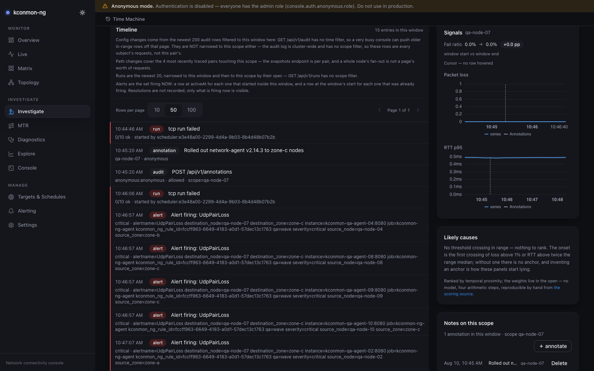
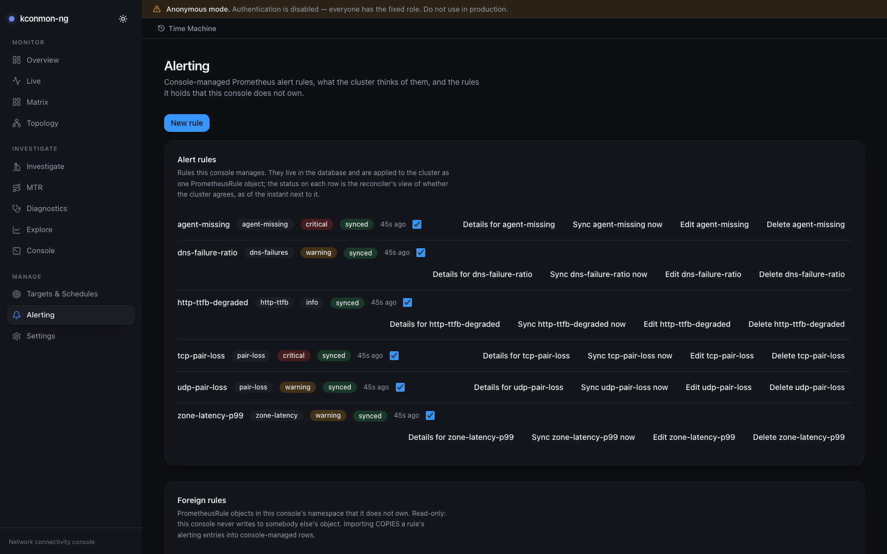
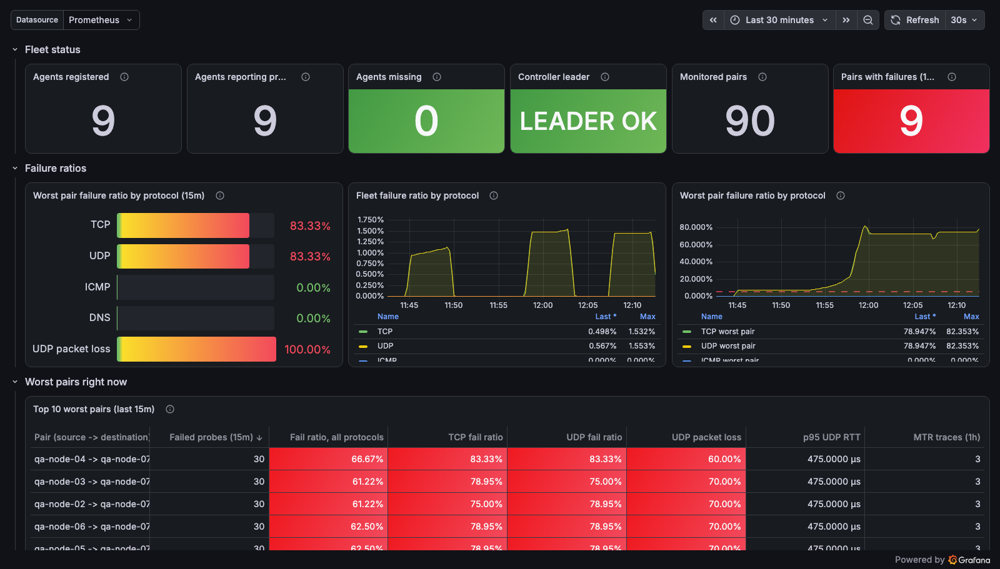
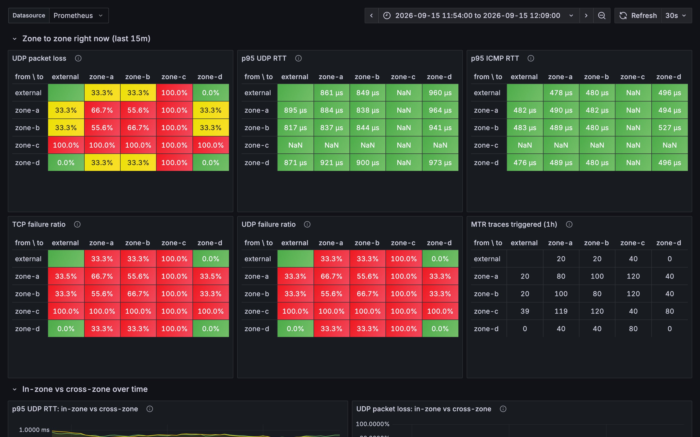
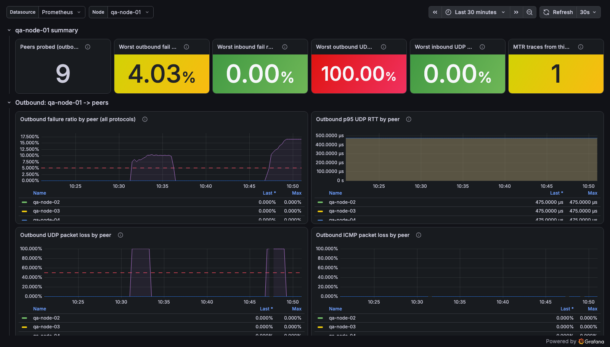

# I got tired of guessing which pair of nodes broke, so I built a console for it

Every incident call I have sat in contains the same five minutes. Something is
timing out, somebody says the network is fine, and nobody in the room can prove
otherwise. Not because it is a lie, but because nothing in the cluster was
actually measuring node-to-node connectivity at the moment it broke.

kconmon-ng exists to make that sentence checkable. An agent on every node probes
every other node over TCP, UDP and ICMP every five seconds, resolves DNS and
checks HTTP endpoints from each node, and exports latency, jitter and packet
loss for every ordered node pair, per protocol. When a TCP, UDP or ICMP probe
fails, the agent immediately fires an MTR trace to that peer, so the bad hop is
already on record before anyone starts looking for it.

I wrote about the measurement core a while back. Since then the project grew an
entire web console, and that is mostly what this post is about.

Repo: <https://github.com/EsDmitrii/kconmon-ng> (Apache 2.0).


*docs/img/console-overview.png. The Overview page: nine nodes counted from the
agents themselves, with the tile admitting there is no k8s node inventory here
so readiness is unknown. Nine of ninety pairs carry a failure ratio, all five
worst ones end at qa-node-07 at 17%, UdpPairLoss is firing critical, and someone
has already opened an incident for exactly that.*

## The failures that cost you the evening are the partial ones

Total outages are easy. The pod does not start, the node goes NotReady, half a
dozen alerts fire and everyone knows within a minute.

The ones that eat an evening look different:

* UDP dropping between two specific nodes while TCP on the same pair stays
  perfectly clean.
* DNS timing out from one node only, so roughly one request in N fails and
  nobody can reproduce it.
* Jitter creeping up across a zone boundary after a kernel upgrade on half the
  fleet.

An aggregate dashboard shows all of that as green. 98% success looks fine until
you notice that the missing 2% is one pair, one protocol, all the time.

So kconmon-ng measures each protocol separately for each ordered pair. A partial
failure reads as exactly what it is: this pair, this protocol, this hop.

## What it measures, and how

Two workloads. One controller Deployment, one agent per node.

```
                          +-------------------------------------------+
                          |          Controller (Deployment)          |
                          |  agent registry (heartbeat eviction)      |
                          |  node watcher (zone labels)               |
                          |  topology API + gRPC event stream         |
                          |  leader election (active/standby)         |
                          +---------------------+---------------------+
                                                |
                       gRPC stream: peer list, pushed on every change
                                                |
              +-------------------+  +-------------------+  +-------------------+
              | Agent (node-1)    |  | Agent (node-2)    |  | Agent (node-3)    |
              | TCP UDP ICMP      |  | TCP UDP ICMP      |  | TCP UDP ICMP      |
              | DNS HTTP          |  | DNS HTTP          |  | DNS HTTP          |
              | MTR on failure    |  | MTR on failure    |  | MTR on failure    |
              | /metrics :8080    |  | /metrics :8080    |  | /metrics :8080    |
              +-------------------+  +-------------------+  +-------------------+
                ^                                                             ^
                +------------------ probes between all pairs -----------------+
```

Agents register with the controller over gRPC and receive a live-updated peer
list. There is no polling and no per-agent configuration: the controller pushes
a full peer snapshot on connect and again on every topology change. It
also reads each node's zone label at registration, so every metric carries
`source_zone` and `destination_zone` without anyone writing zones down by hand.

Each enabled checker runs concurrently against every peer:

| Checker | What it measures |
|---|---|
| TCP | connect time and total RTT per peer |
| UDP | mean RTT, jitter and packet loss over a configurable packet burst |
| ICMP | echo RTT and loss (IPv4/IPv6) |
| DNS | resolution time per (hostname, resolver), system or explicit upstreams |
| HTTP | phased timing for configured URLs: DNS, connect, TLS, TTFB, total |
| MTR | reactive traceroute on failure, per-hop RTT and loss |

TCP, UDP, ICMP and DNS run out of the box on a 5s interval. HTTP is opt-in
because it needs URLs only you know.

A few decisions that only matter at 3am:

* A failed TCP, UDP or ICMP probe triggers MTR for that pair under a per-pair
  cooldown, so a broken link cannot flood the cluster with traces.
* When topology changes, stale per-pair gauges are reset instead of leaving
  ghost readings for a node that no longer exists.
* An agent deregisters on shutdown, so rolling kconmon-ng itself does not write
  false packet loss into its own metrics.
* Config hot-reloads on change and is parsed with unknown keys rejected. A typo
  fails fast instead of being silently ignored.

Seven alert rules ship with the chart when `prometheusRule.enabled=true`: high
UDP loss, failing TCP, DNS and external checks, `PairWentSilent` for a pair that
was probed within the last hour and has stopped reporting entirely, plus two
that watch the monitor itself, `KconmonAgentsMissing` and
`KconmonControllerDown`. A kconmon-ng that goes quiet pages you instead of
looking healthy.

## The console

This is the part that did not exist before. It is an optional web UI, off by
default, deployed by the same chart. It reads the same Prometheus and the same
controller you already run. No second data path, no agent changes, no separate
storage for metrics.

Twelve pages: Overview, Live, Investigate, Matrix, Topology, MTR, Diagnostics,
Targets & Schedules, Explore, Alerting, Console (PromQL dev-tools) and Settings.
Read-only pages work with nothing but a Prometheus URL. History, auth, incidents
and alert rules need PostgreSQL.

Rather than tour all twelve, here is the path I actually walk during an
incident.

### 1. Matrix: which pair

The matrix is N×N, one cell per ordered pair, coloured by loss and latency. A
broken node reads as a red column, a one-directional problem reads as a single
cell, and a zone-boundary problem reads as a block.


*docs/img/console-matrix.png: ten nodes, UDP, pod plane. The column into
qa-node-07 sits at 16.7–17%, over the legend's 10% failing threshold, while its
own outbound row reads "no fail data". You do not have to interpret this one.*

With `controller.events.enabled` the matrix and the topology map are pushed over
a WebSocket. Without it they poll, and the page says which of the two it is
doing rather than pretending to be live.

### 2. Investigate: what happened around the break

Each cell carries an investigate control that takes you to `/investigate` with
the scope and window already in the URL. The page merges nine timeline sources around that scope: topology
events, Kubernetes events, audit writes, MTR path changes, diagnostic runs,
maintenance windows, annotations, derived threshold crossings and firing alerts.

Then it ranks candidate causes, and this is the part I am most willing to
defend. The arithmetic is a class weight multiplied by a linear decay over the
300 seconds before onset. Weights are 3 for things that moved the infrastructure
under the probe (a route change, a Kubernetes node or pod change), 2 for fleet
and configuration changes, 1 for a declared maintenance window, and 0 for
annotations, diagnostic runs, threshold crossings and firing alerts.

That last zero is deliberate. A firing alert is a restatement of the symptom,
usually of the exact series the threshold row already derived. Weighting it
above zero would let the page rank the page about the outage as the cause of the
outage, which is the classic way these panels start lying.

No ML, and the constants are exported from one module that the docs restate
rather than paraphrase.


*docs/img/console-investigate.png: one scope, one window. The annotation someone
left about a network-agent rollout, the runs that failed, and five UdpPairLoss
rows on the same timeline. Likely causes ranks nothing here and says why: no
threshold crossing inside the range, and inventing an anchor is how these panels
start lying.*

Save it as an incident and the permalink rehydrates the exact scope and window
from the stored row, so the link cannot drift away from the incident it names.

### 3. Time Machine: what it looked like at 02:14

Every postmortem has the same annoying gap: by the time you write it, the
dashboards have moved on. Put `?at=` with an RFC 3339 timestamp on any URL and
every read surface resolves through that instant instead of now. Topology is
folded from stored events, PromQL is evaluated at `t`, and the Live feed
becomes scrollback.

Every mutating control is disabled behind a banner while it is engaged. You
cannot change the fleet from inside the past.


*docs/img/console-timemachine.png: the same matrix evaluated straight from
Prometheus at 10:49:03 instead of now. The banner names the instant and holds
the way back to Live; the qa-node-07 column reads 19.5–20.5% there, a little
worse than it is live.*

### 4. Alerting: turn the finding into a rule

Once you know what the failure looks like, you want it to page you next time.
`/alerting` builds a rule from six typed templates (pair loss, zone latency, DNS
failures, HTTP TTFB, agent missing, external target down) or from raw PromQL.

Two things I care about here:

* **Validation runs the expression instead of parsing it.** There is
  deliberately no `prometheus/prometheus` parser dependency in the build.
  `POST /api/v1/alert-rules/preview` executes the expression as an instant query
  against your actual Prometheus and reports how many series it matched. Render
  failures and query failures are reported separately, because "I cannot build
  this rule" and "this rule matches nothing right now" are different problems.
* **The console manages, Prometheus evaluates.** Every enabled rule is
  reconciled by server-side apply into exactly one `PrometheusRule` object. One
  apply target means drift is one comparison and a partial apply is impossible.
  Nothing in the console decides that an alert fired.

`PrometheusRule` objects the console did not write are listed read-only.
Adopting one is an explicit copy that never mutates the object it read, which
also means both copies evaluate until you delete one. The import report says so
out loud.


*docs/img/console-alerting.png: managed rules and their live sync status
against a real prometheus-operator.*

Drift is recorded and then fixed in the same pass, so a rule can honestly show
`drift` alongside a fresh `lastSyncedAt`. Both statements are true: the
divergence was observed, and it was corrected. Failures never crash the loop,
they land per rule with a closed cause class (`crd-missing`, `forbidden`,
`other`).

### The rest, briefly

* **MTR Explorer**: every traced path is content-hashed and deduplicated at
  ingest, so path history is a list of *changes* rather than a wall of identical
  traces. Three panes, client-side diff between any two snapshots, optional
  reverse-DNS and MaxMind hop enrichment (off by default, and the only part that
  talks to anything outside the cluster).
* **Diagnostics, external targets and schedules**: probe a pair on demand
  mid-incident with run history and permalinks; define external targets and let
  agents check them continuously, with the CIDR allowlist enforced by the agent
  rather than by the console.
* **Live feed and command palette**: a virtualized event stream with filters,
  pause-and-buffer and missed-event accounting; `⌘K` over navigation, actions and
  Time Machine, hand-rolled with zero dependencies.
* **Auth, RBAC, audit, webhooks**: `anonymous | local | header | oidc`, 25
  permissions across four built-in roles (`viewer`, `operator`, `alert-editor`,
  `admin`) plus custom ones, an audit log, API tokens, and outbound webhooks on
  incident and alert transitions signed with `X-Kconmon-Signature: sha256=<hmac>`
  over the raw body. Each endpoint's signing secret is write-only over the API
  and sealed at rest with AES-256-GCM.
* **Settings**: configuration exports as a versioned bundle and imports
  dry-run first. Webhook endpoints export with `hasSecret` only, so a sealed
  secret never leaves the API.

## It is still Prometheus underneath

Everything the console shows comes from Prometheus and the controller, so
nothing stops you from staying in Grafana. Three dashboards ship in
[`dashboards/`](https://github.com/EsDmitrii/kconmon-ng/tree/main/dashboards):
cluster overview, zone heatmap, per-node detail.


*docs/img/overview.png: the bundled Grafana overview dashboard on the same
fleet: 10 agents, 90 monitored pairs, 9 of them failing, and the worst-pairs
table pointing at qa-node-07 again.*


*docs/img/zone-heatmap.png: cross-zone latency and loss. Everything landing in
zone-c carries ~3.5% UDP loss and the only MTR traces of the hour.*


*docs/img/node-detail.png: one node, broken down by destination. qa-node-01
probes 9 peers, its worst outbound ratio is 4.03% and inbound is clean.*

Metric names are stable and documented, so your own panels and recording rules
are a grep away in
[docs/metrics.md](https://github.com/EsDmitrii/kconmon-ng/blob/main/docs/metrics.md).
A few queries I keep around:

```promql
# The five worst node pairs by UDP loss right now
topk(5, kconmon_ng_udp_packet_loss_ratio)

# p95 TCP connect time by zone pair
histogram_quantile(0.95,
  sum by (le, source_zone, destination_zone) (
    rate(kconmon_ng_tcp_connect_duration_seconds_bucket[5m])
  )
)

# Pairs where TCP is actually failing, not just slow
rate(kconmon_ng_tcp_results_total{result="fail"}[5m]) > 0

# Where the packets die on one specific pair
kconmon_ng_mtr_hop_rtt_seconds{source_node="node-1", destination_node="node-2"}
```

The peer label set is `source_node`, `destination_node`, `source_zone`,
`destination_zone` and it has not changed across releases, so dashboards and
recording rules written against 1.5.0 still behave the same way.

## From the terminal

`kubectl-kconmon` talks to the controller's HTTP API over a client-go
port-forward, so you can list topology and fire a one-shot check without opening
a browser. A failed check exits `2`, distinct from `1` for CLI or API errors, so
it composes in pipelines. `-o json` prints the raw result.

```
$ kubectl kconmon topology
NODE     ZONE         READY   AGENT                           AGENT IP
node-1   us-east-1a   yes     node-1-kconmon-ng-agent-aaaaa   10.0.0.1
node-2   us-east-1b   yes     node-2-kconmon-ng-agent-bbbbb   10.0.0.2
node-3   us-east-1c   no      -                               -

$ kubectl kconmon check node-1 node-2 --type udp
OK udp node-1 -> node-2 (us-east-1a -> us-east-1b)  duration=1.1ms
  sent=5 recv=5 loss=0% rtt=1.1ms jitter=240µs
```

Install it via krew from a release manifest, until it lands in the krew index:

```bash
kubectl krew install --manifest-url \
  https://github.com/EsDmitrii/kconmon-ng/releases/download/v2.0.0/kconmon.yaml
```

## Quickstart

Kubernetes 1.31+ (CI runs against 1.36), Helm 4 (the chart ships as an OCI
artifact; Helm ≥3.14 also works), and the Prometheus Operator if you want the
bundled `ServiceMonitor` and alert rules. The agent needs no added capabilities:
ICMP and MTR ride the unprivileged ICMP socket that `net.ipv4.ping_group_range`
opens, and the chart sets that sysctl (it is on the kubelet safe list) along
with RBAC for the controller's node watch.

```bash
helm upgrade --install kconmon-ng oci://ghcr.io/esdmitrii/charts/kconmon-ng \
  --version 2.0.0 \
  --set serviceMonitor.enabled=true \
  --set prometheusRule.enabled=true
```

Expect one controller pod plus one agent per node:

```bash
kubectl get pods -l app.kubernetes.io/name=kconmon-ng -o wide
```

Metrics start flowing within seconds. To look at them raw:

```bash
AGENT=$(kubectl get pods -l app.kubernetes.io/component=agent -o jsonpath='{.items[0].metadata.name}')
kubectl port-forward "$AGENT" 8080 &
curl -s http://localhost:8080/metrics | grep '^kconmon_ng' | head
```

Then import the dashboards from `dashboards/` into Grafana, via the UI or:

```bash
for f in dashboards/*.json; do
  curl -s -X POST "http://localhost:3000/api/dashboards/db" \
    -H "Content-Type: application/json" -u admin:admin \
    -d "{\"dashboard\": $(cat "$f"), \"overwrite\": true}"
done
```

### Turning on the console

It is a flag on the same release. Nothing else in the chart changes:

```bash
helm upgrade --install kconmon-ng oci://ghcr.io/esdmitrii/charts/kconmon-ng \
  --version 2.0.0 \
  --set console.enabled=true \
  --set console.prometheus.url=http://prometheus-operated.monitoring:9090

kubectl port-forward svc/kconmon-ng-console 8081:8080
```

That gets you the read-only pages as an anonymous viewer on
<http://localhost:8081>. The rest is opt-in, one flag at a time: history, auth,
incidents and alert rules need `database.existingSecret`;
realtime push needs `controller.events.enabled=true`; alerting needs
`console.alerting.enabled=true` plus the Prometheus Operator's `PrometheusRule`
CRD. Every knob is documented inline in `charts/kconmon-ng/values.yaml`.

### What the 2.0.0 chart does for you

Chart 2.0.0 is mostly about the steps you used to do by hand. Every credential
the chart consumes can still come from an `existingSecret` you own, or from a
`secret:` block the chart renders for you. Field values are written verbatim,
so a `${vault:...}` placeholder passes through byte-for-byte and an injector
resolves it at admission.

The chart installs no datastore of its own. Point `database.existingSecret` at
a Secret holding a `postgres://` DSN and `redis.existingSecret` at one holding
a `redis://` DSN, and whatever you already run answers: RDS, a StatefulSet, a
CloudNativePG cluster of your own. GeoLite2 no longer needs staging.
`geoip.mode=auto` runs MaxMind's own `geoipupdate` image as a sidecar, and the
console re-stats the two files and reopens whichever changed, so a refreshed
database is picked up without a restart.

Dashboards render as ConfigMaps with the `grafana_dashboard` sidecar label, and
the pods carry restricted-PSS defaults, the agent included. It drops `ALL`
capabilities like everything else: ICMP and MTR use the unprivileged ICMP
socket that the `net.ipv4.ping_group_range` sysctl opens, and that sysctl is on
the kubelet's safe list, so a `restricted` namespace takes the DaemonSet as it
ships.

## Watching it catch something

The repo has a reproducible walkthrough on a disposable Minikube cluster
(`docs/demo/breaking-cni.md`). Blackhole UDP between two nodes, watch exactly one
cell of the matrix go red while TCP and ICMP on the same pair stay green, watch
MTR fire and the bundled alert go pending. Then break TCP, ICMP and HTTP in
three other places at once and see each failure isolated to its own pair and
protocol.

If you want the quickest possible version, `hack/README.md` has a NetworkPolicy
that blocks all agent-to-agent traffic while leaving the controller and
Prometheus reachable. That exception is load-bearing: cut Prometheus off too and
the agent series go stale, so the break you just created disappears from every
dashboard. The chaos blinds its own observer.

## How honest is any of this

Some things I would want to know if I were reading someone else's post:

* Everything the console adds is off by default or read-only-additive. Upgrading
  a release and changing nothing renders the same manifests.
* The console is a *consumer* of Prometheus, not a replacement for it. If you
  delete the console tomorrow, every metric, dashboard and alert rule keeps
  working.
* There are no benchmark numbers in this post because I have not run
  benchmarks worth publishing.
* Nothing here intercepts real application traffic. It probes between nodes.
  Service-mesh telemetry and eBPF tooling answer a different question, and they
  answer it better.
* Goldpinger deserves the credit for the shape of this idea, and if your question
  is "is the mesh connected, yes or no", it answers that in minutes with one
  moving part. kconmon-ng trades that simplicity for protocol depth and per-hop
  diagnostics.

On testing: the frontend is at 3593 tests across 120 files, and 29 Go packages
carry tests that CI runs with the race detector on every PR, alongside lint and
a chart lint against the CI value sets. A `v*` tag cross-compiles the binaries,
publishes images and the chart to GHCR and runs e2e.

## What is next

v1.9.0 was the last planned console milestone, so the console is feature-complete
as designed rather than half-built. What do I want next? Other people's clusters
finding the things mine did not: bigger fleets, weirder CNIs, IPv6-heavy
setups.

Issues and PRs are open. If you run it and it lies to you about your network, I
would genuinely like to hear about it.

* Repo: <https://github.com/EsDmitrii/kconmon-ng>
* Chart: `oci://ghcr.io/esdmitrii/charts/kconmon-ng`, version 2.0.0
* License: Apache 2.0
