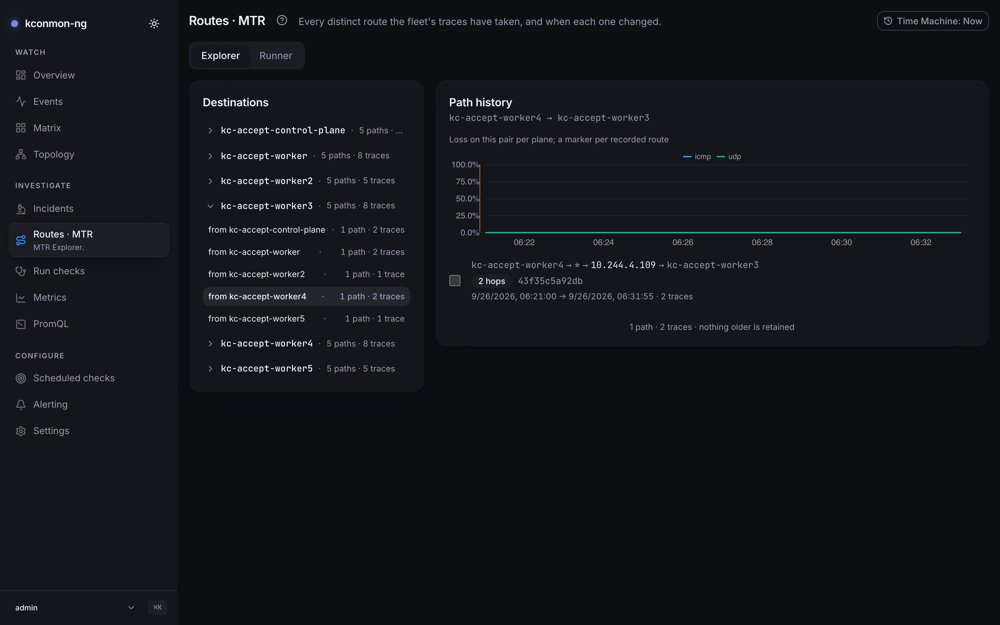

# Diagnose a slow pair

## Symptom

An application team reports that traffic between two services is slow:
sometimes, for some replicas. Classic partial failure: node-level health is
green, `kubectl get nodes` says `Ready`, and the only hard fact is a latency
graph that looks worse than last week. The question kconmon-ng can answer:
**is the network between specific nodes actually slower, on which protocol,
and at which hop?**

## Localize with the Matrix

Open the Console's [Matrix](../console/matrix.md) and flip through the
protocols. "Off-colour" has exact numbers here: the whole console ranks on
two thresholds, **degraded at 1%, failing at 10%**, applied to the worse of
a cell's failure ratio and its packet-loss ratio. They are defined once in
the console source so the Matrix legend, Overview tiles, node colouring and
topology edge filter cannot drift apart, and they are not configurable. You
are looking for structure, not a single number:

- **One cell** off-colour → one directed pair. Check the mirror cell: if
  `A → B` is bad and `B → A` is clean, the problem is directional. Think
  asymmetric routing or a policy on the return path.
- **A row or column** → one node, outbound or inbound respectively.
- **A block** aligned with zones → a zone boundary; confirm on the zone view.

<figure markdown>
  { loading=lazy }
  <figcaption>Matrix, protocol UDP: worker5 → worker3 failing with 100% packet loss in its tooltip while the mirror cell, worker3 → worker5, stays green at 0.0%. Across the grid the pattern repeats: the worker3 and worker4 columns red, the same two rows green toward every node outside zone b. A directional problem into two nodes.</figcaption>
</figure>

Click the suspect cell to open the [pair page](../console/pair-and-node-pages.md):
loss and RTT charts for that pair, recent MTR path history, and the events
around it. If the fleet is large, the [Overview](../console/overview.md)
page's worst-pairs table is the shortcut to the same cell.

The pair page below comes from a larger break on the same stand, with zone-c
(`worker6` and `worker7`) blackholed on every protocol. That is why
`worker3 → worker6` fails in both directions there, while the UDP matrix
above shows the same cell green.

<figure markdown>
  { loading=lazy }
  <figcaption>The pair page for worker3 → worker5 while worker5, zone c's only node, is cut off on every protocol, not the UDP break above: per-direction verdicts in the header, the RTT p95 by protocol chart over the last hour, and the Recent changes rail with the diagnostic timeouts around the break.</figcaption>
</figure>

## Confirm with Metrics

The [Metrics](../console/metrics.md) page (or your own Prometheus) turns
"looks slow" into numbers. RTT distributions are histograms, so ask for a
quantile, here for the pair the Matrix pointed at:

```promql
# p99 TCP round-trip for one directed pair, over 10-minute windows
histogram_quantile(0.99, sum by (le) (
  rate(kconmon_ng_tcp_total_duration_seconds_bucket{
    source_node="node-a", destination_node="node-b"}[10m])))
```

!!! note "Empty result? Check the cardinality valve first"
    This query reads the per-pair histograms, and the
    `agent.metrics.detail` scrape valve drops exactly those:
    `counters-only` and `zone-only` both discard the per-pair `_bucket`
    series at scrape time, so on such a fleet the quantile silently returns
    nothing. That is the valve working, not the pair being unmeasured; see
    [the levers table](../metrics.md#levers-that-exist-today).

While you have the query editor open, separate three things:

- **Latency or loss?** `kconmon_ng_udp_packet_loss_ratio` and
  `kconmon_ng_icmp_packet_loss_ratio` for the same pair. Loss retries dressed
  up as latency is a different investigation than genuinely slow forwarding.
- **Jitter**: `kconmon_ng_udp_jitter_seconds`. A congested or rerouted path
  usually shows variance before it shows sustained slowness.
- **A healthy pair in the same zone pairing**, as a control, to separate
  "this link" from "everything in that direction".

Use A/B compare on the Metrics page for the last one, or add a second
selector in [PromQL](../console/promql.md).

## Find the hop with MTR

If loss is involved, traces already exist. The trigger is literally "the
probe failed": a failed TCP, UDP or ICMP check fires an MTR trace for its
pair, rate-limited by a per-pair cooldown (`config.checkers.mtr.cooldown`,
60s by default; the hop ceiling is `config.checkers.mtr.maxHops`, 30, legal
range 1–64). Slowness alone never triggers a trace (there is no
latency-threshold trigger), so for a pair that is slow without failing,
nothing will appear on its own. Fire one yourself from
[Run checks](../console/run-checks.md) (check type `mtr`), or from a
terminal:

```bash
kubectl kconmon mtr node-a node-b
```

`kubectl-kconmon` installs from the [krew](https://krew.sigs.k8s.io/) index
(`kubectl krew install kconmon`) and needs nothing exposed: it finds the
running controller pods by their labels (`app.kubernetes.io/name=kconmon-ng`,
`app.kubernetes.io/component=controller`; every namespace unless `-n` is
given), starts with the Lease holder, and port-forwards to that pod's http
port with your kubeconfig. It drives the same leader-only diagnostics
endpoint the Console uses and needs a running kconmon-ng in the cluster.
Leases are listed only in the namespaces where controller pods run, so
`leases` list RBAC in the release namespace is enough. When the pod it
picked answers `503 not the leader` or `leadership lost` (no Lease it could
read, or a leader that just changed), it moves on to the next running
controller pod, one extra port-forward each; if that pod
cannot be reached either, the error names both (`controller returned HTTP
503: not the leader; the next controller pod could not be reached: ...`).

Open [Routes · MTR](../console/routes-mtr.md) and pick the destination. Path
history is deduplicated by content, so what you see is the list of *path
changes*, with a diff view between any two traces.

<figure markdown>
  { loading=lazy }
  <figcaption>Routes · MTR Explorer for worker4 → worker3: one recorded route, 2 hops, 2 traces, with a tick box beside it. Once a second route is recorded, ticking both and comparing them is where the investigation goes next.</figcaption>
</figure>

Read the hop table for where RTT jumps or per-hop loss starts: everything
before that hop is fine, the problem lives at or after it. A path that
*changed* around the time the symptom started (an extra hop, a different
middle) is your correlation; the pair page's history shows when.

## Fix and verify

The fix is yours: restart the misbehaving CNI daemon, toggle the offload,
revert yesterday's firewall change. Verification is the same loop backwards,
and it is cheap:

1. Re-run the quantile query: p99 back at baseline.
2. The Matrix cell back under the 1% degraded threshold, both directions.
3. A fresh MTR run showing the expected path again.

If this was an incident worth remembering, save it as one on the
[Incidents](../console/incidents.md) page: the permalink rehydrates the exact
scope and window, and the [Time Machine](../console/time-machine.md) can
replay the console at the minute it broke for the postmortem. If the pair
deserves a tighter watch than the bundled rules give it, declare a scoped
rule for it; see [Set up alerting](set-up-alerting.md).
