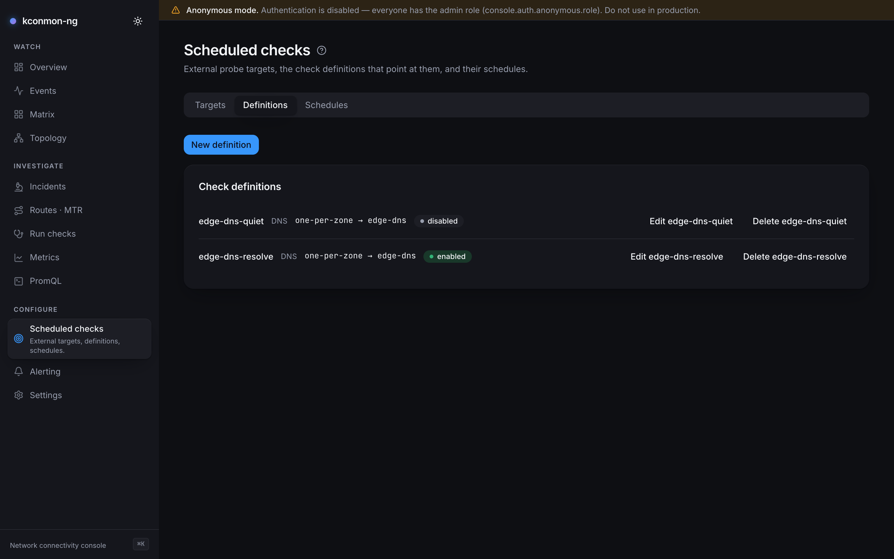

# External targets

## Goal

Probe destinations that are not fleet peers (the corporate DNS server, a
storage array, a VPN far end, a SaaS endpoint) continuously, from the nodes'
point of view. External checks reuse the same agents and the same metric
pipeline with one deliberate difference of shape: the destination is a
**named target** (`host` or `url`), never a raw address. The name, not the
address, is what every downstream metric and event reports as the
destination, because an address must not become an identifier: readdress the
target and its history stays one series instead of splitting in two.

!!! note "This is the *reverse* of external agents"
    External checks are in-cluster agents probing outward, with no new trust
    surface. To move the vantage point itself outside the cluster, an agent
    on a bare host joining the mesh through the controller's TLS gateway,
    see [External agents](../external-agents.md).

## Configure external checks

Nothing is probeable until three layers agree, and each fails visibly when
skipped rather than quietly dropping probes.

**1. The agent-side gate.** Off by default, and the config loader refuses the
half-open state: `enabled: true` with an empty `allowedCidrs` is a **startup
error** ("must be non-empty when enabled... never read as allow-everything"),
not a running agent that denies everything. The process simply does not come
up until the allowlist names something.

```yaml
config:
  checkers:
    external:
      enabled: true
      allowedCidrs: ["10.20.0.0/16"] # matched against the RESOLVED address
      deniedCidrs: []                # carve-outs; denied wins
networkPolicy:
  externalEgress: # required when networkPolicy.enabled — see below
    - to:
        - ipBlock:
            cidr: 10.20.0.0/16 # no ports: key, so ICMP and MTR pass too
```

With `networkPolicy.enabled=true` the chart **fails the render** if
`externalEgress` is empty while the external checker is on: the only default
it could write is allow-everything, and it will not do that silently. Keep
the egress rule scoped to the same range as `allowedCidrs`: one layer lets
the agent try, the other lets the packet leave.

**2. Targets and checks, in the Console.** Both live on the
[Scheduled checks](../console/scheduled-checks.md) page, which is three tabs
over three object kinds. The path is target → definition → schedule:

1. **Targets tab → New target**: a *Name*, a *Kind* (`host` / `url`), the
   *Address*, optional labels. Each target gets its own card at
   `/targets/<id>` with probe history.
2. **Definitions tab → New definition**: *Check type*, *Source selection*
   (`all` / `per-zone` / `one-per-zone`; one vantage point per zone is
   usually enough and N× cheaper), *Destination kind* `target`, and *Params*
   as JSON. Parameters are per check type: `dns` needs `params.query` (the
   name to resolve), `http` needs a target of kind `url`. A definition no
   agent could run as written (http against a `host` target, dns with no
   query) is refused at save time with `422`, not accepted and silently
   skipped later.
3. **Schedules tab → New schedule**: pick the definition, kind `continuous`.

<figure markdown>
  { loading=lazy }
  <figcaption>Scheduled checks: a named host target, and a check definition against it with type dns and one-per-zone agent selection.</figcaption>
</figure>

Continuous checks run at a **fixed cadence: every 30s, with a 5s per-probe
timeout**. Both are constants the reconciler stamps onto every spec; there is
no per-definition interval knob today. See
[Checks, runs and schedules](../concepts/checks-runs-schedules.md) for how
the objects relate.

**3. The dispatch loop.** Continuous external checks are pushed to agents by
the console's scheduler/reconciler, which is opt-in and needs a database:

```yaml
console:
  scheduler:
    enabled: true
```

A one-shot external probe needs none of layer 3: the
[Run checks](../console/run-checks.md) page and the controller's
[diagnostics endpoint](../api.md) accept external destinations directly,
still subject to layer 1.

## Which check types can run continuously

`tcp`, `icmp`, `dns` and `http`. Not `udp`, and not `mtr`: the controller
rejects both on `PUT /api/v1/external-checks`, and the console's reconciler
filters such definitions out before the PUT so one ineligible definition
cannot fail the whole assignment. The reasons differ:

- **UDP** is a peer-to-peer protocol in this tool: the probe talks to the
  peer agent's own UDP echo server, and no external host runs one. There is
  nothing on the far side to answer.
- **MTR** run continuously against an internet destination is a traffic and
  cardinality decision: `mtr_hop_rtt_seconds` is labelled by `hop_ip`,
  unbounded for internet paths. A **one-shot** MTR to an external target
  still works through diagnostics.

A definition that slips through with either type (written before the guard,
or straight to the database) is skipped by the reconciler and counted in
`kconmon_ng_console_external_specs_skipped_total{reason="check-type"}`. That
metric, not an error page, is the observable symptom.

## The target cap

`checkers.external.maxTargets` (default 100) is enforced **on the agent**: an
assignment longer than the cap is truncated, the tail is not probed, and the
agent logs a WARN naming how many specs were dropped. Truncated targets also
lose their gauges, so a capped-out target reads as absent rather than as a
stale healthy reading. If a target you defined never reports, count your
definitions against the cap before debugging the network.

## Verify probes

External metrics carry `target` (your name for it), `target_kind` and
`check_type`, and no `destination_node`, because the destination is not a peer:

```promql
# results flowing per target
sum by (target, check_type, result) (rate(kconmon_ng_external_results_total[5m]))

# probes REFUSED before they happened, by reason
sum by (target, reason) (rate(kconmon_ng_external_denied_total[5m]))
```

If a probe never happens, `kconmon_ng_external_denied_total` holds the
answer; the denial reasons (`cidr` / `resolve` / `disabled`) and why a denied
probe is a visible zero rather than a failure rate are documented in the
[metrics reference](../metrics.md#agent-external).

## Alert on external failures

The bundled `ExternalChecksFailing` rule (`prometheusRule.enabled`) fires
when a target's failure ratio exceeds 10% for 5 minutes, looser than the
in-cluster 5% on purpose, because external paths cross networks you do not
run. Its annotation names the source node, the `target` and the measured
percentage. Tune it like every built-in:

```yaml
prometheusRule:
  externalChecksFailing:
    threshold: 0.05
    severity: critical
```

The ratio rule cannot see a probe that never runs, so pair it with a denial
alert of your own (via `prometheusRule.additionalRules` or the
[Console rule editor](set-up-alerting.md)) on
`rate(kconmon_ng_external_denied_total[5m]) > 0`. That is the alert that
catches an allowlist typo or a NetworkPolicy that quietly ate your probes.
